# LangChain Diagrams

This document contains visual representations of LangChain's architecture, components, and workflows. These diagrams help visualize how LangChain works and how its various components interact.

## Core Component Diagram

```
┌─────────────────────────────────────────────────────────────────┐
│                       LangChain Framework                        │
├─────────────┬─────────────┬────────────────┬───────────────────┤
│             │             │                │                   │
│   Models    │   Prompts   │   Retrievers   │      Agents       │
│             │             │                │                   │
├─────────────┼─────────────┼────────────────┼───────────────────┤
│             │             │                │                   │
│   Memory    │   Chains    │  Embeddings    │      Tools        │
│             │             │                │                   │
└─────────────┴─────────────┴────────────────┴───────────────────┘
```

## LangChain Layered Architecture

```
┌─────────────────────────────────────────────────────────────────┐
│                         Applications                             │
└───────────────────────────────┬─────────────────────────────────┘
                                │
┌───────────────────────────────┴─────────────────────────────────┐
│                            Agents                                │
└───────────────────────────────┬─────────────────────────────────┘
                                │
┌───────────────────────────────┴─────────────────────────────────┐
│                            Chains                                │
└───────────────────────────────┬─────────────────────────────────┘
                                │
┌───────────────────────────────┴─────────────────────────────────┐
│           Indexes             │            Memory                │
└───────────────────────────────┼─────────────────────────────────┘
                                │
┌───────────────────────────────┴─────────────────────────────────┐
│                           Prompts                                │
└───────────────────────────────┬─────────────────────────────────┘
                                │
┌───────────────────────────────┴─────────────────────────────────┐
│                            Models                                │
└─────────────────────────────────────────────────────────────────┘
```

## LLM Chain Flow Diagram

```
┌───────────┐     ┌──────────────┐     ┌─────────┐     ┌──────────┐
│           │     │              │     │         │     │          │
│   Input   ├────►│    Prompt    ├────►│   LLM   ├────►│  Output  │
│           │     │   Template   │     │         │     │          │
└───────────┘     └──────────────┘     └─────────┘     └──────────┘
```

## Retrieval-Augmented Generation (RAG) Flow

```
                  ┌───────────────────┐
                  │                   │
                  │     Document      │
                  │      Store        │
                  │                   │
                  └─────────┬─────────┘
                            │
                            ▼
┌───────────┐     ┌─────────────────┐     ┌───────────────┐
│           │     │                 │     │               │
│   Query   ├────►│    Retriever    ├────►│  Relevant     │
│           │     │                 │     │  Documents    │
└───────────┘     └─────────────────┘     └───────┬───────┘
                                                  │
                                                  ▼
┌───────────────────────────┐     ┌─────────┐     ┌───────────────┐
│                           │     │         │     │               │
│  Context-Enriched Prompt  │◄───┤  Prompt  │◄────┤  User Query   │
│                           │     │         │     │               │
└──────────────┬────────────┘     └─────────┘     └───────────────┘
               │
               ▼
      ┌─────────────────┐     ┌────────────────┐
      │                 │     │                │
      │      LLM        ├────►│     Response   │
      │                 │     │                │
      └─────────────────┘     └────────────────┘
```

## Agent System Architecture

```
                 ┌───────────────────────────┐
                 │                           │
                 │         Agent             │
                 │                           │
                 └─────────┬─────────────────┘
                           │
              ┌────────────┴───────────┐
              │                        │
┌─────────────▼─────┐         ┌────────▼───────────┐
│                   │         │                    │
│   Reasoning       │         │     Tool Usage     │
│   (LLM)           │         │                    │
│                   │         │                    │
└─────────┬─────────┘         └──┬────────────────┘
          │                      │
          │                      │
┌─────────▼─────────┐   ┌────────▼───────────┐
│                   │   │                    │
│  Action Planning  │   │  Tool Execution    │
│                   │   │                    │
└─────────┬─────────┘   └──┬─────────────────┘
          │                │
          └────────────────┘
                 │
      ┌──────────▼──────────┐
      │                     │
      │      Response       │
      │                     │
      └─────────────────────┘
```

## Memory Systems in LangChain

```
┌──────────────────────────────────────────────────────────────────┐
│                         Memory Types                              │
├──────────────┬──────────────┬───────────────┬───────────────────┤
│              │              │               │                   │
│ Conversation │   Vector     │   Entity      │   Summary         │
│   Buffer     │   Store      │   Memory      │   Memory          │
│              │              │               │                   │
└──────────────┴──────────────┴───────────────┴───────────────────┘
                           │
┌──────────────────────────┴───────────────────────────────────────┐
│                        Memory Backends                            │
├──────────────┬──────────────┬───────────────┬───────────────────┤
│              │              │               │                   │
│  In-Memory   │    Files     │   Databases   │  Cloud Storage    │
│              │              │               │                   │
└──────────────┴──────────────┴───────────────┴───────────────────┘
```

## Document Processing Pipeline

```
┌───────────────┐     ┌────────────────┐     ┌─────────────────┐
│               │     │                │     │                 │
│   Document    ├────►│  Text Splitter  ├────►│   Chunked Text  │
│   Loader      │     │                │     │                 │
└───────────────┘     └────────────────┘     └────────┬────────┘
                                                      │
                                                      ▼
                                            ┌─────────────────┐
                                            │                 │
                                            │   Embedding     │
                                            │   Model         │
                                            │                 │
                                            └────────┬────────┘
                                                     │
                                                     ▼
                                            ┌─────────────────┐
                                            │                 │
                                            │  Vector Store   │
                                            │                 │
                                            └─────────────────┘
```

## LangChain Expression Language (LCEL) Flow

```
┌────────────┐   ┌────────────┐   ┌────────────┐   ┌────────────┐
│            │   │            │   │            │   │            │
│ Component1 ├──►│ Component2 ├──►│ Component3 ├──►│ Component4 │
│            │   │            │   │            │   │            │
└────────────┘   └────────────┘   └────────────┘   └────────────┘

                        │
                        ▼

┌───────────────────────────────────────────────────────────────┐
│                                                               │
│  chain = Component1 | Component2 | Component3 | Component4    │
│                                                               │
└───────────────────────────────────────────────────────────────┘
```

## Typical QA System Architecture with LangChain

```
 User Question
      │
      ▼
┌────────────────┐
│                │
│  Preprocessor  │
│                │
└────────┬───────┘
         │
         ▼
┌────────────────┐    ┌─────────────────┐    ┌────────────────┐
│                │    │                 │    │                │
│   Retriever    │◄───┤   Vector Store  │◄───┤  Document DB   │
│                │    │                 │    │                │
└────────┬───────┘    └─────────────────┘    └────────────────┘
         │
         ▼
┌────────────────┐
│                │
│  Context       │
│  Generation    │
│                │
└────────┬───────┘
         │
         ▼
┌────────────────┐
│                │
│  Prompt        │
│  Construction  │
│                │
└────────┬───────┘
         │
         ▼
┌────────────────┐
│                │
│  LLM           │
│                │
└────────┬───────┘
         │
         ▼
┌────────────────┐
│                │
│  Response      │
│  Generation    │
│                │
└────────┬───────┘
         │
         ▼
     Answer
```

## Multi-Agent System Architecture

```
┌─────────────────────────────────────────────────────────────────┐
│                                                                 │
│                        Orchestrator Agent                       │
│                                                                 │
└───┬───────────────────────┬───────────────────────┬────────────┘
    │                       │                       │
    ▼                       ▼                       ▼
┌─────────────┐      ┌─────────────┐         ┌─────────────┐
│             │      │             │         │             │
│ Research    │      │ Planning    │         │ Execution   │
│ Agent       │      │ Agent       │         │ Agent       │
│             │      │             │         │             │
└──┬──────────┘      └──┬──────────┘         └──┬──────────┘
   │                    │                       │
   ▼                    ▼                       ▼
┌─────────────┐      ┌─────────────┐         ┌─────────────┐
│             │      │             │         │             │
│ Knowledge   │      │ Task        │         │ Tool        │
│ Base        │      │ Queue       │         │ Set         │
│             │      │             │         │             │
└─────────────┘      └─────────────┘         └─────────────┘
```

## Retrieval Methods Comparison

```
┌─────────────────────────────────────────────────────────────────┐
│                      Retrieval Methods                           │
├────────────────┬──────────────────┬────────────────────────────┤
│                │                  │                            │
│ Similarity     │ Hybrid           │ Self-Query                 │
│ Search         │ Search           │ Retrieval                  │
│                │                  │                            │
├────────────────┴──────────────────┴────────────────────────────┤
│                                                                │
│                   Performance Characteristics                   │
├────────────────┬──────────────────┬────────────────────────────┤
│                │                  │                            │
│ Semantic       │ Keyword +        │ Natural Language           │
│ Matching       │ Semantic         │ Query Understanding        │
│                │                  │                            │
└────────────────┴──────────────────┴────────────────────────────┘
```

## Integration Points Diagram

```
                  ┌───────────────────────┐
                  │                       │
                  │    LangChain Core     │
                  │                       │
                  └───┬───────────────┬───┘
                      │               │
        ┌─────────────┘               └──────────────┐
        │                                            │
┌───────▼──────────┐                      ┌──────────▼─────────┐
│                  │                      │                    │
│  Model           │                      │  Storage           │
│  Providers       │                      │  Providers         │
│                  │                      │                    │
└──────────────────┘                      └────────────────────┘
   │                                            │
   ▼                                            ▼
┌──────────────────┐                      ┌────────────────────┐
│ OpenAI           │                      │ Pinecone           │
│ Anthropic        │                      │ Chroma             │
│ Hugging Face     │                      │ FAISS              │
│ Google           │                      │ Weaviate           │
│ Azure            │                      │ Qdrant             │
│ Cohere           │                      │ MongoDB            │
└──────────────────┘                      └────────────────────┘
                                        
                    ┌───────────────┐
                    │               │
                    │  Document     │
                    │  Loaders      │
                    │               │
                    └───────────────┘
                             │
                             ▼
                    ┌───────────────┐
                    │ PDF           │
                    │ HTML          │
                    │ JSON          │
                    │ CSV           │
                    │ Markdown      │
                    │ Notion        │
                    │ Google Drive  │
                    └───────────────┘
```

## LangChain Tool Ecosystem

```
┌─────────────────────────────────────────────────────────────────┐
│                          Tool Types                              │
├─────────────┬─────────────┬────────────────┬───────────────────┤
│             │             │                │                   │
│  Search     │   REPL      │   Structured   │     API           │
│  Tools      │   Tools     │   Output       │     Tools         │
│             │             │   Tools        │                   │
├─────────────┼─────────────┼────────────────┼───────────────────┤
│             │             │                │                   │
│  Human      │   Shell     │   Database     │     File          │
│  Tools      │   Tools     │   Tools        │     Tools         │
│             │             │                │                   │
└─────────────┴─────────────┴────────────────┴───────────────────┘
```

## Chain Types and Architecture

```
┌─────────────────────────────────────────────────────────────────┐
│                          Chain Types                             │
├─────────────┬─────────────┬────────────────┬───────────────────┤
│             │             │                │                   │
│  LLM        │  Sequential │   Router       │     QA            │
│  Chain      │   Chain     │   Chain        │     Chain         │
│             │             │                │                   │
├─────────────┼─────────────┼────────────────┼───────────────────┤
│             │             │                │                   │
│  Retrieval  │  MapReduce  │   Refine       │     Transform     │
│  Chain      │   Chain     │   Chain        │     Chain         │
│             │             │                │                   │
└─────────────┴─────────────┴────────────────┴───────────────────┘
```

## RAG System Extended Architecture

```
Offline Processing:
┌───────────────┐     ┌────────────────┐     ┌─────────────────┐
│               │     │                │     │                 │
│   Document    ├────►│  Text Splitter  ├────►│   Text Chunks   │
│   Sources     │     │                │     │                 │
└───────────────┘     └────────────────┘     └────────┬────────┘
                                                      │
                                                      ▼
                                            ┌─────────────────┐
                                            │                 │
                                            │   Metadata      │
                                            │   Enrichment    │
                                            │                 │
                                            └────────┬────────┘
                                                     │
                                                     ▼
                                            ┌─────────────────┐
                                            │                 │
                                            │  Embedding      │
                                            │  Generation     │
                                            │                 │
                                            └────────┬────────┘
                                                     │
                                                     ▼
                                            ┌─────────────────┐
                                            │                 │
                                            │  Vector Store   │
                                            │  Indexing       │
                                            │                 │
                                            └─────────────────┘

Runtime Query Processing:
┌───────────────┐     ┌────────────────┐     ┌─────────────────┐
│               │     │                │     │                 │
│   User        ├────►│  Query         ├────►│   Query         │
│   Query       │     │  Understanding │     │   Embedding     │
└───────────────┘     └────────────────┘     └────────┬────────┘
                                                      │
                                                      ▼
                                            ┌─────────────────┐
                                            │                 │
                                            │   Vector        │
                                            │   Search        │
                                            │                 │
                                            └────────┬────────┘
                                                     │
                                                     ▼
                                            ┌─────────────────┐
                                            │                 │
                                            │  Re-ranking     │
                                            │                 │
                                            └────────┬────────┘
                                                     │
                                                     ▼
                                            ┌─────────────────┐
                                            │                 │
                                            │  Context        │
                                            │  Construction   │
                                            │                 │
                                            └────────┬────────┘
                                                     │
                                                     ▼
                                            ┌─────────────────┐
                                            │                 │
                                            │  LLM            │
                                            │  Generation     │
                                            │                 │
                                            └────────┬────────┘
                                                     │
                                                     ▼
                                            ┌─────────────────┐
                                            │                 │
                                            │  Response       │
                                            │                 │
                                            └─────────────────┘
```

## Advanced LangChain Components Interaction

```
┌────────────────────────────────────────────────────────────────┐
│                                                                │
│                       LangChain Application                     │
│                                                                │
└────────────────────────────┬───────────────────────────────────┘
                             │
                 ┌───────────┴───────────┐
                 │                       │
    ┌────────────▼──────────┐   ┌────────▼───────────┐
    │                       │   │                    │
    │      Chains           │   │     Agents         │
    │                       │   │                    │
    └────────────┬──────────┘   └────────┬───────────┘
                 │                       │
                 │                       │
    ┌────────────▼──────────┐   ┌────────▼───────────┐
    │                       │   │                    │
    │      Retrievers       │   │     Tools          │
    │                       │   │                    │
    └────────────┬──────────┘   └────────┬───────────┘
                 │                       │
                 │                       │
    ┌────────────▼──────────┐   ┌────────▼───────────┐
    │                       │   │                    │
    │      Memory           │   │     Embeddings     │
    │                       │   │                    │
    └────────────┬──────────┘   └────────┬───────────┘
                 │                       │
                 └───────────┬───────────┘
                             │
                  ┌──────────▼─────────┐
                  │                    │
                  │      Models        │
                  │                    │
                  └────────────────────┘
```

## Event-Based Monitoring with LangSmith

```
┌─────────────────────────────────────────────────────────────────┐
│                                                                 │
│                          LangChain App                          │
│                                                                 │
└───────────────────────────┬─────────────────────────────────────┘
                            │
                            │ Emits Events
                            ▼
┌─────────────────────────────────────────────────────────────────┐
│                                                                 │
│                          LangSmith                              │
│                                                                 │
├─────────────┬─────────────┬────────────────┬───────────────────┤
│             │             │                │                   │
│  Traces     │  Feedback   │   Datasets     │     Evaluation    │
│             │             │                │                   │
└─────────────┴─────────────┴────────────────┴───────────────────┘
```

## Different Types of Chains

### LLMChain
```
Input → Prompt Template → LLM → Output
```

### Sequential Chain
```
Input → Chain1 → Output1 → Chain2 → Output2 → ... → ChainN → Final Output

```

### Router Chain
```
                    ┌─────► Chain1 ─────┐
                    │                   │
Input → Routing LLM ├─────► Chain2 ─────┤ → Output
                    │                   │
                    └─────► Chain3 ─────┘
```

### Retrieval QA Chain
```
Question ──────────────────────┐
                               │
                               ▼
Document DB → Retriever → Retrieved Docs → Context Construction
                                               │
                                               ▼
                                       Prompt Template
                                               │
                                               ▼
                                             LLM
                                               │
                                               ▼
                                            Answer
```

## Memory Types and Their Use Cases
```

┌─────────────────────────────────────────────────────────────────┐
│                        Memory Types                              │
├───────────────┬───────────────────────┬──────────────────────────┤
│ Type          │ Description           │ Use Cases                │
├───────────────┼───────────────────────┼──────────────────────────┤
│ Buffer Memory │ Stores raw history    │ Simple chatbots          │
├───────────────┼───────────────────────┼──────────────────────────┤
│ Summary       │ Keeps compressed      │ Long conversations       │
│ Memory        │ history               │                          │
├───────────────┼───────────────────────┼──────────────────────────┤
│ Vector Store  │ Stores embeddings     │ Semantic search in       │
│ Memory        │ of conversations      │ conversation history     │
├───────────────┼───────────────────────┼──────────────────────────┤
│ Entity Memory │ Tracks information    │ Personalized             │
│               │ about entities        │ interactions             │
├───────────────┼───────────────────────┼──────────────────────────┤
│ Conversation  │ Manages messages      │ Multi-turn               │
│ Token Buffer  │ within token limits   │ conversations            │
└───────────────┴───────────────────────┴──────────────────────────┘
```

## Core Abstractions in LangChain

```
┌─────────────────────────────────────────────────────────────────┐
│                     Core LangChain Abstractions                  │
├─────────────┬─────────────┬────────────────┬───────────────────┤
│             │             │                │                   │
│  Model      │  Prompt     │   Index        │     Chain         │
│             │             │                │                   │
├─────────────┼─────────────┼────────────────┼───────────────────┤
│             │             │                │                   │
│  Memory     │  Retriever  │   Embedding    │     Agent         │
│             │             │                │                   │
└─────────────┴─────────────┴────────────────┴───────────────────┘
```

## LangChain Class Hierarchy and Functions

Below are comprehensive diagrams showing the most important classes and their functions in LangChain.

### Model Classes Hierarchy

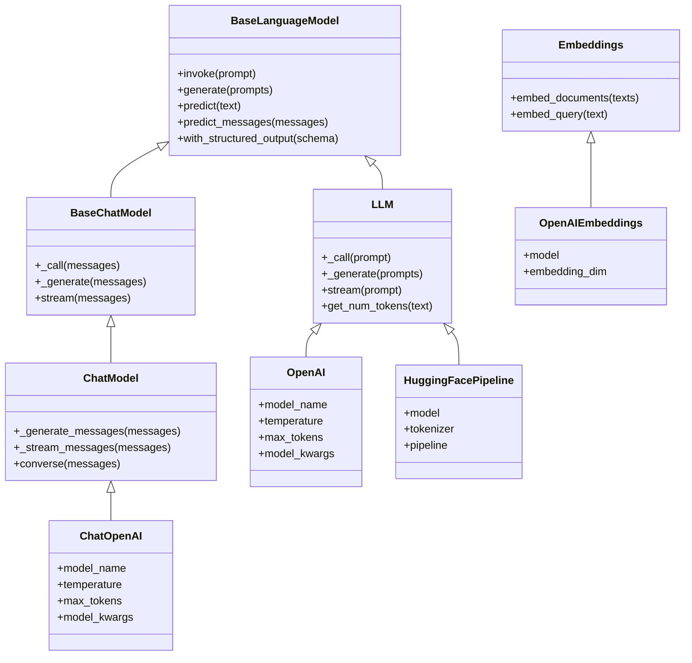

### Prompt Classes and Functions

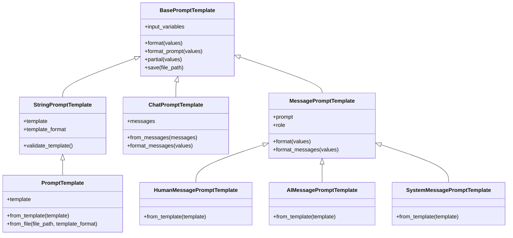

### Chain Classes Hierarchy

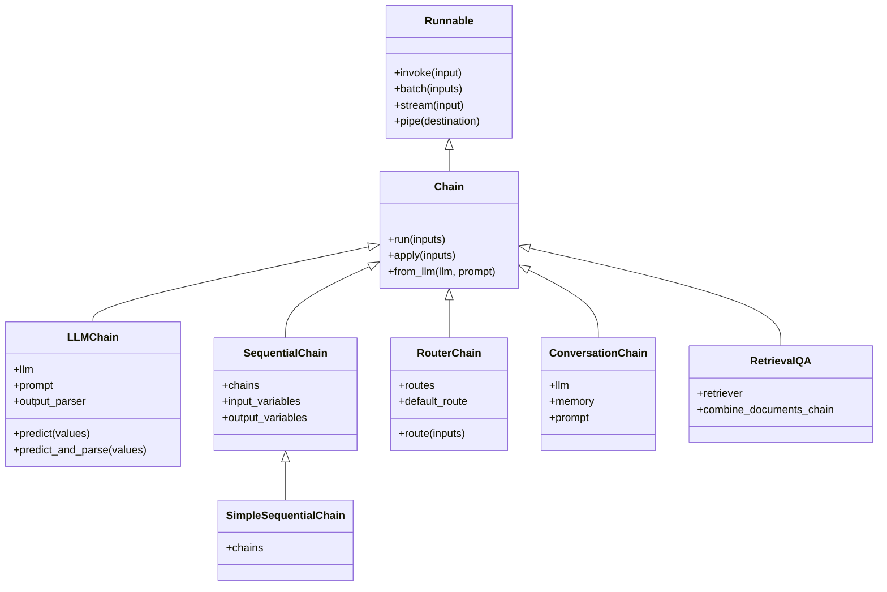

### Memory Classes

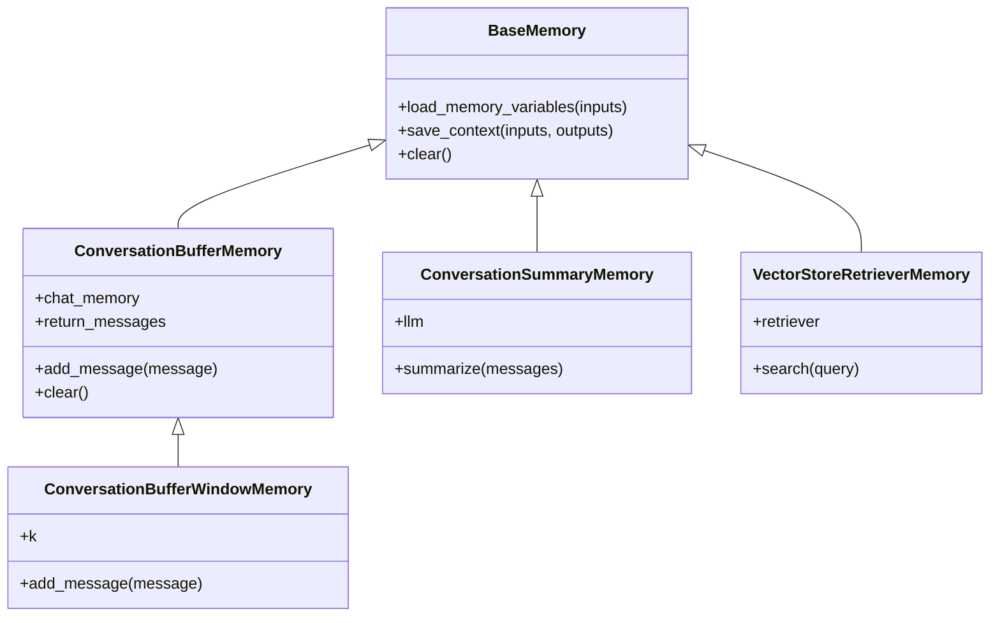

### Document Loading and Processing

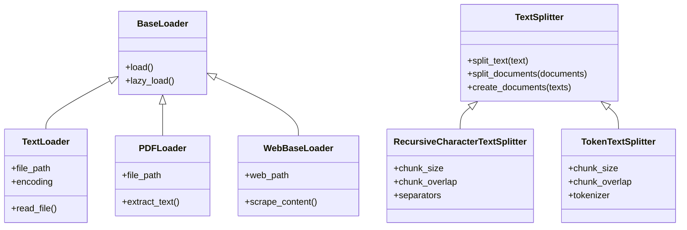

### Vector Stores and Retrievers

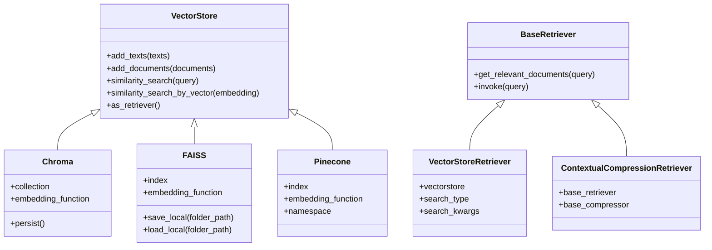

### Agents and Tools

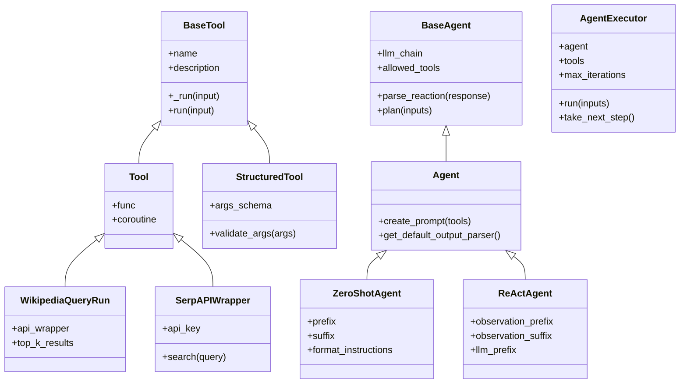

### LangChain Expression Language (LCEL) Components

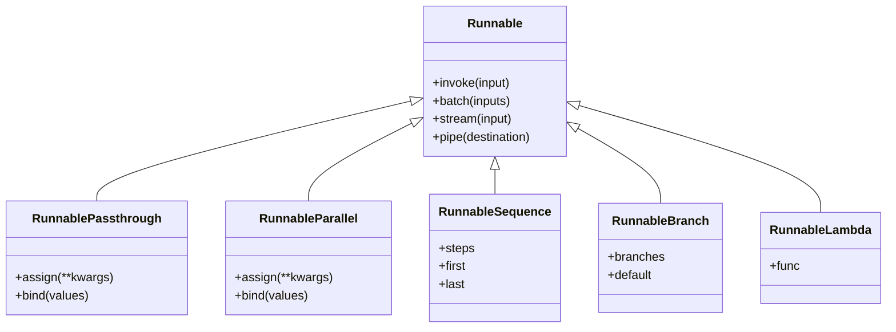

### Common Function Usage Patterns

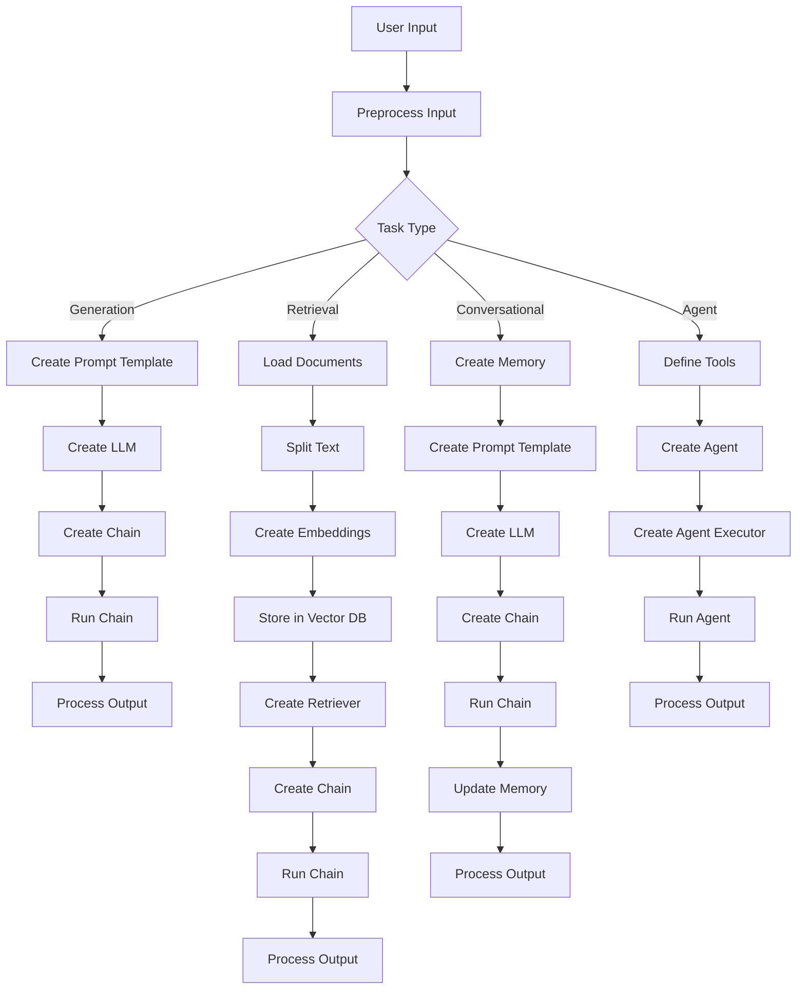

## Common LangChain Imports and Their Use Cases

This section provides a reference guide for the most frequently used LangChain imports and their typical use cases. Understanding these import patterns will help you quickly implement various LangChain functionalities.

### Models Imports

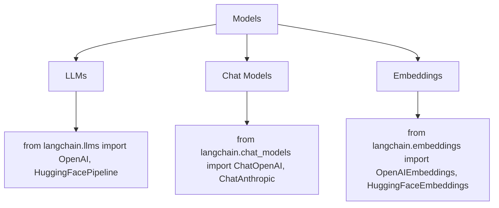

| Import Statement | Purpose | Example Use |
|-----------------|---------|-------------|
| `from langchain.llms import OpenAI` | Import text-completion LLM models | `llm = OpenAI(temperature=0.7)` |
| `from langchain.chat_models import ChatOpenAI` | Import conversational models | `chat = ChatOpenAI(model="gpt-4")` |
| `from langchain.embeddings import OpenAIEmbeddings` | Import embedding models | `embeddings = OpenAIEmbeddings()` |
| `from langchain_openai import OpenAI, ChatOpenAI` | Direct provider imports (newer syntax) | `model = ChatOpenAI()` |
| `from langchain_anthropic import ChatAnthropic` | Import Anthropic models | `model = ChatAnthropic(model="claude-3-sonnet-20240229")` |
| `from langchain_google_vertexai import ChatVertexAI` | Import Google's Vertex AI models | `model = ChatVertexAI()` |
| `from langchain_huggingface import HuggingFaceEndpoint` | Import HuggingFace endpoints | `model = HuggingFaceEndpoint(repo_id="mistralai/Mistral-7B-Instruct-v0.1")` |

### Prompts Imports

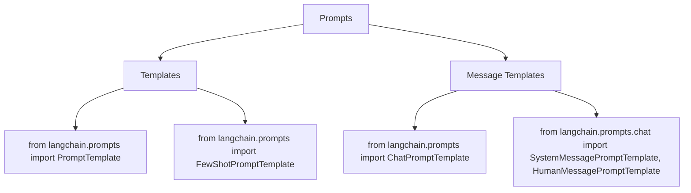

| Import Statement | Purpose | Example Use |
|-----------------|---------|-------------|
| `from langchain.prompts import PromptTemplate` | Create reusable text prompts with variables | `template = PromptTemplate.from_template("Answer about {topic}")` |
| `from langchain.prompts import ChatPromptTemplate` | Create multi-message chat prompts | `prompt = ChatPromptTemplate.from_messages([("system", "You are a helper"), ("human", "{query}")])` |
| `from langchain.prompts import FewShotPromptTemplate` | Create prompts with examples | `few_shot = FewShotPromptTemplate(examples=examples, example_prompt=example_prompt, prefix=prefix, suffix=suffix)` |
| `from langchain.prompts.chat import SystemMessagePromptTemplate` | Create system message templates | `system_message = SystemMessagePromptTemplate.from_template("You are a {role}")` |
| `from langchain.prompts.chat import HumanMessagePromptTemplate` | Create human message templates | `human_message = HumanMessagePromptTemplate.from_template("{input}")` |
| `from langchain.prompts.chat import AIMessagePromptTemplate` | Create AI message templates | `ai_message = AIMessagePromptTemplate.from_template("{response}")` |

### Chains Imports

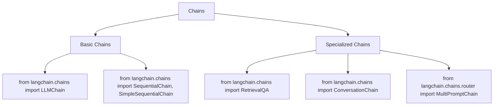

| Import Statement | Purpose | Example Use |
|-----------------|---------|-------------|
| `from langchain.chains import LLMChain` | Basic chain connecting prompt to LLM | `chain = LLMChain(llm=llm, prompt=prompt)` |
| `from langchain.chains import SequentialChain` | Chain multiple chains together | `chain = SequentialChain(chains=[chain1, chain2], input_variables=["query"])` |
| `from langchain.chains import SimpleSequentialChain` | Simpler sequential chain with single inputs/outputs | `chain = SimpleSequentialChain(chains=[chain1, chain2])` |
| `from langchain.chains import RetrievalQA` | Chain for question answering over documents | `qa_chain = RetrievalQA.from_chain_type(llm, retriever=retriever)` |
| `from langchain.chains import ConversationChain` | Chain with conversation memory | `conversation = ConversationChain(llm=llm, memory=memory)` |
| `from langchain.chains.router import MultiPromptChain` | Route inputs to different chains | `router_chain = MultiPromptChain(router_chain=router, destination_chains=destination_chains)` |
| `from langchain.chains.summarize import load_summarize_chain` | Chain for text summarization | `summarize_chain = load_summarize_chain(llm, chain_type="map_reduce")` |

### Memory Imports

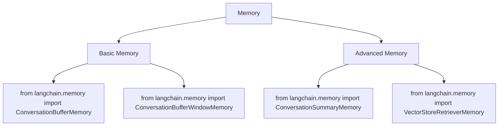

| Import Statement | Purpose | Example Use |
|-----------------|---------|-------------|
| `from langchain.memory import ConversationBufferMemory` | Store full conversation history | `memory = ConversationBufferMemory()` |
| `from langchain.memory import ConversationBufferWindowMemory` | Store limited conversation turns | `memory = ConversationBufferWindowMemory(k=5)` |
| `from langchain.memory import ConversationSummaryMemory` | Summarize conversation history | `memory = ConversationSummaryMemory(llm=llm)` |
| `from langchain.memory import ConversationTokenBufferMemory` | Limit memory by token count | `memory = ConversationTokenBufferMemory(llm=llm, max_token_limit=2000)` |
| `from langchain.memory import VectorStoreRetrieverMemory` | Store memories in vector store | `memory = VectorStoreRetrieverMemory(retriever=retriever)` |

### Document Processing Imports

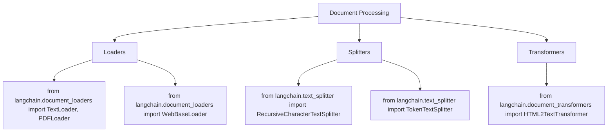

| Import Statement | Purpose | Example Use |
|-----------------|---------|-------------|
| `from langchain.document_loaders import TextLoader` | Load text files | `loader = TextLoader("document.txt")` |
| `from langchain.document_loaders import PDFLoader` | Load PDF files | `loader = PDFLoader("document.pdf")` |
| `from langchain.document_loaders import WebBaseLoader` | Load web pages | `loader = WebBaseLoader("https://example.com")` |
| `from langchain.document_loaders import DirectoryLoader` | Load files from directory | `loader = DirectoryLoader("./data/", glob="**/*.pdf", loader_cls=PDFLoader)` |
| `from langchain.document_loaders.csv_loader import CSVLoader` | Load CSV files | `loader = CSVLoader("data.csv")` |
| `from langchain.text_splitter import RecursiveCharacterTextSplitter` | Split text by character with awareness of structure | `splitter = RecursiveCharacterTextSplitter(chunk_size=1000, chunk_overlap=200)` |
| `from langchain.text_splitter import TokenTextSplitter` | Split text based on token count | `splitter = TokenTextSplitter(chunk_size=256, chunk_overlap=20)` |

### Vector Stores and Retrievers Imports

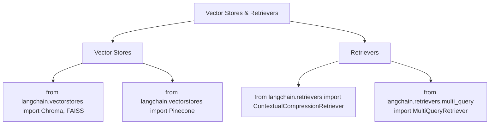

| Import Statement | Purpose | Example Use |
|-----------------|---------|-------------|
| `from langchain.vectorstores import Chroma` | In-memory or persistent vector store | `db = Chroma.from_documents(docs, embedding)` |
| `from langchain.vectorstores import FAISS` | Facebook AI Similarity Search | `db = FAISS.from_documents(docs, embedding)` |
| `from langchain.vectorstores import Pinecone` | Pinecone vector database | `db = Pinecone.from_documents(docs, embedding, index_name="my-index")` |
| `from langchain.vectorstores import Milvus` | Milvus vector database | `db = Milvus.from_documents(docs, embedding)` |
| `from langchain.vectorstores import Qdrant` | Qdrant vector database | `db = Qdrant.from_documents(docs, embedding)` |
| `from langchain.retrievers import ContextualCompressionRetriever` | Compress retriever results | `retriever = ContextualCompressionRetriever(base_retriever=vectorstore.as_retriever(), base_compressor=compressor)` |
| `from langchain.retrievers.multi_query import MultiQueryRetriever` | Generate multiple queries | `retriever = MultiQueryRetriever.from_llm(retriever=vectorstore.as_retriever(), llm=llm)` |

### Agents and Tools Imports

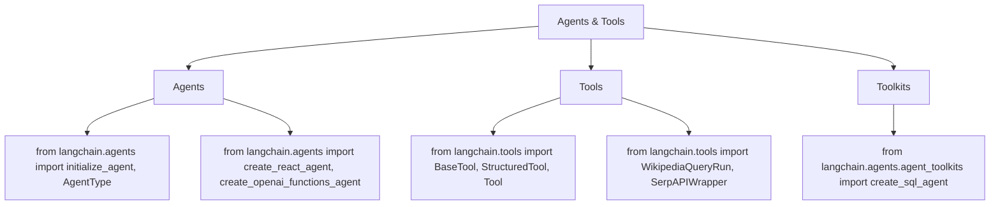

| Import Statement | Purpose | Example Use |
|-----------------|---------|-------------|
| `from langchain.agents import initialize_agent, AgentType` | Create agent with predefined types | `agent = initialize_agent(tools, llm, agent=AgentType.ZERO_SHOT_REACT_DESCRIPTION)` |
| `from langchain.agents import create_react_agent` | Create ReAct agent | `agent = create_react_agent(llm, tools, prompt)` |
| `from langchain.agents import create_openai_functions_agent` | Create OpenAI Functions agent | `agent = create_openai_functions_agent(llm, tools, prompt)` |
| `from langchain.agents import AgentExecutor` | Execute agent actions | `agent_executor = AgentExecutor(agent=agent, tools=tools, verbose=True)` |
| `from langchain.tools import Tool` | Define tools for agents | `tool = Tool(name="Search", func=search_func, description="Search for information")` |
| `from langchain.tools.python.tool import PythonREPLTool` | Python execution tool | `python_tool = PythonREPLTool()` |
| `from langchain.tools import WikipediaQueryRun` | Search Wikipedia | `wikipedia_tool = WikipediaQueryRun(api_wrapper=WikipediaAPIWrapper())` |
| `from langchain.agents.agent_toolkits import create_sql_agent` | Create SQL database agent | `agent = create_sql_agent(llm=llm, toolkit=sql_toolkit, verbose=True)` |

### Output Parsing Imports

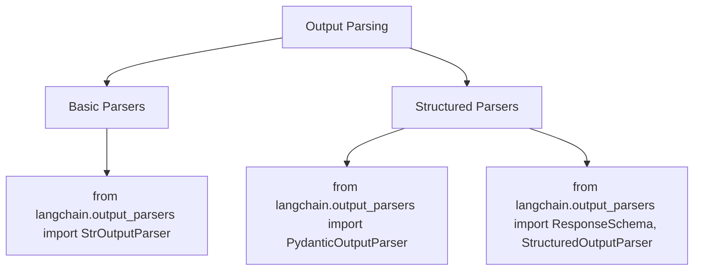

| Import Statement | Purpose | Example Use |
|-----------------|---------|-------------|
| `from langchain.output_parsers import StrOutputParser` | Parse output as string | `parser = StrOutputParser()` |
| `from langchain.output_parsers import PydanticOutputParser` | Parse output into Pydantic model | `parser = PydanticOutputParser(pydantic_object=MyModel)` |
| `from langchain.output_parsers import ResponseSchema, StructuredOutputParser` | Parse output into structured format | `parser = StructuredOutputParser.from_response_schemas([ResponseSchema(name="answer")])` |
| `from langchain.output_parsers import CommaSeparatedListOutputParser` | Parse comma-separated list | `parser = CommaSeparatedListOutputParser()` |
| `from langchain.output_parsers.json import SimpleJsonOutputParser` | Parse JSON output | `parser = SimpleJsonOutputParser()` |

### LCEL (LangChain Expression Language) Imports

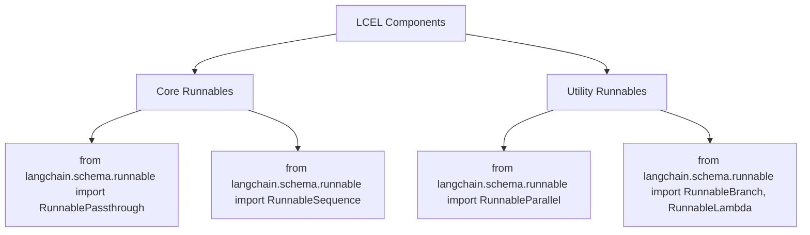

| Import Statement | Purpose | Example Use |
|-----------------|---------|-------------|
| `from langchain.schema.runnable import RunnablePassthrough` | Pass input unchanged | `chain = {"context": retriever, "question": RunnablePassthrough()} \| prompt \| model` |
| `from langchain.schema.runnable import RunnableSequence` | Explicit sequence of steps | `chain = RunnableSequence([retriever, prompt, model, parser])` |
| `from langchain.schema.runnable import RunnableParallel` | Process inputs in parallel | `chain = RunnableParallel({"summary": summarize_chain, "entities": entity_chain})` |
| `from langchain.schema.runnable import RunnableBranch` | Select branch based on condition | `chain = RunnableBranch((lambda x: condition, chain_a), chain_b)` |
| `from langchain.schema.runnable import RunnableLambda` | Apply custom function | `chain = RunnableLambda(lambda x: process_data(x))` |

### Core Framework Imports

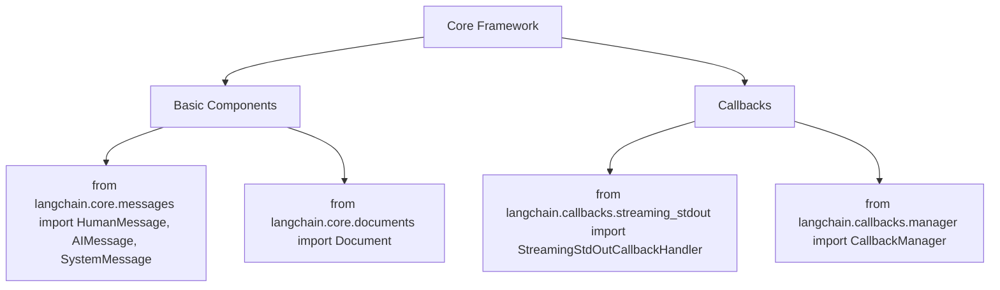

| Import Statement | Purpose | Example Use |
|-----------------|---------|-------------|
| `from langchain.core.messages import HumanMessage, AIMessage, SystemMessage` | Message objects for chat | `messages = [SystemMessage(content="You are a helpful AI"), HumanMessage(content="Hello")]` |
| `from langchain.core.documents import Document` | Document objects | `doc = Document(page_content="text", metadata={"source": "file.txt"})` |
| `from langchain.callbacks.streaming_stdout import StreamingStdOutCallbackHandler` | Stream model output | `model = ChatOpenAI(streaming=True, callbacks=[StreamingStdOutCallbackHandler()])` |
| `from langchain.callbacks.manager import CallbackManager` | Manage multiple callbacks | `callback_manager = CallbackManager([handler1, handler2])` |
| `from langchain.schema import BaseOutputParser` | Base class for custom parsers | `class CustomParser(BaseOutputParser): ...` |

### Integration Imports

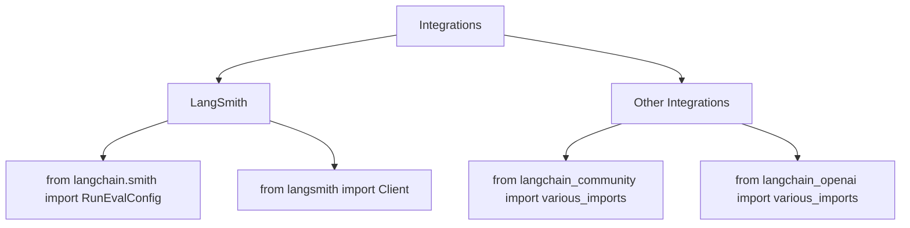

| Import Statement | Purpose | Example Use |
|-----------------|---------|-------------|
| `from langchain.smith import RunEvalConfig` | Configure evaluation runs | `eval_config = RunEvalConfig(evaluators=["qa"])` |
| `from langsmith import Client` | LangSmith client | `client = Client()` |
| `from langchain_community.chat_models import ChatOllama` | Community models | `model = ChatOllama(model="llama2")` |
| `from langchain_community.vectorstores import Qdrant` | Community vector stores | `db = Qdrant.from_documents(docs, embedding)` |
| `from langchain_openai import ChatOpenAI` | OpenAI integration | `model = ChatOpenAI()` |
| `from langchain_experimental.agents import create_pandas_dataframe_agent` | Experimental features | `agent = create_pandas_dataframe_agent(llm, df, verbose=True)` |

### Migration Note

Recent versions of LangChain have reorganized imports. The pattern is now:

- `langchain`: Core abstractions and interfaces
- `langchain_community`: Community-contributed components
- `langchain_{provider}`: Provider-specific implementations (e.g., `langchain_openai`)

For example:
- Old: `from langchain.chat_models import ChatOpenAI`
- New: `from langchain_openai import ChatOpenAI`

Many imports still work with the old pattern but are being gradually migrated to the new structure.
