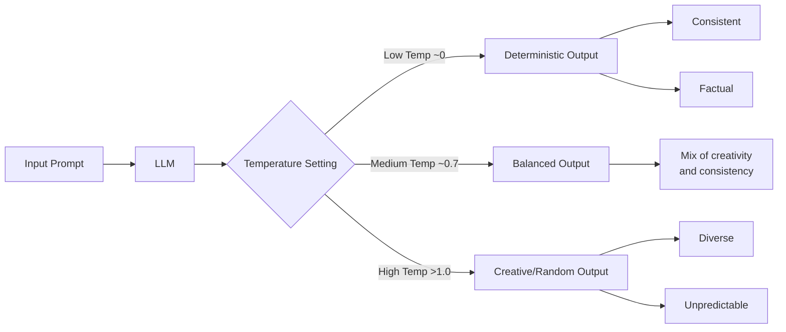
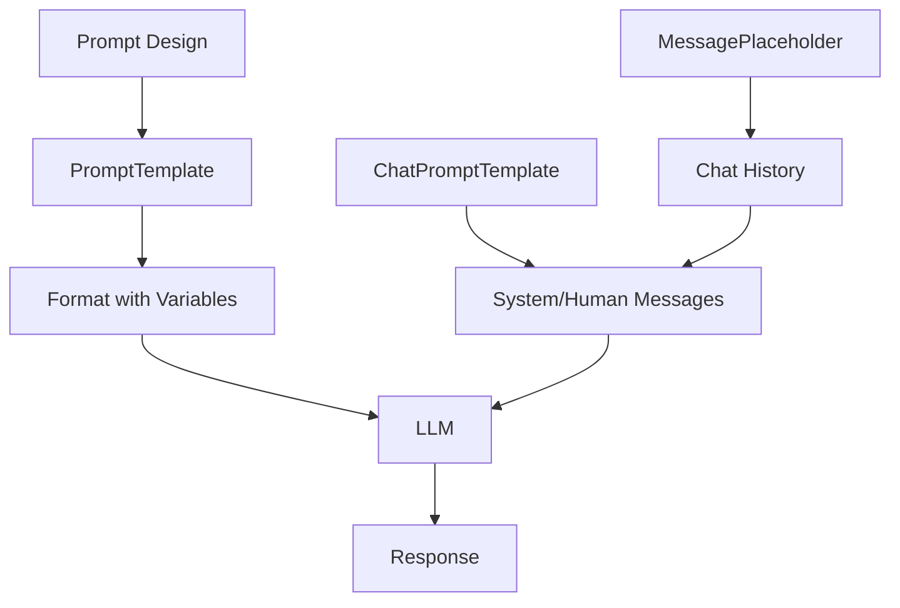

# Prompts in LangChain: Comprehensive Notes

## Table of Contents
- [Introduction](#introduction)
- [Understanding Temperature in LLMs](#understanding-temperature-in-llms)
- [Prompts in LangChain](#prompts-in-langchain)
  - [Static vs Dynamic Prompts](#static-vs-dynamic-prompts)
  - [PromptTemplate Class](#prompttemplate-class)
  - [Benefits of Using PromptTemplate](#benefits-of-using-prompttemplate)
- [Building a Simple LLM Application](#building-a-simple-llm-application)
- [Message Types in LangChain](#message-types-in-langchain)
  - [SystemMessage](#systemmessage)
  - [HumanMessage](#humanmessage)
  - [AIMessage](#aimessage)
- [ChatPromptTemplate for Multi-Turn Conversations](#chatprompttemplate-for-multi-turn-conversations)
- [MessagePlaceholders for Chat History](#messageplaceholders-for-chat-history)
- [Summary](#summary)

## Introduction

Prompts are instructions or queries sent to a language model to generate responses. In the context of LangChain, prompts are a crucial component that significantly influence the output of Large Language Models (LLMs). A well-crafted prompt can guide the model to produce more accurate, relevant, and helpful responses.

The prompts component in LangChain provides tools and abstractions to create, manage, and optimize prompts for different use cases. It allows developers to create both simple static prompts and complex dynamic prompts with variables that can be filled at runtime.

## Understanding Temperature in LLMs

Before diving into LangChain prompts, it's important to understand a key parameter that affects LLM outputs: temperature.

Temperature controls the randomness of the model's output:

- **Low temperature (close to 0)**: Produces more deterministic and focused outputs. For the same input, the model will consistently generate the same or very similar outputs. This setting is ideal for applications that require factual, consistent responses.

- **High temperature (above 1.0)**: Produces more diverse and creative outputs. The model will explore more possibilities and generate varied responses even for the same input. This setting is useful for creative writing, brainstorming, or generating multiple alternative solutions.



Example of temperature effect:

```python
from langchain.chat_models import ChatOpenAI
from dotenv import load_dotenv

load_dotenv()
model = ChatOpenAI(temperature=0)  # Deterministic output

response = model.invoke("Write a five-line poem about cricket")
print(response.content)  # Will produce the same poem each time

# Changing to creative output
model = ChatOpenAI(temperature=1.5)  # More random/creative output
response = model.invoke("Write a five-line poem about cricket")
print(response.content)  # Will produce different poems each time
```

## Prompts in LangChain

### Static vs Dynamic Prompts

LangChain supports two types of prompts:

1. **Static Prompts**: Fixed text prompts where the entire prompt is predefined. 
   
   ```python
   response = model.invoke("Summarize the Attention Is All You Need paper")
   ```

   Static prompts are simple but have limitations:
   - They provide too much control to end-users
   - They can lead to inconsistent experiences
   - Users might make mistakes in their prompts (typos, inaccuracies)
   - The LLM output is highly sensitive to prompt wording

2. **Dynamic Prompts**: Templates with placeholders that get filled with values at runtime.
   
   ```python
   template = """Please summarize the research paper titled {paper_input} with the 
   following specifications: explanation style: {style_input} and explanation 
   length: {length_input}. Include relevant mathematical equations if present in the paper."""
   ```

   Dynamic prompts offer several advantages:
   - Consistent user experiences
   - Error reduction
   - Better control over the output format and style
   - Reusability across multiple cases

### PromptTemplate Class

LangChain provides the `PromptTemplate` class to create dynamic prompts:

```python
from langchain.core.prompts import PromptTemplate

template = """Please summarize the research paper titled {paper_input} with the 
following specifications: explanation style: {style_input} and explanation 
length: {length_input}.

Include relevant mathematical equations if present in the paper.
Explain the mathematical concepts using simple, intuitive code snippets where applicable.
Add relatable analogies where possible.
If any piece of information is unavailable, simply put "Insufficient information available".
Ensure the summary is clear, accurate, and aligns with the provided style and length."""

prompt_template = PromptTemplate.from_template(template)
```

Usage:

```python
# Fill the template with values
prompt = prompt_template.format(
    paper_input="Attention Is All You Need",
    style_input="code-oriented",
    length_input="medium"
)

# Send to LLM
result = model.invoke(prompt)
```

### Benefits of Using PromptTemplate

1. **Validation**: PromptTemplate automatically validates that all placeholders are provided.
   
   ```python
   # This will raise an error if you don't provide all required placeholder values
   prompt_template = PromptTemplate.from_template(template, validate_template=True)
   ```

2. **Reusability**: Templates can be saved and loaded as needed.
   
   ```python
   # Save template
   prompt_template.save("template.json")
   
   # Load template
   from langchain.core.prompts import load_prompt
   template = load_prompt("template.json")
   ```

3. **Integration with LangChain Ecosystem**: PromptTemplates work seamlessly with chains and other LangChain components.
   
   ```python
   from langchain.chains import LLMChain
   
   chain = LLMChain(llm=model, prompt=prompt_template)
   result = chain.invoke({"paper_input": "Attention Is All You Need", 
                        "style_input": "code-oriented", 
                        "length_input": "medium"})
   ```

## Building a Simple LLM Application

Here's an example of building a simple research paper summarizer application using Streamlit and LangChain:

```python
from langchain.chat_models import ChatOpenAI
from langchain.core.prompts import PromptTemplate
from dotenv import load_dotenv
import streamlit as st

# Load environment variables and initialize model
load_dotenv()
model = ChatOpenAI()

# Create Streamlit UI
st.header("Research Paper Summarizer")

# Create dropdown inputs
paper_input = st.selectbox(
    "Select Research Paper",
    ["Attention Is All You Need", "Word2Vec", "BERT", "GPT-3", "ResNet"]
)

style_input = st.selectbox(
    "Explanation Style",
    ["Simple", "Code-oriented", "Math-heavy", "Intuitive"]
)

length_input = st.selectbox(
    "Explanation Length",
    ["Short", "Medium", "Long"]
)

if st.button("Summarize"):
    # Create the template
    template = PromptTemplate.from_template("""Please summarize the research paper titled {paper_input} with the 
    following specifications: explanation style: {style_input} and explanation 
    length: {length_input}.

    Include relevant mathematical equations if present in the paper.
    Explain the mathematical concepts using simple, intuitive code snippets where applicable.
    Add relatable analogies where possible.
    If any piece of information is unavailable, simply put "Insufficient information available".
    Ensure the summary is clear, accurate, and aligns with the provided style and length.""")
    
    # Fill the template
    prompt = template.format(
        paper_input=paper_input,
        style_input=style_input,
        length_input=length_input
    )
    
    # Get response
    result = model.invoke(prompt)
    
    # Display result
    st.write(result.content)
```

## Message Types in LangChain

When working with chat models, LangChain provides specialized message types to structure conversations:

### SystemMessage

System messages are instructions to the model about how it should behave. They typically appear at the beginning of a conversation to set the context or assign a role.

```python
from langchain.core.messages import SystemMessage

system_message = SystemMessage(content="You are a helpful AI assistant.")
```

### HumanMessage

Human messages represent input from the user.

```python
from langchain.core.messages import HumanMessage

human_message = HumanMessage(content="Tell me about LangChain.")
```

### AIMessage

AI messages represent responses generated by the model.

```python
from langchain.core.messages import AIMessage

ai_message = AIMessage(content="LangChain is a framework for developing applications powered by language models.")
```

These message types are used together to form a conversation history:

```python
messages = [
    SystemMessage(content="You are a helpful AI assistant."),
    HumanMessage(content="Tell me about LangChain."),
]

response = model.invoke(messages)
messages.append(response)  # Add AI response to conversation history
```

## ChatPromptTemplate for Multi-Turn Conversations

For multi-turn conversations with dynamic elements, LangChain provides `ChatPromptTemplate`:

```python
from langchain.core.prompts import ChatPromptTemplate

chat_template = ChatPromptTemplate.from_messages([
    ("system", "You are a helpful {domain} expert."),
    ("human", "Explain in simple terms what is {topic}.")
])

# Fill dynamic elements
prompt = chat_template.format_messages(
    domain="cricket",
    topic="doosra"
)

# Result is a list of properly formatted messages
```

Alternative format (using tuples for more control):

```python
chat_template = ChatPromptTemplate.from_messages([
    ("system", "You are a helpful {domain} expert"),
    ("human", "Explain in simple terms what is {topic}")
])
```

## MessagePlaceholders for Chat History

LangChain provides a special placeholder type called `MessagePlaceholder` that can insert multiple messages at once, which is particularly useful for including chat history:

```python
from langchain.core.prompts import ChatPromptTemplate, MessagePlaceholder

# Create a template with a placeholder for chat history
chat_template = ChatPromptTemplate.from_messages([
    ("system", "You are a helpful customer support agent."),
    MessagePlaceholder(variable_name="chat_history"),
    ("human", "{query}")
])

# Load chat history from database
chat_history = [
    HumanMessage(content="I want to request a refund for my order #12345"),
    AIMessage(content="Your refund request for order #12345 has been initiated. You will receive your refund in 3-5 business days.")
]

# Create prompt with today's query
prompt = chat_template.format_messages(
    chat_history=chat_history,
    query="Where is my refund?"
)

# Result will include the system message, all messages from chat_history, and the new query
```

This pattern is essential for maintaining context across conversation sessions, especially in customer support and chat applications.

## Summary

Prompts are a critical component in LangChain that influence how LLMs generate responses. Key points covered:

1. **Temperature** controls response randomness and creativity
2. **Static vs Dynamic Prompts** offer different levels of control and consistency
3. **PromptTemplate** enables dynamic content with placeholder variables
4. **Message Types** (System, Human, AI) help structure conversations
5. **ChatPromptTemplate** supports multi-turn dynamic conversations
6. **MessagePlaceholders** allow insertion of conversation history

Understanding and effectively using prompts is essential for building applications with LLMs. By leveraging LangChain's prompt capabilities, developers can create more controlled, consistent, and context-aware AI interactions.



For advanced prompt engineering techniques like few-shot learning, chain-of-thought, and other specialized patterns, additional resources and future chapters will provide deeper insights.