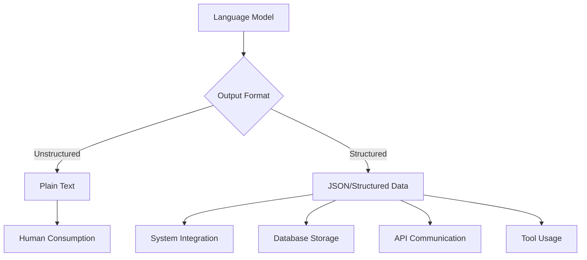
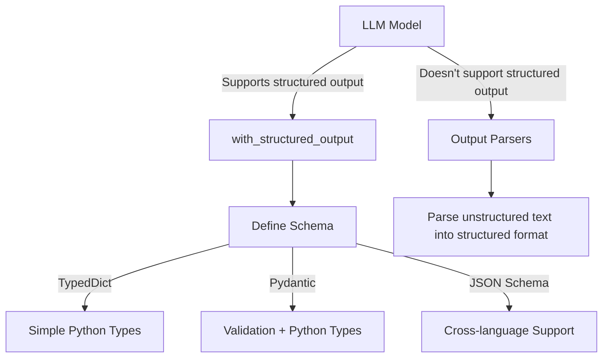

# Structured Output in LangChain: Comprehensive Notes

## Table of Contents
- [Introduction](#introduction)
- [Unstructured vs Structured Output](#unstructured-vs-structured-output)
- [Use Cases for Structured Output](#use-cases-for-structured-output)
- [Methods for Generating Structured Output](#methods-for-generating-structured-output)
  - [with_structured_output Function](#with_structured_output-function)
  - [Schema Definition Methods](#schema-definition-methods)
    - [TypedDict Approach](#typeddict-approach)
    - [Pydantic Approach](#pydantic-approach)
    - [JSON Schema Approach](#json-schema-approach)
- [Implementation Examples](#implementation-examples)
  - [Extracting Data from Reviews](#extracting-data-from-reviews)
  - [Handling Optional Fields](#handling-optional-fields)
  - [Adding Field Constraints](#adding-field-constraints)
- [Output Modes](#output-modes)
  - [JSON Mode vs Function Calling](#json-mode-vs-function-calling)
- [Model Compatibility](#model-compatibility)
- [Summary](#summary)

## Introduction

Structured output in LangChain refers to the practice of having language models return responses in well-defined data formats instead of plain text. This is essential for integrating LLMs with other systems like databases, APIs, or tools that require data in specific structures.

Until now, we've primarily used LLMs for human-to-machine interactions, where both humans and LLMs communicate via text. However, when we want to connect LLMs with other systems, unstructured text becomes a limitation. Structured output solves this problem by formatting LLM responses in a predictable, machine-readable way.

## Unstructured vs Structured Output

**Unstructured Output**: The default response from an LLM is text. When you ask a question like "What is the capital of India?", the LLM returns a text response like "New Delhi is the capital of India." This format is excellent for human consumption but challenging for programmatic processing.

**Structured Output**: When an LLM returns data in a structured format like JSON, where information is organized into key-value pairs. For example:

Unstructured output for a travel itinerary:
```
Here is a suggested itinerary for Paris:
Morning: Visit Eiffel Tower
Afternoon: Visit Louvre Museum
Evening: Have dinner at a local restaurant
```

Structured output for the same itinerary:
```json
[
  {
    "time": "Morning",
    "activity": "Visit Eiffel Tower"
  },
  {
    "time": "Afternoon",
    "activity": "Visit Louvre Museum"
  },
  {
    "time": "Evening",
    "activity": "Have dinner at a local restaurant"
  }
]
```

The structured format makes it much easier to process programmatically and integrate with other systems.



## Use Cases for Structured Output

There are numerous applications for structured output:

1. **Data Extraction**: Extracting specific information from documents, resumes, or any text content and storing it in a database. For example, extracting candidate information from resumes on a job portal.

2. **API Building**: Creating APIs that process and return structured information from text. For instance, analyzing product reviews to extract topics, pros, cons, and sentiment.

3. **Building Agents**: Creating AI agents that can interact with tools. Agents need to understand user requests, extract relevant parameters, and call the appropriate tools with those parameters.

## Methods for Generating Structured Output

LangChain provides two main approaches for generating structured output:

1. **with_structured_output**: For models that natively support structured output (like OpenAI's GPT models).
2. **Output Parsers**: For models that don't natively support structured output.

This section focuses on the `with_structured_output` function, while output parsers will be covered in a separate guide.

### with_structured_output Function

The `with_structured_output` function in LangChain makes it easy to get structured output from supported models. Here's how it works:

1. You define a schema for the output you want
2. You call the `with_structured_output` function with your model and schema
3. The model returns responses in the format you specified

The basic workflow remains similar to regular LLM interactions, with one key difference: you define your expected data structure before invoking the model.

```python
from langchain.chat_models import ChatOpenAI
from typing import TypedDict
from dotenv import load_dotenv

load_dotenv()
model = ChatOpenAI()

# Define your schema
class Review(TypedDict):
    summary: str
    sentiment: str

# Create a structured output model
structured_model = model.with_structured_output(Review)

# Use it with your input text
review_text = "I loved this phone! The battery life is amazing and the camera is great."
result = structured_model.invoke(review_text)

# Access the structured data
print(result["summary"])     # A summary of the review
print(result["sentiment"])   # Positive
```

Behind the scenes, LangChain generates a system prompt instructing the model to extract the specified information and return it in the requested format.

### Schema Definition Methods

LangChain supports three main ways to define schemas for structured output:

#### TypedDict Approach

TypedDict is a way to define dictionaries in Python where you specify what keys and values should exist. It helps ensure your dictionary follows a specific structure.

```python
from typing import TypedDict, List

class Review(TypedDict):
    summary: str  # A summary of the review
    sentiment: str  # The sentiment of the review (positive/negative/neutral)
    key_themes: List[str]  # Main topics discussed in the review
    pros: List[str]  # Positive aspects mentioned
    cons: List[str]  # Negative aspects mentioned
```

Pros:
- Simple and lightweight
- Native to Python
- Provides type hints for better code editor support

Cons:
- No runtime validation
- Limited to Python only
- No additional constraints or validation options

#### Pydantic Approach

Pydantic is a data validation and settings management library that enforces type hints at runtime.

```python
from pydantic import BaseModel, Field, EmailStr
from typing import List, Optional

class Review(BaseModel):
    summary: str = Field(description="A brief overview of the review content")
    sentiment: str = Field(description="Overall sentiment (positive, negative, or neutral)")
    key_themes: List[str] = Field(description="Main topics discussed in the review")
    pros: Optional[List[str]] = Field(None, description="Positive aspects mentioned in the review")
    cons: Optional[List[str]] = Field(None, description="Negative aspects mentioned in the review")
```

Pros:
- Runtime data validation
- Rich validation features (field constraints, email validation, etc.)
- Default values
- Field descriptions
- Automatic type conversion
- Can convert to/from JSON

Cons:
- Additional dependency
- Python-specific

#### JSON Schema Approach

JSON Schema is a vocabulary that allows you to annotate and validate JSON documents.

```python
json_schema = {
    "title": "Review",
    "type": "object",
    "properties": {
        "key_themes": {
            "type": "array",
            "items": {
                "type": "string"
            },
            "description": "Main topics discussed in the review"
        },
        "summary": {
            "type": "string",
            "description": "A brief overview of the review content"
        },
        "sentiment": {
            "type": "string",
            "enum": ["positive", "negative", "neutral"],
            "description": "Overall tone of the review"
        },
        "pros": {
            "type": ["array", "null"],
            "items": {
                "type": "string"
            },
            "description": "Positive aspects mentioned in the review"
        },
        "cons": {
            "type": ["array", "null"],
            "items": {
                "type": "string"
            },
            "description": "Negative aspects mentioned in the review"
        }
    },
    "required": ["key_themes", "summary", "sentiment"]
}
```

Pros:
- Language-agnostic (can be used across different programming languages)
- Widely supported in many environments
- Good for cross-language projects

Cons:
- More verbose
- No automatic type conversion

## Implementation Examples

Let's look at some practical examples of using structured output in LangChain.

### Extracting Data from Reviews

```python
from langchain.chat_models import ChatOpenAI
from typing import TypedDict, List
from dotenv import load_dotenv

load_dotenv()
model = ChatOpenAI()

# Define schema using TypedDict
class Review(TypedDict):
    summary: str
    sentiment: str
    key_themes: List[str]

# Sample review text
review_text = """
I recently purchased the PixelPhone 12 and I'm extremely satisfied with it. The Snapdragon 5000 processor is lightning fast and handles all apps smoothly. The 45W fast charging is impressive - I can get from 0 to 50% in just 20 minutes. The 5000mAh battery easily lasts all day even with heavy use. The only downside is the camera, which could be better in low light conditions. Overall, a great phone for the price!
"""

# Create structured model
structured_model = model.with_structured_output(Review)

# Get structured output
result = structured_model.invoke(review_text)

print(f"Summary: {result['summary']}")
print(f"Sentiment: {result['sentiment']}")
print(f"Key Themes: {', '.join(result['key_themes'])}")
```

### Handling Optional Fields

You can specify fields as optional using the Pydantic approach:

```python
from pydantic import BaseModel, Field
from typing import List, Optional

class Review(BaseModel):
    summary: str = Field(description="A brief overview of the review")
    sentiment: str = Field(description="The sentiment (positive, negative, neutral)")
    key_themes: List[str] = Field(description="Main topics discussed in the review")
    pros: Optional[List[str]] = Field(None, description="Positive aspects mentioned")
    cons: Optional[List[str]] = Field(None, description="Negative aspects mentioned")
    
# Then use it with structured_model = model.with_structured_output(Review)
```

### Adding Field Constraints

With Pydantic, you can add constraints to fields:

```python
from pydantic import BaseModel, Field, EmailStr

class ProductRating(BaseModel):
    product_name: str = Field(description="Name of the product")
    rating: float = Field(
        description="Rating from 0 to 5",
        ge=0,  # greater than or equal to 0
        le=5   # less than or equal to 5
    )
    reviewer_email: EmailStr = Field(description="Email of the reviewer")
    
# This will validate that rating is between 0 and 5
# and that reviewer_email is a valid email format
```

## Output Modes

The `with_structured_output` function has a `method` parameter that determines how the structured output is generated:

```python
structured_model = model.with_structured_output(
    Review, 
    method="json"  # or "function_calling"
)
```

### JSON Mode vs Function Calling

- **JSON Mode**: Instructs the model to return a JSON object conforming to your schema. Best for models like Claude or Gemini that support JSON output.

- **Function Calling**: Uses the model's function calling capabilities to generate structured data. This is generally the preferred method for OpenAI models and is the default.

## Model Compatibility

Not all models support structured output. Here's a general guideline:

- **Full Support**: OpenAI models (GPT-3.5, GPT-4) have excellent support via function calling
- **JSON Support**: Claude and Gemini models can return JSON but may not support function calling
- **No Support**: Many open-source models cannot reliably generate structured output without additional help

For models that don't support structured output natively, you'll need to use output parsers (covered in a separate guide).



## Summary

Structured output in LangChain enables the integration of LLMs with other systems by formatting responses in structured, machine-readable formats. Key points:

1. Structured output transforms plain text responses into organized data structures
2. Major use cases include data extraction, API building, and creating AI agents
3. LangChain provides the `with_structured_output` function for models that support structured output
4. Three schema definition approaches: TypedDict (simple), Pydantic (validation), and JSON Schema (cross-language)
5. Output modes include JSON and function calling
6. Not all models support structured output natively

When building complex LLM applications, structured output is essential for enabling reliable integrations with databases, APIs, and tools.