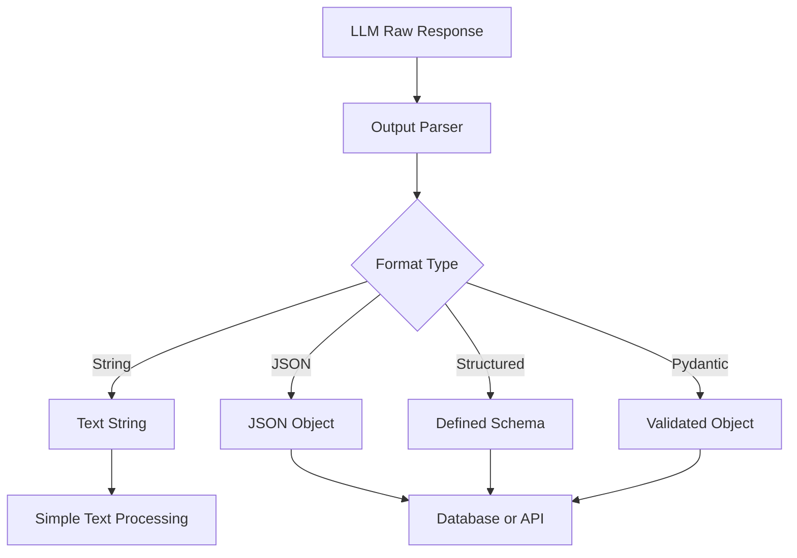
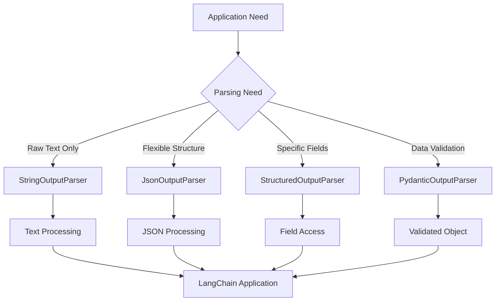

# Output Parsers in LangChain: Comprehensive Guide

## Table of Contents
- [Introduction](#introduction)
- [Understanding Output Parsers](#understanding-output-parsers)
- [Types of Output Parsers](#types-of-output-parsers)
  - [String Output Parser](#string-output-parser)
  - [JSON Output Parser](#json-output-parser)
  - [Structured Output Parser](#structured-output-parser)
  - [Pydantic Output Parser](#pydantic-output-parser)
  - [Other Output Parsers](#other-output-parsers)
- [Practical Examples](#practical-examples)
- [Best Practices](#best-practices)
- [Summary](#summary)

## Introduction

This guide builds on concepts from structured output generation in LangChain and explores how to work with the outputs from language models through Output Parsers. Whether you're working with models that natively support structured output formats or those that don't, understanding output parsers is essential for creating robust LLM applications.

## Understanding Output Parsers

Output parsers in LangChain help convert raw LLM responses (textual responses) into structured formats like JSON, CSV, Pydantic models, and more. They ensure consistency, validation, and ease of use in applications.



**Definition**: Output parsers are classes in LangChain that help you work with any type of LLM and derive structured output from them. They act as an intermediary layer between the raw LLM response and your application logic.

### Why Use Output Parsers?

1. **Consistency**: Ensure responses follow a specific format
2. **Validation**: Check that outputs meet required criteria
3. **Integration**: Easily connect LLM outputs to other systems
4. **Structure**: Transform unstructured text into structured data

### Important Note

Output parsers can be used with:
- Models that natively support structured output ("can" models)
- Models that don't support structured output by default ("can't" models)

This flexibility makes output parsers a powerful tool in your LangChain toolkit.

## Types of Output Parsers

While LangChain offers many output parsers, we'll focus on the four most commonly used ones:

### String Output Parser

The simplest output parser in LangChain is the StringOutputParser. This parser extracts just the text content from an LLM response, ignoring metadata and other properties.

```python
from langchain.output_parsers import StrOutputParser

parser = StrOutputParser()
```

**Purpose**: The StringOutputParser extracts the pure text content from an LLM response object.

**When to use**: Use this parser when you need just the raw text output from your LLM and don't require any specific structure or validation.

**How it works**: When you call an LLM, it typically returns a complex object with various properties including content, metadata, and other information. The StringOutputParser extracts just the "content" property, giving you a clean text string to work with.

#### Example with OpenAI

```python
from langchain.chat_models import ChatOpenAI
from langchain.output_parsers import StrOutputParser
from langchain.prompts import ChatPromptTemplate

# Create the model and parser
model = ChatOpenAI()
parser = StrOutputParser()

# Create a prompt
prompt = ChatPromptTemplate.from_messages([
    ("system", "You are a helpful assistant."),
    ("human", "Tell me a brief joke about programming.")
])

# Chain components together
chain = prompt | model | parser

# Run the chain
result = chain.invoke({})
print(result)  # This will be a string, not a complex object
```

#### Example with Open Source Model

```python
from langchain.llms import HuggingFaceEndpoint
from langchain.output_parsers import StrOutputParser
from langchain.prompts import PromptTemplate

# Create the model and parser
model = HuggingFaceEndpoint(
    repo_id="mistralai/Mistral-7B-Instruct-v0.1",
    max_length=128
)
parser = StrOutputParser()

# Create a prompt
prompt = PromptTemplate.from_template(
    "Tell me a brief joke about programming."
)

# Chain components together
chain = prompt | model | parser

# Run the chain
result = chain.invoke({})
print(result)  # This will be a string, not a complex object
```

#### Strengths and Limitations

**Strengths**:
- Simple to use
- Works with any LLM
- No special prompt formatting required
- Ideal for text-based applications

**Limitations**:
- No structure enforcement
- No validation capabilities
- Limited integration with other systems

#### Real-World Use Case: Multi-Stage Processing

The StringOutputParser is particularly useful in multi-stage LLM pipelines. For example, if you need to:

1. Generate a detailed report on a topic
2. Pass that report back to the LLM for summarization

Using the StringOutputParser with chains makes this easy:

```python
from langchain.chat_models import ChatOpenAI
from langchain.prompts import PromptTemplate
from langchain.output_parsers import StrOutputParser

# Create components
model = ChatOpenAI()
parser = StrOutputParser()

# Create prompts
report_template = PromptTemplate.from_template(
    "Write a detailed report on the topic: {topic}"
)
summary_template = PromptTemplate.from_template(
    "Write a five-line summary of the following text:\n\n{text}"
)

# Create the pipeline
chain = (
    {"topic": lambda x: x}
    | report_template
    | model
    | parser
    | {"text": lambda x: x}
    | summary_template
    | model
    | parser
)

# Run the chain
result = chain.invoke("black holes")
print(result)
```

This pipeline first generates a detailed report on black holes, then passes that report to the model again to create a concise summary, all in a single operation.

### JSON Output Parser

The JSONOutputParser formats LLM responses as structured JSON objects, making it easy to work with complex data.

```python
from langchain.output_parsers import JsonOutputParser

parser = JsonOutputParser()
```

**Purpose**: The JSONOutputParser helps convert LLM text responses into Python dictionaries (JSON objects) that can be easily manipulated programmatically.

**When to use**: Use this parser when you need structured data from your LLM that you can easily access by keys, iterate through, or pass to other systems that expect JSON data.

**How it works**: The parser adds specific formatting instructions to your prompt, requesting that the model return a valid JSON object. It then parses the response text into a Python dictionary.

#### Example Implementation

```python
from langchain.chat_models import ChatOpenAI
from langchain.output_parsers import JsonOutputParser
from langchain.prompts import ChatPromptTemplate

# Create the model and parser
model = ChatOpenAI()
parser = JsonOutputParser()

# Create a prompt template with formatting instructions
template = ChatPromptTemplate.from_messages([
    ("system", "You are a helpful assistant."),
    ("human", """
    Give me the name, age, and city of a fictional person.
    
    {format_instructions}
    """)
])

# Add format instructions as a partial variable
prompt = template.partial(
    format_instructions=parser.get_format_instructions()
)

# Create a chain
chain = prompt | model | parser

# Run the chain
result = chain.invoke({})
print(result)  # Will print a Python dictionary
print(type(result))  # <class 'dict'>
```

#### Accessing JSON Data

Since the result is a Python dictionary, you can access the data using keys:

```python
print(result["name"])  # Access a specific field
```

#### More Complex JSON Example

You can also generate more complex JSON structures:

```python
template = ChatPromptTemplate.from_messages([
    ("system", "You are a helpful assistant."),
    ("human", """
    Give me five facts about {topic}.
    
    {format_instructions}
    """)
])

prompt = template.partial(
    format_instructions=parser.get_format_instructions()
)

chain = prompt | model | parser

result = chain.invoke({"topic": "black holes"})
print(result)
```

This might return a structure like:

```json
{
  "facts_about_black_holes": [
    "Black holes are regions of spacetime where gravity is so strong that nothing can escape from them.",
    "They are formed from the remnants of large stars after they collapse under their own gravity.",
    "Black holes are characterized by an event horizon, beyond which no light or matter can return.",
    "The concept of black holes was first proposed by John Michell in 1783.",
    "In 2019, astronomers captured the first image of a black hole's event horizon."
  ]
}
```

#### Strengths and Limitations

**Strengths**:
- Enables structured data extraction from LLMs
- Works with any LLM
- Easy to implement
- Output is easy to process programmatically

**Limitations**:
- Cannot enforce a specific schema (structure)
- No validation of data types
- LLM might occasionally produce invalid JSON that requires correction
- You cannot control the exact structure of keys and values

If you need stricter control over the JSON structure, you should consider using the Structured Output Parser or Pydantic Output Parser, which we'll explore next.

### Structured Output Parser

The Structured Output Parser helps you enforce a specific schema for your JSON outputs, giving you more control over the structure.

```python
from langchain.output_parsers import StructuredOutputParser, ResponseSchema
```

**Purpose**: The Structured Output Parser allows you to define a schema for your JSON output, ensuring that the LLM follows a specific structure when generating responses.

**When to use**: Use this parser when you need a specific JSON structure but don't need data type validation. It's particularly useful when you want to ensure your output has specific named fields.

**How it works**: You define a list of `ResponseSchema` objects, each representing a field in the desired output. The parser then instructs the LLM to follow this schema.

#### Example Implementation

```python
from langchain.chat_models import ChatOpenAI
from langchain.output_parsers import StructuredOutputParser, ResponseSchema
from langchain.prompts import ChatPromptTemplate

# Define the response schema
response_schemas = [
    ResponseSchema(name="fact_1", description="First fact about the topic"),
    ResponseSchema(name="fact_2", description="Second fact about the topic"),
    ResponseSchema(name="fact_3", description="Third fact about the topic")
]

# Create the parser
parser = StructuredOutputParser.from_response_schemas(response_schemas)

# Create a prompt template with formatting instructions
template = ChatPromptTemplate.from_messages([
    ("system", "You are a helpful assistant."),
    ("human", """
    Give three facts about {topic}.
    
    {format_instructions}
    """)
])

# Add format instructions as a partial variable
prompt = template.partial(
    format_instructions=parser.get_format_instructions()
)

# Create the model
model = ChatOpenAI()

# Run the chain
chain = prompt | model | parser
result = chain.invoke({"topic": "black holes"})
print(result)
```

This will return a dictionary with the keys `fact_1`, `fact_2`, and `fact_3`, each containing a fact about black holes.

#### Using the Schema-Enforced Output

```python
# Access individual fields
print(f"First fact: {result['fact_1']}")
print(f"Second fact: {result['fact_2']}")
print(f"Third fact: {result['fact_3']}")
```

#### Simplifying with Chains

You can simplify this code using LangChain's chain syntax:

```python
chain = template | model | parser
result = chain.invoke({"topic": "black holes"})
```

#### Strengths and Limitations

**Strengths**:
- Enforces a specific schema structure
- More control over output format than JSONOutputParser
- Works with any LLM
- Clearly communicates expected format to the model

**Limitations**:
- Cannot validate data types (e.g., strings vs. integers)
- No constraints on field values
- Limited to flat structures (not ideal for deeply nested JSON)
- Some LLMs may still occasionally fail to follow the schema

#### Real-World Use Case

The Structured Output Parser is particularly useful for applications like:

- Creating structured database entries
- Generating API payloads with specific fields
- Building knowledge bases with consistent field naming
- Extracting specific information from text in a consistent format

For even more control over the structure and data types, including validation of values, you should consider the Pydantic Output Parser.

### Pydantic Output Parser

The Pydantic Output Parser is the most powerful parser in LangChain, offering both schema enforcement and data validation.

```python
from langchain.output_parsers import PydanticOutputParser
from pydantic import BaseModel, Field
```

**Purpose**: The Pydantic Output Parser allows you to define a full data model for your LLM output, including data types, constraints, and validation.

**When to use**: Use this parser when you need strict control over both the structure and the data types of your output, especially when you need to validate the values in the output.

**How it works**: You define a Pydantic model class that inherits from `BaseModel`, specifying fields, data types, and constraints. The parser then ensures that the LLM output conforms to this model.

#### Example Implementation

```python
from langchain.chat_models import ChatOpenAI
from langchain.output_parsers import PydanticOutputParser
from langchain.prompts import ChatPromptTemplate
from pydantic import BaseModel, Field, field_validator

# Define the Pydantic model
class Person(BaseModel):
    name: str = Field(description="The person's name")
    age: int = Field(description="The person's age", gt=18)
    city: str = Field(description="The city where the person lives")
    
    # You can also add validators
    @field_validator('name')
    def name_must_have_lastname(cls, v):
        if ' ' not in v:
            raise ValueError('Name must have a last name')
        return v

# Create the parser
parser = PydanticOutputParser(pydantic_object=Person)

# Create a prompt template with formatting instructions
template = ChatPromptTemplate.from_messages([
    ("system", "You are a helpful assistant."),
    ("human", """
    Generate information for a fictional {place} person.
    
    {format_instructions}
    """)
])

# Add format instructions as a partial variable
prompt = template.partial(
    format_instructions=parser.get_format_instructions()
)

# Create the model
model = ChatOpenAI()

# Run the chain
chain = prompt | model | parser
result = chain.invoke({"place": "Indian"})
print(result)
```

#### Accessing the Validated Data

The result is now an actual Python object (an instance of the Person class):

```python
print(f"Name: {result.name}")
print(f"Age: {result.age} (this is guaranteed to be an integer > 18)")
print(f"City: {result.city}")
```

#### Examining the Generated Prompt

If you print the prompt that's sent to the LLM, you'll see that the Pydantic parser generates extensive instructions, including:

1. Data structure details
2. Required fields
3. Data type expectations
4. Constraints and validation rules

This helps guide the LLM to generate the correct output format.

#### Strengths and Limitations

**Strengths**:
- Full schema and data type validation
- Value constraints (e.g., minimum/maximum values)
- Custom validation rules
- Works with nested models and complex structures
- Type conversion (string to int, etc.)
- Integration with other Python libraries that support Pydantic

**Limitations**:
- More complex to set up than other parsers
- Verbose format instructions may consume more tokens
- Can fail if the LLM generates invalid data that can't be parsed
- Requires maintenance if your data model changes

#### Real-World Use Case

Pydantic Output Parser is ideal for:

- Creating validated database entries
- Ensuring API payloads are correctly typed and validated
- Processing form submissions with validation requirements
- Working with financial or sensitive data that needs strict validation

### Other Output Parsers

Beyond these four main parsers, LangChain offers several specialized parsers for specific use cases:

- **CSV Output Parser**: For comma-separated value outputs
- **MarkdownListOutputParser**: For parsing markdown lists
- **DatetimeOutputParser**: For parsing dates and times
- **OutputFixingParser**: For automatically fixing errors in parser outputs
- **ListOutputParser**: For parsing lists of items
- **CustomListOutputParser**: For parsing custom-formatted lists

These specialized parsers can be useful for specific applications but are less commonly used than the four main parsers we've covered.

## Practical Examples

Let's explore some practical examples of using output parsers in real-world scenarios.

### Example 1: Building a Knowledge Extraction System

In this example, we'll build a system that extracts structured information from unstructured text using the Pydantic Output Parser:

```python
from langchain.chat_models import ChatOpenAI
from langchain.output_parsers import PydanticOutputParser
from langchain.prompts import ChatPromptTemplate
from pydantic import BaseModel, Field
from typing import List

# Define our knowledge structure
class ResearchPaper(BaseModel):
    title: str = Field(description="The title of the research paper")
    authors: List[str] = Field(description="List of authors of the paper")
    publication_year: int = Field(description="Year the paper was published")
    key_findings: List[str] = Field(description="The main findings or contributions of the paper")
    methodology: str = Field(description="Brief description of the methodology used")
    limitations: List[str] = Field(description="Limitations of the research")

# Create parser
parser = PydanticOutputParser(pydantic_object=ResearchPaper)

# Create template
template = ChatPromptTemplate.from_messages([
    ("system", "You are a research assistant that extracts structured information from text."),
    ("human", """
    Extract key information from the following text about a research paper:
    
    {text}
    
    {format_instructions}
    """)
])

# Create model and chain
model = ChatOpenAI(temperature=0)
chain = template.partial(format_instructions=parser.get_format_instructions()) | model | parser

# Sample text about a research paper
text = """
Attention Is All You Need by Ashish Vaswani, Noam Shazeer, Niki Parmar, Jakob Uszkoreit, 
Llion Jones, Aidan N. Gomez, Lukasz Kaiser, and Illia Polosukhin was published in 2017. 
The paper introduced the Transformer model architecture, which relies entirely on self-attention 
mechanisms without using recurrent neural networks. The key findings include demonstrating that 
the Transformer architecture outperforms previous state-of-the-art models on translation tasks 
while being more parallelizable and requiring less training time. The methodology involved 
developing a novel architecture based on attention mechanisms and conducting experiments on
English-to-German and English-to-French translation tasks. Limitations include challenges with 
very long sequences and potential lack of interpretability of attention mechanisms.
"""

# Run the chain
result = chain.invoke({"text": text})

# Use the structured data
print(f"Title: {result.title}")
print(f"Published in: {result.publication_year}")
print(f"Authors: {', '.join(result.authors)}")
print("\nKey Findings:")
for i, finding in enumerate(result.key_findings, 1):
    print(f"  {i}. {finding}")
```

### Example 2: Multi-Format Extraction Pipeline

This example showcases a pipeline that extracts information in multiple formats from a single input:

```python
from langchain.chat_models import ChatOpenAI
from langchain.prompts import ChatPromptTemplate
from langchain.output_parsers import StructuredOutputParser, ResponseSchema
from langchain.output_parsers import JsonOutputParser
from langchain.schema.runnable import RunnableParallel, RunnableBranch

# Create model
model = ChatOpenAI()

# Create JSON parser for sentiment analysis
json_parser = JsonOutputParser()

# Create structured parser for key points
response_schemas = [
    ResponseSchema(name="positive_points", description="Positive aspects mentioned in the review"),
    ResponseSchema(name="negative_points", description="Negative aspects mentioned in the review"),
    ResponseSchema(name="suggestions", description="Suggestions for improvement based on the review")
]
structured_parser = StructuredOutputParser.from_response_schemas(response_schemas)

# Create templates
sentiment_template = ChatPromptTemplate.from_messages([
    ("system", "You analyze customer reviews and determine the sentiment."),
    ("human", """
    Analyze the sentiment of this product review:
    
    {review}
    
    {format_instructions}
    """)
]).partial(format_instructions=json_parser.get_format_instructions())

extraction_template = ChatPromptTemplate.from_messages([
    ("system", "You extract key points from customer reviews."),
    ("human", """
    Extract key points from this product review:
    
    {review}
    
    {format_instructions}
    """)
]).partial(format_instructions=structured_parser.get_format_instructions())

# Create parallel processing pipeline
parallel_chain = RunnableParallel(
    sentiment=sentiment_template | model | json_parser,
    key_points=extraction_template | model | structured_parser
)

# Sample review
review = """
I've been using this smartphone for about 3 months now. The camera quality is excellent, and the battery life is impressive - lasting all day even with heavy use. The screen is vibrant but a bit too reflective in sunlight. The biggest disappointment is the charging speed which is slower than advertised. The user interface is intuitive but occasionally lags when multiple apps are open. I would recommend this phone if camera and battery are your priorities, but the company should improve the processor and charging capabilities in the next model.
"""

# Run the parallel chain
result = parallel_chain.invoke({"review": review})

# Access the results
print("SENTIMENT ANALYSIS:")
print(f"Sentiment: {result['sentiment'].get('sentiment', 'N/A')}")
print(f"Score: {result['sentiment'].get('score', 'N/A')}/10")

print("\nKEY POINTS EXTRACTION:")
print("\nPositive Points:")
for point in result['key_points']['positive_points'].split('\n'):
    if point.strip():
        print(f"- {point.strip()}")

print("\nNegative Points:")
for point in result['key_points']['negative_points'].split('\n'):
    if point.strip():
        print(f"- {point.strip()}")

print("\nSuggestions:")
for suggestion in result['key_points']['suggestions'].split('\n'):
    if suggestion.strip():
        print(f"- {suggestion.strip()}")
```

## Best Practices

To get the most out of LangChain's output parsers, follow these best practices:

### 1. Choose the Right Parser for Your Needs

- **Use StringOutputParser** when you only need the raw text response and don't require structured data.
- **Use JsonOutputParser** when you need a flexible JSON structure but don't need to enforce a specific schema.
- **Use StructuredOutputParser** when you need to ensure specific field names in your output.
- **Use PydanticOutputParser** when you need strict data validation and type checking.

### 2. Provide Clear Instructions

The quality of your structured output depends significantly on how well you communicate your expectations to the model:

```python
# Bad example (vague instructions)
prompt = PromptTemplate.from_template("Extract information about {person}.")

# Good example (clear instructions)
prompt = PromptTemplate.from_template("""
Extract the following information about {person}:
- Full name
- Year of birth
- Profession
- Key achievements

{format_instructions}
""")
```

### 3. Handle Parsing Errors Gracefully

LLMs sometimes generate outputs that don't match the expected format. Use try-except blocks to handle these cases:

```python
from langchain.output_parsers import OutputFixingParser

# Create a fallback mechanism for parsing errors
try:
    result = parser.parse(llm_output)
except Exception as e:
    # Create a fixing parser that attempts to correct the output
    fixing_parser = OutputFixingParser.from_llm(parser=parser, llm=model)
    result = fixing_parser.parse(llm_output)
```

### 4. Use Temperature Settings Strategically

Lower temperatures (closer to 0) generally produce more consistent and predictable outputs, which are easier to parse:

```python
# For structured data extraction, use low temperature
model = ChatOpenAI(temperature=0)
```

### 5. Leverage Chain Composition

Combine parsers with other LangChain components to create powerful pipelines:

```python
# Example of a multi-stage processing chain
chain = (
    {"input": lambda x: x}
    | first_prompt
    | model
    | first_parser
    | second_prompt
    | model
    | second_parser
)
```

### 6. Validate Outputs

Even with structured parsers, it's good practice to validate the outputs:

```python
# Basic validation
if 'required_field' not in result:
    # Handle missing field
    pass

# For Pydantic models, validation is built-in
try:
    validated_result = MyPydanticModel(**result)
except ValidationError as e:
    # Handle validation error
    print(f"Validation error: {e}")
```

### 7. Optimize Token Usage

Parser instructions consume tokens. For production applications, consider:

1. Caching common prompts and responses
2. Being specific but concise in your format instructions
3. Using shorter field names in your schemas

### 8. Test with Multiple Inputs

Test your parsers with a variety of inputs to ensure robustness:

```python
test_inputs = [
    "simple case",
    "complex case with unusual formatting",
    "edge case with minimal information",
    "case with irrelevant information"
]

for input_text in test_inputs:
    try:
        result = chain.invoke({"input": input_text})
        print(f"Success: {result}")
    except Exception as e:
        print(f"Failed on input '{input_text}': {str(e)}")
```

## Summary

Output parsers are a crucial component in the LangChain ecosystem that bridge the gap between unstructured LLM outputs and structured data that can be used in applications.

### Key Takeaways

1. **Output Parsers Transform LLM Responses**: They convert raw text outputs into structured, usable formats like strings, JSON objects, or validated data models.

2. **Different Parsers for Different Needs**:
   - **StringOutputParser**: For simple text extraction
   - **JsonOutputParser**: For flexible JSON structures
   - **StructuredOutputParser**: For enforcing specific output fields
   - **PydanticOutputParser**: For strict data validation and type checking

3. **Integration with LangChain Ecosystem**: Parsers work seamlessly with other LangChain components like models, prompts, and chains.

4. **Error Handling is Important**: LLMs may not always generate perfectly formatted outputs, so error handling and fallback mechanisms are essential.

5. **Practical Applications**:
   - Extracting structured information from documents
   - Building conversational interfaces with consistent outputs
   - Creating data processing pipelines
   - Validating user inputs processed by LLMs

Output parsers enable you to harness the power of LLMs while maintaining control over their outputs, making them an essential tool for building reliable, production-ready LLM applications.



By understanding and effectively using output parsers, you can create more robust, maintainable, and user-friendly LLM-powered applications.