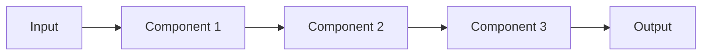
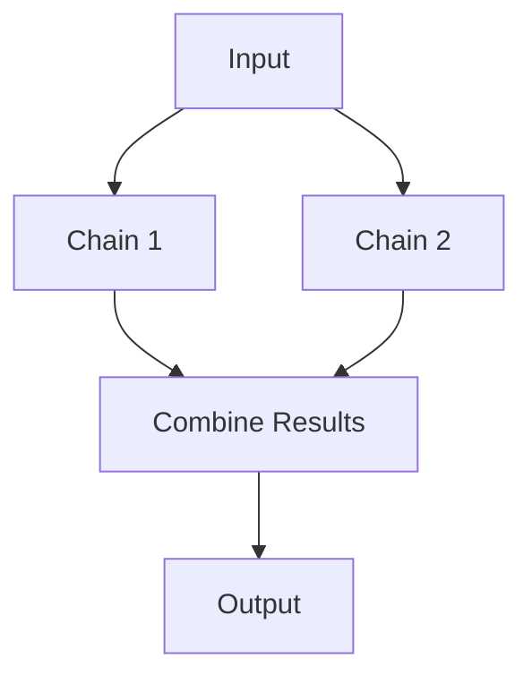
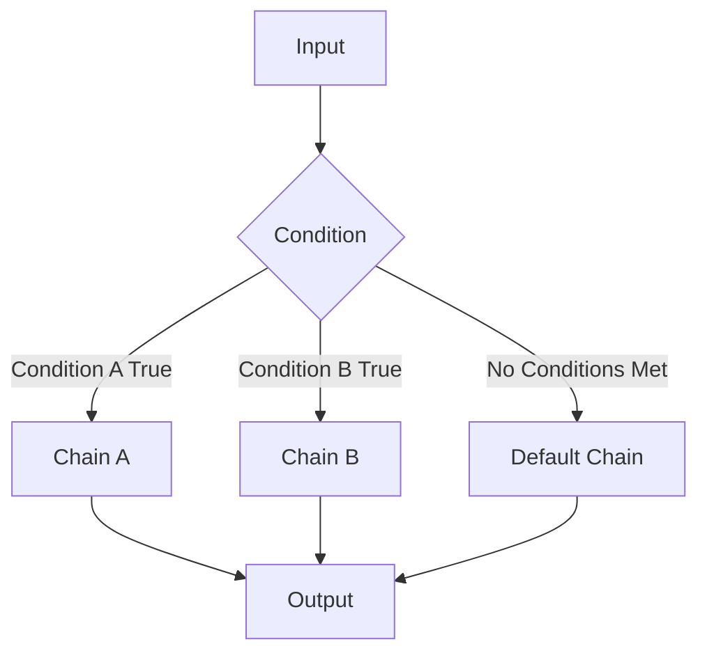

# LangChain Chains: Building Powerful LLM Pipelines

## Table of Contents
- [Introduction](#introduction)
- [Understanding Chains](#understanding-chains)
- [Types of Chains](#types-of-chains)
  - [Sequential Chains](#sequential-chains)
  - [Parallel Chains](#parallel-chains)
  - [Conditional Chains](#conditional-chains)
- [LangChain Expression Language (LCEL)](#langchain-expression-language-lcel)
- [Working with Chains](#working-with-chains)
- [Best Practices](#best-practices)
- [Advanced Concepts](#advanced-concepts)
- [Summary](#summary)

## Introduction

Welcome to this comprehensive guide on Chains in LangChain, one of the most fundamental and powerful components of the framework. In fact, LangChain is named after this concept because of how central it is to the library's functionality.

In previous sections, we've covered:
1. **Models** - How to interact with different types of AI models
2. **Prompts** - How to design effective prompts to send to LLMs
3. **Output Parsers** - How to generate structured outputs from LLMs

Now, we're moving to Chains, which brings all these components together into cohesive workflows.

## Understanding Chains

### What are Chains?

Chains in LangChain are a way to create pipelines that connect multiple components together to build complex LLM-powered applications. 

When building applications with LLMs, you typically need to execute a series of steps:

1. Prepare a prompt based on user input
2. Send the prompt to an LLM
3. Process the LLM's response
4. (Optionally) Send the processed response to another component

Without chains, you would need to manually execute each step and manage the flow of data between them. Chains automate this process by connecting components together so that the output of one component becomes the input to the next.

### Why Use Chains?

Chains provide several significant benefits:

1. **Automation**: Connect multiple steps into a streamlined workflow
2. **Reusability**: Create modular components that can be reused across applications
3. **Simplicity**: Reduce boilerplate code and focus on application logic
4. **Flexibility**: Build complex workflows with different patterns (sequential, parallel, conditional)
5. **Visibility**: Visualize and debug your application flow more easily

### The Basic Chain Architecture

At its simplest, a chain consists of:

```
INPUT → COMPONENT 1 → COMPONENT 2 → ... → COMPONENT N → OUTPUT
```

Where components can be:
- Prompts
- LLMs
- Output parsers
- Other chains
- Custom functions

## Types of Chains

LangChain supports three primary types of chains, each with its own use cases:

### Sequential Chains

Sequential chains execute components one after another in a linear fashion, where the output of one component becomes the input to the next.



#### Basic Sequential Chain Example

Let's implement a simple sequential chain that:
1. Takes a topic from the user
2. Generates five interesting facts about that topic

```python
from langchain.chat_models import ChatOpenAI
from langchain.prompts import PromptTemplate
from langchain.output_parsers import StrOutputParser

# Create the prompt template
prompt = PromptTemplate.from_template(
    "Generate five interesting facts about {topic}"
)

# Create the model
model = ChatOpenAI()

# Create the parser
parser = StrOutputParser()

# Create the chain
chain = prompt | model | parser

# Invoke the chain
result = chain.invoke({"topic": "cricket"})
print(result)
```

This code creates a chain that:
1. Takes a topic input and formats it into a prompt
2. Sends the prompt to the ChatOpenAI model
3. Parses the model output into a string
4. Returns the result

#### Multi-Step Sequential Chain

We can extend this to create more complex sequential chains that involve multiple LLM calls:

```python
# Create the first prompt to generate a detailed report
prompt_1 = PromptTemplate.from_template(
    "Generate a detailed report on {topic}"
)

# Create the second prompt to summarize the report
prompt_2 = PromptTemplate.from_template(
    "Generate a five-point summary from the following text:\n\n{text}"
)

# Create the model and parser
model = ChatOpenAI()
parser = StrOutputParser()

# Create the chain
chain = (
    {"topic": lambda x: x}
    | prompt_1
    | model
    | parser
    | {"text": lambda x: x}
    | prompt_2
    | model
    | parser
)

# Invoke the chain
result = chain.invoke("unemployment in India")
print(result)
```

This chain:
1. Takes a topic and generates a detailed report using the first LLM call
2. Takes that report and summarizes it into five points using a second LLM call

#### Visualizing Chains

One of the great features of LangChain is the ability to visualize your chains. This helps in understanding and debugging the flow of data:

```python
# Print the chain structure
print(chain.get_graph().print_ascii())
```

This will output a text-based visualization of your chain, showing all components and how they're connected.

### Parallel Chains

Parallel chains execute multiple chains simultaneously and then combine their results. This is useful when you need to perform independent operations on the same input.



#### Parallel Chain Example

Let's build an application that takes a piece of text and generates both study notes and quiz questions from it in parallel:

```python
from langchain.chat_models import ChatOpenAI
from langchain.chat_models import ChatAnthropic  # Alternative model
from langchain.prompts import PromptTemplate
from langchain.output_parsers import StrOutputParser
from langchain.schema.runnable import RunnableParallel

# Create the models
model_1 = ChatOpenAI()
model_2 = ChatAnthropic(model="claude-3-haiku-20240307")  # Or another model of your choice

# Create the prompts
notes_prompt = PromptTemplate.from_template(
    "Generate short and simple notes from the following text:\n\n{text}"
)

quiz_prompt = PromptTemplate.from_template(
    "Generate five short question-answers from the following text:\n\n{text}"
)

merge_prompt = PromptTemplate.from_template(
    "Merge the provided notes and quiz into a single document:\n\nNOTES:\n{notes}\n\nQUIZ:\n{quiz}"
)

# Create the parser
parser = StrOutputParser()

# Create the parallel chains
parallel_chain = RunnableParallel(
    notes=notes_prompt | model_1 | parser,
    quiz=quiz_prompt | model_2 | parser
)

# Create the merging chain
merge_chain = (
    merge_prompt
    | model_1
    | parser
)

# Connect the parallel chain to the merge chain
chain = parallel_chain | merge_chain

# Sample text to process
text = """
Support Vector Machine (SVM) is a supervised machine learning algorithm that can be used for 
both classification and regression tasks. However, it is widely used in classification problems. 
SVM works by finding the optimal hyperplane that best separates the data into different classes. 
The hyperplane is chosen to maximize the margin, which is the distance between the hyperplane 
and the nearest data points from each class, called support vectors. These support vectors are 
critical in defining the hyperplane. SVMs can efficiently perform non-linear classification using 
the kernel trick, which implicitly maps inputs into high-dimensional feature spaces.
"""

# Run the chain
result = chain.invoke({"text": text})
print(result)
```

This application:
1. Takes a text input and processes it in two parallel chains
   - One chain generates study notes
   - The other chain generates quiz questions
2. Combines the results of both chains in a merging step
3. Returns the final combined document

### Conditional Chains

Conditional chains allow for different execution paths based on certain conditions, similar to if-else statements in programming.



#### Conditional Chain Example

Let's build a sentiment analysis application that:
1. Analyzes the sentiment of a customer feedback message
2. Generates an appropriate response based on whether the sentiment is positive or negative

```python
from langchain.chat_models import ChatOpenAI
from langchain.prompts import PromptTemplate
from langchain.output_parsers import StrOutputParser, PydanticOutputParser
from langchain.schema.runnable import RunnableBranch
from pydantic import BaseModel, Field
from typing import Literal

# Define the feedback sentiment model
class FeedbackSentiment(BaseModel):
    sentiment: Literal["positive", "negative"] = Field(description="The sentiment of the feedback")

# Create the sentiment analysis components
sentiment_prompt = PromptTemplate.from_template(
    "Classify the sentiment of the following feedback text into positive or negative:\n\n{feedback}\n\n{format_instructions}"
)
sentiment_parser = PydanticOutputParser(pydantic_object=FeedbackSentiment)

# Create the response prompts
positive_prompt = PromptTemplate.from_template(
    "Write a friendly response thanking the user for their positive feedback:\n\n{feedback}"
)

negative_prompt = PromptTemplate.from_template(
    "Write an apologetic response addressing the user's negative feedback:\n\n{feedback}"
)

# Create the model and string parser
model = ChatOpenAI()
str_parser = StrOutputParser()

# Create the classifier chain
classifier_chain = (
    sentiment_prompt.partial(format_instructions=sentiment_parser.get_format_instructions())
    | model
    | sentiment_parser
)

# Create the branching logic
branch_chain = RunnableBranch(
    (lambda x: x.sentiment == "positive", positive_prompt | model | str_parser),
    (lambda x: x.sentiment == "negative", negative_prompt | model | str_parser),
    # Default branch if no conditions match
    lambda _: "Could not determine sentiment."
)

# Create the final chain
chain = classifier_chain | branch_chain

# Test with different feedback
positive_feedback = "This is a wonderful smartphone! The camera quality is excellent and battery life is impressive."
negative_feedback = "This is a terrible smartphone. It keeps crashing and the battery drains too quickly."

# Run the chain with positive feedback
result = chain.invoke({"feedback": positive_feedback})
print("RESPONSE TO POSITIVE FEEDBACK:")
print(result)

# Run the chain with negative feedback
result = chain.invoke({"feedback": negative_feedback})
print("\nRESPONSE TO NEGATIVE FEEDBACK:")
print(result)
```

This application:
1. Takes customer feedback as input
2. Classifies the sentiment as positive or negative
3. Based on the classification:
   - For positive feedback: Generates a thank you response
   - For negative feedback: Generates an apologetic response
4. Returns the appropriate response

## LangChain Expression Language (LCEL)

The examples above use LangChain Expression Language (LCEL), a declarative way to compose chains using the pipe (`|`) operator. LCEL allows for intuitive and concise creation of chains.

### Key Features of LCEL

1. **Pipe Operator (`|`)**: Connect components together with a syntax similar to Unix pipes
2. **Dictionary Composition**: Pass multiple inputs to a component using dictionaries
3. **Lambda Functions**: Transform data between components
4. **Partial Application**: Pre-configure components with some fixed inputs

### Basic LCEL Patterns

```python
# Simple sequential chain
chain = prompt | model | parser

# Chain with data transformation
chain = (
    {"topic": lambda x: x}
    | prompt
    | model
    | parser
)

# Chain with partial configuration
chain = prompt.partial(format_instructions="...") | model | parser
```

LCEL is a powerful way to create chains with minimal boilerplate code. It's recommended for most LangChain applications and is actively developed as a core feature of the framework.

## Working with Chains

### Invoking Chains

To run a chain with input, use the `invoke` method:

```python
result = chain.invoke({"topic": "machine learning"})
# or for simpler chains that take a single string input
result = chain.invoke("machine learning")
```

### Streaming Responses

For long responses, you may want to stream the output rather than waiting for the entire response:

```python
for chunk in chain.stream({"topic": "machine learning"}):
    print(chunk, end="", flush=True)
```

### Batch Processing

To process multiple inputs at once:

```python
results = chain.batch([{"topic": "AI"}, {"topic": "Blockchain"}, {"topic": "Cloud Computing"}])
```

### Asynchronous Execution

For applications that need non-blocking calls:

```python
import asyncio

async def run_chain():
    result = await chain.ainvoke({"topic": "quantum computing"})
    return result

asyncio.run(run_chain())
```

## Best Practices

### 1. Design for Modularity

Break your application into reusable components that can be combined in different ways:

```python
# Create reusable prompt templates
summary_prompt = PromptTemplate.from_template("Summarize the following: {text}")
translate_prompt = PromptTemplate.from_template("Translate to {language}: {text}")

# Combine them as needed
summary_chain = summary_prompt | model | parser
translation_chain = translate_prompt | model | parser
summary_then_translate = summary_chain | translation_chain
```

### 2. Handle Errors Gracefully

LLM calls can fail for various reasons (API errors, rate limits, etc.). Build error handling into your chains:

```python
from langchain.schema.runnable import RunnablePassthrough

def fallback_response(error):
    return "Sorry, I couldn't process that request. Please try again later."

# Create a chain with error handling
robust_chain = chain.with_fallbacks([fallback_response])
```

### 3. Add Observability

For complex chains, add tracing to understand what's happening at each step:

```python
from langchain.callbacks import get_openai_callback

with get_openai_callback() as cb:
    result = chain.invoke({"topic": "astronomy"})
    print(f"Total Tokens: {cb.total_tokens}")
    print(f"Prompt Tokens: {cb.prompt_tokens}")
    print(f"Completion Tokens: {cb.completion_tokens}")
    print(f"Total Cost (USD): ${cb.total_cost}")
```

### 4. Cache Results

Cache expensive LLM calls to improve performance and reduce costs:

```python
from langchain.cache import InMemoryCache
from langchain.globals import set_llm_cache

# Set up caching
set_llm_cache(InMemoryCache())

# Now repeated identical calls will use cached results
```

### 5. Test with Multiple Inputs

Ensure your chains handle different inputs gracefully:

```python
test_inputs = [
    {"topic": "a very short topic"},
    {"topic": "a topic with special characters: !@#$%^&*()"},
    {"topic": "a very very very very very very very very very very very very very very very long topic"},
    {"topic": ""}  # Empty input
]

for input in test_inputs:
    try:
        result = chain.invoke(input)
        print(f"SUCCESS: {input} -> {result[:50]}...")
    except Exception as e:
        print(f"ERROR: {input} -> {str(e)}")
```

## Advanced Concepts

### Memory in Chains

For applications that need to maintain context across multiple turns:

```python
from langchain.memory import ConversationBufferMemory
from langchain.chains import ConversationChain

memory = ConversationBufferMemory()
conversation_chain = ConversationChain(llm=ChatOpenAI(), memory=memory)

# First interaction
response = conversation_chain.run("Hi, my name is Alice.")
print(response)  # The model now knows the user's name

# Second interaction
response = conversation_chain.run("What's my name?")
print(response)  # The model can recall the user's name
```

### Dynamic Chains

Create chains that adapt based on runtime conditions:

```python
from langchain.agents import initialize_agent, Tool
from langchain.tools import BaseTool

# Define tools
tools = [
    Tool(
        name="Search",
        func=lambda query: "Search results for: " + query,
        description="Useful for searching information"
    ),
    Tool(
        name="Calculator",
        func=lambda query: eval(query),
        description="Useful for performing calculations"
    )
]

# Create an agent that dynamically decides which tools to use
agent = initialize_agent(
    tools, 
    ChatOpenAI(temperature=0), 
    agent="zero-shot-react-description",
    verbose=True
)

result = agent.run("What is 234 * 789?")
```

### Custom Components

Extend LangChain by creating your own custom components:

```python
from langchain.schema.runnable import RunnablePassthrough
from langchain.schema.output_parser import StrOutputParser

class SentimentScorer:
    def __init__(self):
        pass
        
    def score(self, text):
        # Simplified example - in reality, you'd use a proper sentiment model
        positive_words = ["good", "great", "excellent", "amazing", "wonderful"]
        negative_words = ["bad", "terrible", "awful", "horrible", "poor"]
        
        score = 0
        for word in positive_words:
            score += text.lower().count(word)
        for word in negative words:
            score -= text.lower().count(word)
            
        return {"text": text, "sentiment_score": score}

# Create a custom component
sentiment_scorer = RunnablePassthrough() | (lambda x: SentimentScorer().score(x))

# Use it in a chain
chain = prompt | model | parser | sentiment_scorer

result = chain.invoke({"topic": "customer review"})
print(f"Sentiment score: {result['sentiment_score']}")
```

## Summary

Chains are the backbone of LangChain, allowing you to connect multiple components into powerful workflows that can solve complex problems.

### Key Takeaways

1. **Types of Chains**:
   - **Sequential Chains**: Execute components in order
   - **Parallel Chains**: Execute multiple chains simultaneously
   - **Conditional Chains**: Execute different paths based on conditions

2. **Benefits**:
   - Automation of workflow steps
   - Code reusability and modularity
   - Simplified application development
   - Flexible architecture patterns

3. **LangChain Expression Language (LCEL)**:
   - A declarative way to compose chains
   - Uses the pipe operator (`|`) for intuitive composition
   - Supports dictionary inputs, lambda functions, and partial configuration

4. **Best Practices**:
   - Design for modularity
   - Handle errors gracefully
   - Add observability
   - Cache results
   - Test with diverse inputs

By mastering chains, you'll be able to build sophisticated LLM applications that are maintainable, efficient, and powerful. In the next section, we'll explore Runnables, which are the underlying concept that powers chains in LangChain.