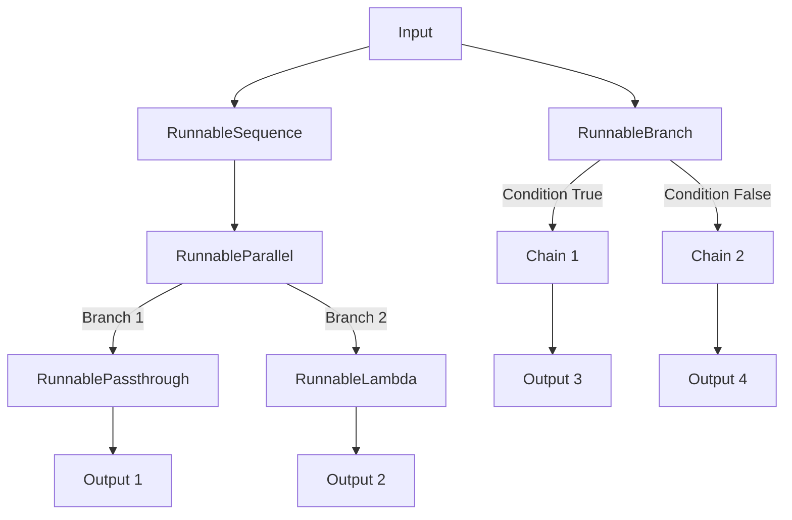

# LangChain Runnables

## Introduction to Runnables

Runnables are one of the most important concepts in LangChain, forming the foundation of the LangChain Expression Language (LCEL). In fact, runnables are so central to LangChain that the framework itself was named after this concept. This document provides a comprehensive understanding of runnables, their types, and how they power the flexible workflows in LangChain.

## What are Runnables?

Runnables in LangChain are standardized components that implement a common interface, allowing them to be easily composed together to build complex AI application workflows. At their core, runnables are callable objects that:

1. Accept inputs
2. Process those inputs according to their specific functionality
3. Return outputs in a standardized format
4. Can be seamlessly connected with other runnables

The standardization of runnables makes it possible to create pipelines where the output of one component automatically becomes the input for the next component. This eliminates the need to manually handle each step's inputs and outputs, greatly simplifying the development process.

## The Evolution of Runnables

When LangChain was first created, it offered various components like prompts, language models, retrievers, and parsers. However, these components weren't standardized - they used different methods to interact with them:

- Prompts had a `format()` method
- Language models had a `predict()` method
- Parsers had a `parse()` method
- Retrievers had a `get_relevant_documents()` method

This inconsistency made it difficult to connect these components effectively. The LangChain team recognized this challenge and introduced runnables as a solution. They created an abstract class that all components would inherit from, ensuring they implement a standard set of methods, including the crucial `invoke()` method.

## Types of Runnables

Runnables can be broadly categorized into two types:

### 1. Task-Specific Runnables

These are core LangChain components that have been converted into runnables. Their purpose is to perform specific tasks within an LLM application:

- **ChatModels**: Interact with language models (e.g., `ChatOpenAI`)
- **PromptTemplates**: Design prompts with variable substitution
- **OutputParsers**: Convert LLM outputs into structured formats
- **Retrievers**: Fetch relevant documents from vector stores

### 2. Runnable Primitives

These are fundamental building blocks used to structure execution logic in AI workflows. They help orchestrate execution by defining how different runnables interact:

- **RunnableSequence**: Connects runnables sequentially
- **RunnableParallel**: Executes multiple runnables in parallel
- **RunnableBranch**: Implements conditional logic to choose execution paths
- **RunnableLambda**: Converts Python functions into runnables
- **RunnablePassthrough**: Passes inputs unchanged to outputs

Let's explore each of these primitive runnables in detail.

## Runnable Primitives in Detail

### RunnableSequence

`RunnableSequence` allows you to connect multiple runnables in sequence, where the output of one runnable becomes the input for the next. This is the most commonly used primitive.

Here's a simple example of generating a joke about a given topic:

```python
from langchain_openai import ChatOpenAI
from langchain_core.prompts import PromptTemplate
from langchain_core.output_parsers import StringOutputParser
from langchain_core.runnables import RunnableSequence

# Initialize components
prompt = PromptTemplate(
    template="Write a joke about {topic}",
    input_variables=["topic"]
)
model = ChatOpenAI()
parser = StringOutputParser()

# Create a chain using RunnableSequence
chain = RunnableSequence(
    [prompt, model, parser]
)

# Execute the chain
result = chain.invoke({"topic": "AI"})
print(result)
```

With LangChain Expression Language (LCEL), this can be written more elegantly using the pipe operator:

```python
chain = prompt | model | parser
result = chain.invoke({"topic": "AI"})
print(result)
```

### RunnableParallel

`RunnableParallel` allows you to execute multiple runnables in parallel, with each receiving the same input. The results are returned as a dictionary with keys corresponding to the names you provide.

Here's an example that generates both a tweet and a LinkedIn post about a topic:

```python
from langchain_core.runnables import RunnableParallel

# Create prompt templates
tweet_prompt = PromptTemplate(
    template="Generate a tweet about {topic}",
    input_variables=["topic"]
)
linkedin_prompt = PromptTemplate(
    template="Generate a LinkedIn post about {topic}",
    input_variables=["topic"]
)

# Create chains for each prompt
tweet_chain = tweet_prompt | model | parser
linkedin_chain = linkedin_prompt | model | parser

# Create a parallel chain
parallel_chain = RunnableParallel(
    tweet=tweet_chain,
    linkedin=linkedin_chain
)

# Execute the parallel chain
result = parallel_chain.invoke({"topic": "AI"})
print("Tweet:", result["tweet"])
print("LinkedIn post:", result["linkedin"])
```

### RunnablePassthrough

`RunnablePassthrough` is a special primitive that simply passes its input directly to its output without any modifications. This is useful when you need to preserve original inputs while processing them in parallel branches.

Here's an example that generates a joke about a topic and then explains it, showing both the joke and explanation:

```python
from langchain_core.runnables import RunnablePassthrough

# Create initial joke generation chain
joke_chain = prompt | model | parser

# Create joke explanation prompt
explain_prompt = PromptTemplate(
    template="Explain the following joke: {text}",
    input_variables=["text"]
)

# Create explanation chain
explain_chain = explain_prompt | model | parser

# Create parallel processing chain
parallel_chain = RunnableParallel(
    joke=RunnablePassthrough(),
    explanation=explain_chain
)

# Connect the chains
final_chain = joke_chain | parallel_chain

# Execute the chain
result = final_chain.invoke({"topic": "programming"})
print("Joke:", result["joke"])
print("Explanation:", result["explanation"])
```

### RunnableLambda

`RunnableLambda` converts any Python function into a runnable. This is extremely useful when you need to incorporate custom logic into your LangChain workflows.

Here's an example that counts words in a generated joke:

```python
from langchain_core.runnables import RunnableLambda

# Create a word counting function
def count_words(text):
    return len(text.split())

# Convert function to a runnable
word_counter = RunnableLambda(count_words)

# Create parallel chain to show joke and word count
parallel_chain = RunnableParallel(
    joke=RunnablePassthrough(),
    word_count=word_counter
)

# Connect chains
final_chain = joke_chain | parallel_chain

# Execute the chain
result = final_chain.invoke({"topic": "programming"})
print(f"Joke: {result['joke']}")
print(f"Word count: {result['word_count']}")
```

### RunnableBranch

`RunnableBranch` implements conditional logic, allowing you to choose different execution paths based on the input. Think of it as an if-else statement in the LangChain universe.

Here's an example that either summarizes a report if it's longer than 300 words or returns it as-is if it's shorter:

```python
from langchain_core.runnables import RunnableBranch

# Create report generation prompt
report_prompt = PromptTemplate(
    template="Write a detailed report on {topic}",
    input_variables=["topic"]
)

# Create summary prompt
summary_prompt = PromptTemplate(
    template="Summarize the following text:\n{text}",
    input_variables=["text"]
)

# Create report generation chain
report_chain = report_prompt | model | parser

# Create branch chain
branch_chain = RunnableBranch(
    (lambda x: len(x.split()) > 300, summary_prompt | model | parser),
    RunnablePassthrough()
)

# Connect chains
final_chain = report_chain | branch_chain

# Execute the chain
result = final_chain.invoke({"topic": "artificial intelligence"})
print(result)
```

## LangChain Expression Language (LCEL)

LangChain Expression Language (LCEL) is a declarative way to define chains in LangChain. It uses the pipe operator (`|`) to connect runnables sequentially, making code more readable and concise.

Instead of writing:

```python
chain = RunnableSequence([prompt, model, parser])
```

You can write:

```python
chain = prompt | model | parser
```

This approach is not only more readable but also more maintainable. Currently, LCEL supports sequential chaining through the pipe operator, but future versions of LangChain may introduce similar declarative syntax for other runnable primitives.

## Working with Runnables

Runnables provide a consistent interface with several key methods:

### 1. Invoking Runnables

The primary way to execute a runnable is through the `invoke()` method:

```python
result = chain.invoke({"topic": "artificial intelligence"})
```

### 2. Streaming Results

For applications requiring real-time responses, you can use the `stream()` method:

```python
for chunk in chain.stream({"topic": "artificial intelligence"}):
    print(chunk, end="", flush=True)
```

### 3. Batch Processing

To process multiple inputs efficiently, use the `batch()` method:

```python
topics = [{"topic": "AI"}, {"topic": "machine learning"}, {"topic": "neural networks"}]
results = chain.batch(topics)
for result in results:
    print(result)
```

### 4. Async Execution

For non-blocking operation in async contexts, use `ainvoke()`, `astream()`, or `abatch()`:

```python
import asyncio

async def main():
    result = await chain.ainvoke({"topic": "quantum computing"})
    print(result)

asyncio.run(main())
```

## Best Practices for Working with Runnables

1. **Standardize Input/Output Formats**: Ensure consistency in how data flows between runnables.

2. **Use Type Annotations**: Leverage Python's type hints to document expected input and output formats.

3. **Error Handling**: Implement proper error handling strategies, especially when composing multiple runnables.

4. **Testing**: Test complex chains with representative inputs to ensure they behave as expected.

5. **Modularity**: Design runnables to be modular and reusable across different parts of your application.

6. **Monitor Performance**: For production applications, monitor the performance of your runnables to identify bottlenecks.

7. **Use LCEL**: Prefer the pipe operator syntax for better readability when creating sequential chains.

## Advanced Concepts

### Custom Runnables

You can create custom runnables by implementing the `Runnable` protocol:

```python
from typing import Any, Dict
from langchain_core.runnables import Runnable

class MyCustomRunnable(Runnable):
    def invoke(self, input: Dict[str, Any]) -> str:
        # Custom processing logic
        return f"Processed: {input['text']}"
```

### Debugging Runnables

For debugging complex chains, use `chain.get_graph().print_ascii()` to visualize the structure:

```python
chain.get_graph().print_ascii()
```

### Configuring Runnables

Runnables can be configured at invocation time:

```python
# Configure temperature for a specific invocation
result = chain.invoke({"topic": "AI"}, config={"configurable": {"temperature": 0.7}})
```

## Summary

Runnables are the building blocks of LangChain applications. They provide a standardized way to connect different components, making it easy to create complex AI workflows with minimal code.

The core runnable primitives - RunnableSequence, RunnableParallel, RunnablePassthrough, RunnableLambda, and RunnableBranch - give you the flexibility to create virtually any workflow you can imagine, from simple sequential processing to complex conditional branching and parallel execution.

By understanding runnables and the LangChain Expression Language, you can build powerful, modular, and maintainable LLM applications efficiently.

