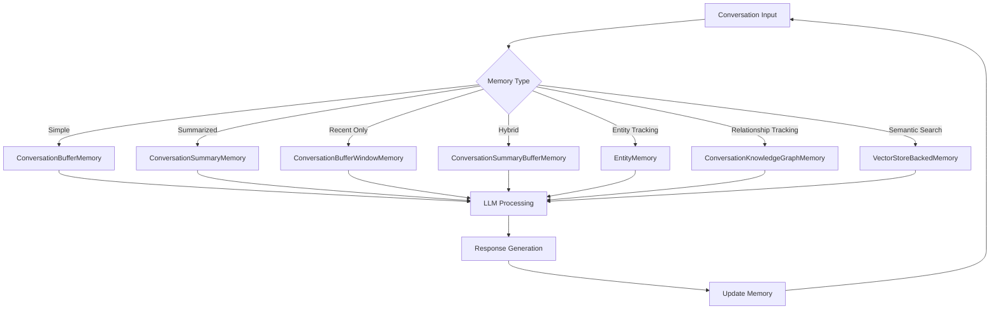

# LangChain Memory: Building Conversational Intelligence

## Table of Contents
- [LangChain Memory: Building Conversational Intelligence](#langchain-memory-building-conversational-intelligence)
  - [Table of Contents](#table-of-contents)
  - [Introduction](#introduction)
  - [Why Memory Matters](#why-memory-matters)
  - [Memory Approaches in LLM Applications](#memory-approaches-in-llm-applications)
    - [1. Built-in Model Memory](#1-built-in-model-memory)
    - [2. Prompt-Based Memory](#2-prompt-based-memory)
    - [3. External Storage and Retrieval](#3-external-storage-and-retrieval)
  - [Memory Types in LangChain](#memory-types-in-langchain)
    - [ConversationBufferMemory](#conversationbuffermemory)
    - [ConversationSummaryMemory](#conversationsummarymemory)
    - [ConversationBufferWindowMemory](#conversationbufferwindowmemory)
    - [ConversationSummaryBufferMemory](#conversationsummarybuffermemory)
    - [EntityMemory](#entitymemory)
    - [ConversationKnowledgeGraphMemory](#conversationknowledgegraphmemory)
    - [VectorStoreBackedMemory](#vectorstorebackedmemory)
  - [Best Practices](#best-practices)
    - [1. Match Memory Type to Use Case](#1-match-memory-type-to-use-case)
    - [2. Consider Token Economy](#2-consider-token-economy)
    - [3. Implement Memory Persistence](#3-implement-memory-persistence)
    - [4. Provide Transparency to Users](#4-provide-transparency-to-users)
    - [5. Address Privacy Concerns](#5-address-privacy-concerns)
  - [Memory in LangGraph](#memory-in-langgraph)
  - [Summary](#summary)

## Introduction

Memory is one of the most critical components in building effective conversational AI systems. Without memory, language models respond to each prompt in isolation, unable to remember previous interactions or maintain context over time. This creates disjointed conversations that feel unnatural and lack the continuity humans expect.

LangChain provides a robust framework for implementing different types of memory in your LLM applications, allowing your AI to maintain conversation context, track entities, build knowledge graphs, and deliver more coherent and personalized interactions.

## Why Memory Matters

Memory is essential in LLM applications for several key reasons:

1. **Human-like Interactions**: Humans naturally expect conversation partners to remember previous exchanges. When an AI recalls details from earlier in the conversation, it creates a more natural and satisfying user experience.

2. **Context Maintenance**: Many questions and statements only make sense in the context of previous exchanges. Memory allows the AI to interpret these contextual references correctly.

3. **Personalization**: By remembering user preferences, characteristics, and previous interactions, AI can provide more personalized and relevant responses.

4. **Efficiency**: Without memory, users would need to restate relevant information in every prompt, making conversations tedious and inefficient.

## Memory Approaches in LLM Applications

There have been several approaches to implementing memory in LLM applications:

### 1. Built-in Model Memory

Some attempts have been made to build memory capabilities directly into transformer models. However, this approach hasn't been optimal, even with the most advanced models from OpenAI and Anthropic as of 2025. Built-in memory remains limited, which is why external memory management is the preferred approach.

### 2. Prompt-Based Memory

The simplest approach is to include conversation history directly in the prompt. For example:

```python
system_message = "You are a digital assistant named Alex who enjoys talking with Harish."
history = [
    {"role": "user", "content": "Hi, I'm Harish. I love photography."},
    {"role": "assistant", "content": "Hi Harish! I'm Alex. Photography is fascinating!"},
    {"role": "user", "content": "I mostly take nature shots, especially birds."},
    {"role": "assistant", "content": "Bird photography requires such patience and precision!"}
]
new_user_message = "Hi Alex, remember my bird photography?"
```

By including the entire conversation history in the prompt, the model can respond with appropriate context. However, this approach has significant limitations:

- **Context Window Constraints**: Even the most advanced models have token limits (e.g., 128K tokens for GPT-4). As conversations grow, they will eventually exceed these limits.
- **Cost Inefficiency**: Including the entire conversation history in every prompt increases token usage and costs.
- **Performance Issues**: Large prompts can slow down model response times.

### 3. External Storage and Retrieval

A more advanced approach is to store conversation history in external systems (databases, vector stores, etc.) and selectively retrieve relevant information when needed. This approach is particularly effective for long conversations or when incorporating external knowledge.

## Memory Types in LangChain

LangChain offers several memory implementations, each designed for different use cases and with unique strengths and limitations:

### ConversationBufferMemory

This is the most basic form of memory in LangChain. It simply stores the complete conversation history (messages from both the human and AI) and includes it in future prompts.

```python
from langchain.memory import ConversationBufferMemory
from langchain.chains import ConversationChain
from langchain.chat_models import ChatOpenAI

# Initialize the memory
memory = ConversationBufferMemory()

# Create a conversation chain with the memory
conversation = ConversationChain(
    llm=ChatOpenAI(model="gpt-4", temperature=0),
    memory=memory,
    verbose=True
)

# First interaction
conversation.predict(input="Hi there, I'm Harish.")
# Output: "Hello Harish, it's great to meet you..."

# Second interaction
conversation.predict(input="How are you today?")
# The prompt now includes the previous exchange
```

**How it works:**
- The entire conversation history is stored verbatim in a buffer.
- For each new prompt, the complete history is included in the context.
- No processing or summarization is performed.

**Advantages:**
- Simple to implement and understand
- Preserves all conversation details exactly as they occurred
- Perfect for short conversations

**Limitations:**
- Not scalable for lengthy conversations due to context window limitations
- Can become expensive as token count increases
- No filtering or prioritization of information

### ConversationSummaryMemory

Instead of storing the full conversation verbatim, this memory type periodically creates a summary of the conversation history using an LLM. This summary replaces the detailed history to save tokens.

```python
from langchain.memory import ConversationSummaryMemory

memory = ConversationSummaryMemory(llm=ChatOpenAI(model="gpt-4", temperature=0))
conversation = ConversationChain(
    llm=ChatOpenAI(model="gpt-4", temperature=0),
    memory=memory,
    verbose=True
)

# After several interactions
# Instead of storing all messages, it will contain a summary like:
# "Harish introduced himself to the AI. They discussed photography, 
# particularly Harish's interest in bird photography. The AI expressed 
# appreciation for the technical skill required in wildlife photography."
```

**How it works:**
- After each exchange, the memory uses an LLM to generate a concise summary of the conversation so far.
- Only this summary (not the raw conversation) is included in future prompts.
- The summary is continually updated as the conversation progresses.

**Advantages:**
- Significantly reduces token usage for long conversations
- Maintains essential context while discarding less important details
- More scalable than buffer memory for extended interactions

**Limitations:**
- May lose specific details that could be important later
- Requires additional LLM calls to generate summaries, adding latency and cost
- Summary quality depends on the underlying LLM

### ConversationBufferWindowMemory

This memory type keeps only the most recent K interactions in the conversation history, discarding older exchanges.

```python
from langchain.memory import ConversationBufferWindowMemory

# Only keep the last 2 interactions in memory
memory = ConversationBufferWindowMemory(k=2)
conversation = ConversationChain(
    llm=ChatOpenAI(model="gpt-4", temperature=0),
    memory=memory,
    verbose=True
)

# First interaction
conversation.predict(input="Hi there, I'm Harish.")
# Second interaction
conversation.predict(input="Can you write me a LinkedIn post?")
# Third interaction
conversation.predict(input="Make it about AI in healthcare.")

# At this point, the memory only contains the second and third interactions
# The first interaction has been forgotten
```

**How it works:**
- Maintains a fixed-size window of the most recent K conversation turns.
- When new messages arrive, the oldest messages are removed to maintain the window size.
- Only messages within this window are included in future prompts.

**Advantages:**
- Keeps token usage constant regardless of conversation length
- Focuses on recent context, which is often most relevant
- Simple to implement and predictable memory usage

**Limitations:**
- Completely loses older context that might still be relevant
- Fixed window size may be too small or large for different conversations
- Can make the AI seem forgetful about earlier topics

### ConversationSummaryBufferMemory

This is a hybrid approach that combines aspects of both buffer and summary memory. It keeps the most recent conversations in a buffer while summarizing older conversations.

```python
from langchain.memory import ConversationSummaryBufferMemory

# Keep messages up to a token limit, then summarize older ones
memory = ConversationSummaryBufferMemory(
    llm=ChatOpenAI(model="gpt-4", temperature=0),
    max_token_limit=200
)
conversation = ConversationChain(
    llm=ChatOpenAI(model="gpt-4", temperature=0),
    memory=memory,
    verbose=True
)
```

**How it works:**
- Tracks the token count of the conversation buffer.
- When the token count exceeds the specified limit, it summarizes the oldest messages.
- The summary and the recent messages (still in buffer) are both included in future prompts.

**Advantages:**
- Balances detail retention with token efficiency
- Preserves exact wording of recent exchanges while maintaining context from older ones
- More flexible than either pure buffer or pure summary approaches

**Limitations:**
- More complex to implement and tune
- Still requires additional LLM calls for summarization
- Finding the optimal token limit requires experimentation

### EntityMemory

Instead of focusing on the chronological flow of conversation, EntityMemory tracks specific entities (people, organizations, products, concepts) mentioned in the conversation and remembers attributes associated with them.

```python
from langchain.memory import ConversationEntityMemory

memory = ConversationEntityMemory(llm=ChatOpenAI(model="gpt-4", temperature=0))
conversation = ConversationChain(
    llm=ChatOpenAI(model="gpt-4", temperature=0),
    memory=memory,
    verbose=True
)

# User: "My cat Whiskers is 3 years old."
# Memory stores: {"whiskers": "cat, age 3"}

# User: "Whiskers likes tuna."
# Memory updates: {"whiskers": "cat, age 3, likes tuna"}

# Later, user asks: "Does Whiskers like fish?"
# The AI can access the entity information to inform its response
```

**How it works:**
- As the conversation progresses, the memory identifies entities and their attributes.
- These are stored in a structured format (typically a dictionary).
- When entities are referenced in later conversations, the memory provides their attributes to the LLM.

**Advantages:**
- More efficient storage, only keeping information about specific entities
- Better organized information, structured by entity
- Easier to update and reference specific details
- Reduces context window usage compared to full conversation storage

**Limitations:**
- May miss contextual information that isn't tied to specific entities
- Requires more sophisticated parsing to identify entities and attributes
- Entity extraction may not always be accurate

### ConversationKnowledgeGraphMemory

This memory type extends EntityMemory by not just tracking entities and their attributes, but also the relationships between different entities, creating a knowledge graph.

```python
from langchain.memory import ConversationKnowledgeGraphMemory

memory = ConversationKnowledgeGraphMemory(llm=ChatOpenAI(model="gpt-4", temperature=0))
conversation = ConversationChain(
    llm=ChatOpenAI(model="gpt-4", temperature=0),
    memory=memory,
    verbose=True
)

# User: "John works at Apple."
# Graph stores: (John) -[works at]-> (Apple)

# User: "Apple makes iPhones."
# Graph stores: (Apple) -[makes]-> (iPhones)

# User: "Who makes John's company's products?"
# The AI can follow the path: John -[works at]-> Apple -[makes]-> iPhones
```

**How it works:**
- Creates a graph structure where entities are nodes and relationships are edges.
- As new information is introduced, it updates this graph accordingly.
- For answering questions, it can traverse the graph to find connections between entities.

**Advantages:**
- Stores relationships between facts, not just the facts themselves
- Can answer complex questions by following connection paths
- Information is stored as a network, not just a list
- More structured representation of knowledge than raw text

**Limitations:**
- More complex to implement and maintain
- Relationship extraction may not always be accurate
- May not capture nuanced or ambiguous relationships well

### VectorStoreBackedMemory

This advanced memory type uses vector embeddings and semantic search to retrieve relevant past conversations based on the current query, rather than including all history.

```python
from langchain.memory import VectorStoreRetrieverMemory
from langchain.embeddings import OpenAIEmbeddings
from langchain.vectorstores import Chroma

# Create embeddings
embeddings = OpenAIEmbeddings()
# Create vector store
vector_store = Chroma(embedding_function=embeddings)
# Create retriever
retriever = vector_store.as_retriever(search_kwargs={"k": 3})
# Create memory
memory = VectorStoreRetrieverMemory(retriever=retriever)

# As conversation happens, messages are stored in the vector store
# When a new query comes, semantically similar previous messages are retrieved
```

**How it works:**
- Conversation turns are converted into vector embeddings that capture their semantic meaning.
- These embeddings are stored in a vector database.
- For each new user input, semantically similar previous exchanges are retrieved and included in the prompt.

**Advantages:**
- Can handle massive amounts of conversation history efficiently
- Retrieves only the most relevant past context for each new query
- Finds relevant information even when different wording is used
- Perfect for long-running conversations or knowledge bases with years of data

**Limitations:**
- More complex to set up and maintain
- Requires additional infrastructure for the vector store
- Embedding generation adds latency and cost
- Quality depends on the embedding model and retrieval strategy

## Best Practices

When implementing memory in your LangChain applications, consider these best practices:

### 1. Match Memory Type to Use Case

Different memory types are suitable for different scenarios:
- **Short, simple conversations**: Use `ConversationBufferMemory`
- **Long conversations with general context**: Use `ConversationSummaryMemory`
- **Focus on recent exchanges**: Use `ConversationBufferWindowMemory`
- **Tracking specific entities**: Use `EntityMemory`
- **Complex relationship tracking**: Use `ConversationKnowledgeGraphMemory`
- **Massive conversation history**: Use `VectorStoreBackedMemory`

### 2. Consider Token Economy

Memory directly impacts token usage, which affects both cost and performance:
- Monitor token usage with different memory implementations
- Set appropriate limits for buffer sizes and summary frequencies
- Consider hybrid approaches for the best balance

### 3. Implement Memory Persistence

For production applications, ensure memory persists across sessions:
- Implement serialization/deserialization of memory objects
- Consider database storage for memory state
- Enable users to clear or manage their conversation history

### 4. Provide Transparency to Users

Users should understand how and what the system remembers:
- Consider adding a feature to view what the AI remembers
- Allow users to correct misconceptions in the AI's memory
- Provide options to delete sensitive information from memory

### 5. Address Privacy Concerns

Memory raises important privacy considerations:
- Clearly communicate what information is being stored
- Implement appropriate data retention policies
- Ensure compliance with relevant privacy regulations
- Consider offering "incognito" modes that don't store history

## Memory in LangGraph

While traditional LangChain memory classes are still useful, the LangChain ecosystem is evolving toward LangGraph for more complex applications. LangGraph offers a more flexible and powerful way to implement memory in agent-based systems.

Unlike the linear flow of traditional chains, LangGraph uses a graph-based approach where nodes can represent different states and components of your application, with memory integrated into the state management system.

```python
from langgraph.graph import StateGraph
from typing import Dict, List

# Define the graph state (including memory)
class GraphState:
    messages: List[Dict]
    memory: Dict

# Create a new graph
graph = StateGraph(GraphState)

# Define nodes
@graph.node
async def call_model(state: GraphState) -> GraphState:
    # Process state, call model, update memory
    return updated_state

# Connect nodes
graph.add_node("call_model", call_model)
graph.set_entry_point("call_model")
```

LangGraph offers several advantages for memory management:
- More flexible state management
- Support for complex agent systems
- Ability to pause execution for human intervention
- Better handling of multi-agent conversations
- Integration with different types of memory simultaneously

## Summary

Memory is a crucial component in building effective LLM applications that can maintain context, remember important details, and deliver coherent, personalized experiences. LangChain provides a comprehensive set of memory implementations to suit different use cases and requirements.

When designing your application, consider the nature of the conversations, the importance of historical context, token efficiency, and the specific entities or relationships you need to track. By selecting the appropriate memory type and implementing best practices, you can create conversational AI experiences that feel natural, informed, and responsive.

As the field evolves, the move toward graph-based systems like LangGraph opens new possibilities for even more sophisticated memory management in complex AI applications.

