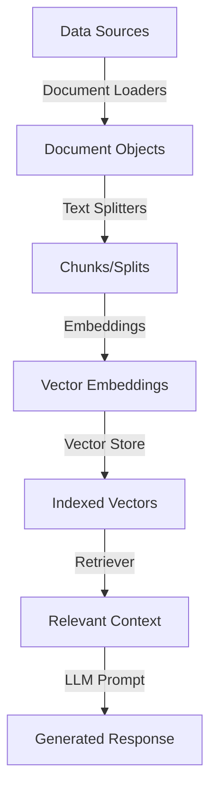

# Document Loaders in LangChain

## Introduction to Document Loaders

Document loaders are essential components in LangChain used to load data from various sources into a standardized format, typically as Document objects. These Document objects can then be used for chunking, embedding, retrieval, and generation in LLM applications, especially in Retrieval Augmented Generation (RAG) systems.

### What is RAG?

Before diving into document loaders, let's understand the context of Retrieval Augmented Generation (RAG):

RAG is a technique that combines information retrieval with language generation, where a model retrieves relevant documents from a knowledge base and then uses them as context to generate accurate and grounded responses.

Key benefits of RAG:
- Access to up-to-date information that might not be in the LLM's training data
- Enhanced privacy as sensitive documents don't need to be shared with external LLM providers
- No limit on document size through effective chunking and retrieval strategies
- Ability to ground responses in specific knowledge sources

RAG has become one of the most powerful trends in the industry for creating LLM applications that can leverage external knowledge bases. Building a RAG-based application involves several key components, with document loaders being the first essential piece.

## Document Loaders Fundamentals

### What are Document Loaders?

Document loaders in LangChain are utilities that:
- Load data from various sources (files, databases, APIs, web pages, etc.)
- Convert this data into a standardized Document format
- Prepare the documents for further processing in the RAG pipeline

Each Document object typically contains:
- `page_content`: The actual content/text of the document
- `metadata`: Information about the document (source, creation date, author, page numbers, etc.)

The standardized Document format ensures consistency throughout the RAG pipeline, regardless of the original data source.

## Common Document Loaders

Let's explore some of the most commonly used document loaders in LangChain:

### 1. Text Loader

TextLoader is one of the simplest document loaders, designed to load plain text files.

```python
from langchain_community.document_loaders import TextLoader

# Initialize the loader with a file path
loader = TextLoader("cricket.txt", encoding="utf-8")

# Load the document
docs = loader.load()

# Print the number of documents
print(len(docs))  # Usually 1 for a single text file

# Access the content of the first document
print(docs[0].page_content)

# Access the metadata
print(docs[0].metadata)
```

TextLoader is ideal for:
- Log files
- Code snippets
- Transcripts
- Simple text documents

### 2. PDF Loader

PyPDFLoader is commonly used for loading PDF documents. It processes PDFs on a page-by-page basis.

```python
from langchain_community.document_loaders import PyPDFLoader

# Initialize the loader with a PDF file path
loader = PyPDFLoader("DL_curriculum.pdf")

# Load the document
docs = loader.load()

# Print the number of documents (equals the number of pages)
print(len(docs))  # Each page becomes a separate Document

# Access content of the first page
print(docs[0].page_content)

# Access metadata including page information
print(docs[0].metadata)
```

PyPDFLoader characteristics:
- Creates one Document object per page in the PDF
- Each Document includes page_content and metadata (with page numbers)
- Works well with simple text-based PDFs
- Uses the pypdf library internally

For more complex PDF formats, LangChain offers specialized loaders:
- PDFPlumberLoader: Better for extracting tabular data
- UnstructuredPDFLoader: Better for scanned images in PDFs
- AmazonTextractPDFLoader: Leverages AWS Textract for complex layouts
- PyMuPDFLoader: Better for complex layouts
- UnstructuredPDFLoader: For structured extraction from PDFs

### 3. Directory Loader

DirectoryLoader allows loading multiple documents from a directory in one operation.

```python
from langchain_community.document_loaders import DirectoryLoader, PyPDFLoader

# Initialize the directory loader
loader = DirectoryLoader(
    path="books",  # Directory containing documents
    glob="*.pdf",  # Pattern to match files
    loader_cls=PyPDFLoader  # Loader class to use for each file
)

# Load all documents
docs = loader.load()

# Print the total number of documents
print(len(docs))  # Total number of pages across all PDFs

# Access content of a specific document
print(docs[0].page_content)
print(docs[0].metadata)  # Includes source file information
```

Pattern options for the `glob` parameter:
- `**/*.txt`: All text files in the directory and subdirectories
- `*.pdf`: All PDF files in the root directory
- `data/*.csv`: All CSV files in the data directory
- `**/*`: All files in the directory and subdirectories

### 4. Lazy Loading

For large document collections, LangChain provides lazy loading to handle memory constraints:

```python
# Instead of loader.load() which loads everything at once
docs_gen = loader.lazy_load()

# Process documents one at a time
for doc in docs_gen:
    print(doc.metadata)
    # Process each document individually without storing all in memory
```

Comparing eager loading vs. lazy loading:
- `load()`: Loads everything at once, returns a list of Document objects
- `lazy_load()`: Loads on demand, returns a generator of Document objects

Use lazy loading when:
- Working with a large number of documents
- Dealing with memory constraints
- Processing documents sequentially

### 5. Web Base Loader

WebBaseLoader extracts text content from web pages.

```python
from langchain_community.document_loaders import WebBaseLoader

# Initialize the loader with a URL
loader = WebBaseLoader("https://www.example.com/page")

# Load the document
docs = loader.load()

# Access the content of the web page
print(docs[0].page_content)

# Ask questions about the content
from langchain_core.prompts import PromptTemplate
from langchain_openai import ChatOpenAI
from langchain_core.output_parsers import StringOutputParser

prompt = PromptTemplate(
    template="Answer the following question:\n\n{question}\n\nBased on this content: {text}",
    input_variables=["question", "text"]
)
model = ChatOpenAI()
parser = StringOutputParser()

chain = prompt | model | parser
response = chain.invoke({
    "question": "What is the main topic of this page?",
    "text": docs[0].page_content
})

print(response)
```

WebBaseLoader characteristics:
- Uses the requests library for HTTP requests
- Uses BeautifulSoup for HTML parsing and text extraction
- Works best with static websites
- Can accept a list of URLs to process multiple pages
- Not ideal for JavaScript-heavy websites (use SeleniumURLLoader instead)

### 6. CSV Loader

CSVLoader processes CSV files, creating one document per row.

```python
from langchain_community.document_loaders import CSVLoader

# Initialize the loader with a CSV file path
loader = CSVLoader("social_network_ads.csv")

# Load the documents
docs = loader.load()

# Print the number of documents (equals the number of rows)
print(len(docs))

# Access content of the first row
print(docs[0].page_content)
print(docs[0].metadata)
```

CSVLoader characteristics:
- Creates one Document object per row in the CSV
- Each row's columns and values become part of the page_content
- Metadata includes source and row number
- Can be used with lazy_load for large CSV files

## Additional Document Loaders

LangChain provides a vast ecosystem of document loaders for various data sources:

### Web and Online Content
- UnstructuredSitemapLoader
- HyperbrowserAgent
- AZLyricsLoader
- YouTubeTranscriptLoader

### Cloud Storage Services
- S3DirectoryLoader
- S3FileLoader
- AzureBlobStorageContainerLoader
- GoogleDriveLoader
- DropboxLoader

### Databases and Structured Data
- MongoDBLoader
- PostgresLoader
- SQLDatabaseLoader
- NotionDirectoryLoader

### Messaging Platforms
- SlackDirectoryLoader
- DiscordChatLoader
- TelegramChatLoader

### Productivity Tools
- EvernotePDFLoader
- GoogleDocsLoader
- GitLoader

### Code and Development
- GitHubIssuesLoader
- GitHubRepoLoader
- ConfluenceLoader

For a complete list of available document loaders, refer to the LangChain documentation.

## Creating Custom Document Loaders

If your specific data source isn't supported by existing loaders, you can create a custom document loader:

```python
from langchain_community.document_loaders.base import BaseLoader
from langchain_core.documents import Document
from typing import List, Iterator

class MyCustomLoader(BaseLoader):
    """Custom loader for my specific data source."""
    
    def __init__(self, file_path: str):
        """Initialize with file path."""
        self.file_path = file_path
    
    def load(self) -> List[Document]:
        """Load documents."""
        # Custom logic to load documents
        # Process data from self.file_path
        
        # Create Document objects with content and metadata
        docs = [
            Document(
                page_content="Content from my custom source",
                metadata={"source": self.file_path}
            )
        ]
        
        return docs
    
    def lazy_load(self) -> Iterator[Document]:
        """Lazy load documents."""
        # Custom logic for lazy loading
        for item in my_custom_iterator:
            yield Document(
                page_content=item.content,
                metadata={"source": self.file_path}
            )
```

## Document Loader Best Practices

1. **Select the appropriate loader for your data source**
   - Match the loader to the file format and structure
   - Consider special cases (scanned PDFs vs. native PDFs)

2. **Use lazy loading for large datasets**
   - Prevent memory issues with large document collections
   - Process documents incrementally

3. **Extract useful metadata**
   - Ensure source tracking is enabled
   - Include additional context like creation dates, authors, etc.

4. **Handle errors gracefully**
   - Implement try/except blocks for robust loading
   - Log problematic files for inspection

5. **Consider preprocessing when needed**
   - Clean or normalize text before loading
   - Remove irrelevant sections

6. **Balance granularity**
   - Too many small documents can create overhead
   - Too few large documents can reduce retrieval precision

## Document Loaders in the RAG Pipeline

Document loaders are just the first step in a complete RAG pipeline:



After loading documents, the typical RAG pipeline continues with:
1. **Text Splitting**: Breaking documents into smaller, manageable chunks
2. **Vector Store**: Storing embeddings of chunks for efficient retrieval
3. **Retrieval**: Finding the most relevant chunks for a given query
4. **Response Generation**: Using the retrieved context to generate accurate responses

## Summary

Document loaders are foundational components in LangChain's RAG ecosystem that:
- Standardize data ingestion from diverse sources
- Create Document objects with content and metadata
- Support both eager and lazy loading patterns
- Enable further processing in the RAG pipeline

The choice of document loader depends on your data source, and LangChain's modular design allows you to use different loaders while maintaining a consistent interface for downstream components.

In the next sections, we'll explore text splitters, vector stores, and retrievers to complete our understanding of the RAG pipeline.