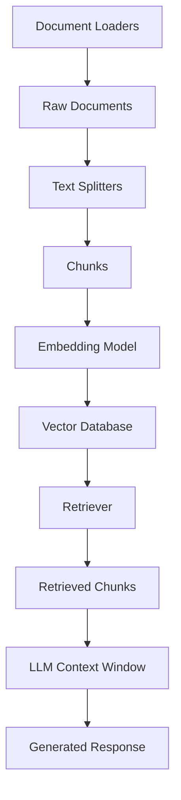

# Text Splitters in LangChain

## Introduction to Text Splitting

Text splitting is a critical component in the LLM application development pipeline, especially for Retrieval Augmented Generation (RAG) systems. It involves breaking down large documents into smaller, manageable chunks that can be processed effectively by language models.

## Why Text Splitting is Important

There are several key reasons why text splitting is essential when working with LLMs:

### 1. Overcoming Context Length Limitations

Language models have maximum input size constraints. For example, a specific LLM might have a context window limited to 8,000 tokens. If you want to process a PDF with thousands of pages (potentially millions of tokens), you cannot feed it to the model all at once. Text splitting allows you to process documents that would otherwise exceed these limits.

### 2. Improving Downstream Task Performance

Text splitting significantly enhances the performance of various downstream tasks:

- **Embeddings Generation**: Smaller chunks produce better quality embeddings that more accurately capture semantic meaning. When text is too large, embeddings tend to lose precision in capturing the semantic essence of the content.

- **Semantic Search**: Searching across smaller, topic-focused chunks leads to more precise retrieval results than searching through large, mixed-topic documents.

- **Summarization**: LLMs perform better when summarizing smaller, focused chunks rather than large documents where they may drift or hallucinate content.

### 3. Optimizing Computational Resources

Working with smaller chunks is more memory-efficient and allows for better parallelization of processing tasks. This reduces computational requirements and improves overall system performance.

## Text Splitting Techniques

Let's explore the main text splitting techniques available in LangChain:

### 1. Length-Based Text Splitting

This is the simplest and fastest approach to text splitting, where you divide text based on a predetermined character or token count.

#### Character Text Splitter

```python
from langchain.text_splitter import CharacterTextSplitter

# Sample text to split
text = "Space exploration has led to incredible scientific discoveries and technological innovations. Exploring distant planets and stars has expanded our understanding of the universe and our place within it."

# Initialize the splitter with chunk size and overlap
splitter = CharacterTextSplitter(
    chunk_size=100,
    chunk_overlap=0,
    separator=""
)

# Split the text
chunks = splitter.split_text(text)

# Print the number of chunks and the first chunk
print(f"Number of chunks: {len(chunks)}")
print(f"First chunk: {chunks[0]}")
```

In this example:
- The text is traversed from the beginning
- Every 100 characters form a chunk
- The process continues until the entire text is split

**Advantages**:
- Very simple conceptually
- Easy to implement
- Fast processing

**Disadvantages**:
- Doesn't consider linguistic structure, grammar, or semantic meaning
- May cut in the middle of words, sentences, or paragraphs
- Can lead to context loss at chunk boundaries

#### Chunk Overlap

To mitigate the issue of context loss at chunk boundaries, we can use chunk overlap:

```python
splitter = CharacterTextSplitter(
    chunk_size=100,
    chunk_overlap=20,
    separator=""
)
```

With overlap, each chunk shares some content with adjacent chunks, helping to preserve context across chunk boundaries. For RAG applications, an overlap of 10-20% of the chunk size is typically recommended.

### 2. Text Structure-Based Splitting

This technique respects the inherent structure of text, recognizing that text is typically organized in paragraphs, sentences, and words.

#### RecursiveCharacterTextSplitter

This is one of the most widely used text splitting techniques in LangChain. It attempts to split text while respecting its structure:

```python
from langchain.text_splitter import RecursiveCharacterTextSplitter

# Initialize the splitter with separator hierarchy
splitter = RecursiveCharacterTextSplitter(
    chunk_size=300,
    chunk_overlap=30,
    separators=["\n\n", "\n", " ", ""]
)

# Split the text
chunks = splitter.split_text(text)
```

The RecursiveCharacterTextSplitter works by:

1. First attempting to split by paragraphs (using `\n\n`)
2. If chunks are still too large, it tries to split by sentences/lines (using `\n`)
3. If needed, it then tries to split by words (using spaces)
4. As a last resort, it splits by characters

This approach preserves the natural structure of the text while respecting the specified chunk size limits.

**Example**:
For a text like: "My name is Nitish. I am 35 years old. I live in Gurgaon. How are you?"

With `chunk_size=25`:
- The splitter first tries to break by paragraphs (none in this case)
- Then by line breaks (none in this case)
- Then by sentences, resulting in chunks like:
  1. "My name is Nitish."
  2. "I am 35 years old."
  3. "I live in Gurgaon."
  4. "How are you?"

**Advantages**:
- Preserves the natural structure of text
- Minimizes breaking in the middle of words or sentences
- Produces more semantically coherent chunks
- Adapts to different chunk size requirements

### 3. Document-Type Based Splitting

When working with non-plain text documents (like code, HTML, or Markdown), standard text splitting techniques may not be appropriate because these documents have their own structural elements.

#### Language-Specific Splitters

RecursiveCharacterTextSplitter can be configured for specific languages:

```python
# For Python code
python_splitter = RecursiveCharacterTextSplitter.from_language(
    language="python",
    chunk_size=300,
    chunk_overlap=30
)

# For Markdown
markdown_splitter = RecursiveCharacterTextSplitter.from_language(
    language="markdown",
    chunk_size=300,
    chunk_overlap=30
)
```

These specialized splitters use language-appropriate separators. For example, Python code might use:
- Class definitions
- Function definitions
- Loops or conditionals
- Line breaks
- Spaces

This ensures that the splitting respects the structure of the specific document type.

### 4. Semantic Meaning-Based Splitting

In some cases, neither length-based nor structure-based splitting produces optimal results. Consider a paragraph that discusses two completely different topics (e.g., agriculture and sports). Ideally, this should be split into two separate chunks even though it's a single paragraph.

Semantic meaning-based splitters address this challenge:

```python
from langchain_experimental import SemanticChunker
from langchain_openai import OpenAIEmbeddings

# Initialize the semantic chunker
splitter = SemanticChunker(
    embeddings=OpenAIEmbeddings(),
    threshold_type="standard_deviation",
    threshold=1.0
)

chunks = splitter.split_text(text)
```

This approach:
1. Breaks text into sentences
2. Generates embeddings for each sentence
3. Compares the similarity between consecutive sentences
4. Identifies "breaking points" where similarity drops significantly
5. Creates chunks based on these semantic boundaries

While still experimental in LangChain, semantic chunking offers a promising approach for content that doesn't have clear structural boundaries but has topic transitions.

## Connecting with Document Loaders

Text splitters often work in conjunction with document loaders in a typical RAG pipeline. Here's an example combining both:

```python
from langchain_community.document_loaders import PyPDFLoader
from langchain.text_splitter import RecursiveCharacterTextSplitter

# Load a PDF document
loader = PyPDFLoader("curriculum.pdf")
docs = loader.load()

# Initialize a splitter
splitter = RecursiveCharacterTextSplitter(
    chunk_size=1000,
    chunk_overlap=100
)

# Split the documents
chunks = splitter.split_documents(docs)

print(f"Number of chunks: {len(chunks)}")
print(f"First chunk content: {chunks[0].page_content}")
```

## Best Practices for Text Splitting

1. **Choose the appropriate splitting technique for your content**:
   - Use RecursiveCharacterTextSplitter for most general text
   - Use language-specific splitters for code or structured formats
   - Consider semantic chunkers for mixed-topic content

2. **Select an appropriate chunk size**:
   - Too small: Fragments lose context and meaning
   - Too large: Exceeds model limits and reduces precision
   - Typical range: 300-1000 tokens for most applications

3. **Use chunk overlap to maintain context**:
   - 10-20% overlap works well for most applications
   - Higher overlap may be needed for complex or technical content

4. **Test different configurations**:
   - Experiment with different chunk sizes and overlaps
   - Evaluate downstream task performance (retrieval accuracy, response quality)

5. **Consider document types**:
   - Technical/code documents: Use smaller chunks and language-specific splitters
   - Narrative text: Larger chunks may work better to preserve context
   - Mixed content: Consider semantic chunking approaches

## Text Splitting in the RAG Pipeline

Text splitting is a crucial step in the RAG pipeline that affects all downstream operations:



## Summary

Text splitting is a foundational technique in building effective LLM applications, particularly for RAG systems. Choosing the right splitting strategy directly impacts the quality of embeddings, retrieval precision, and ultimately the accuracy of generated responses.

The RecursiveCharacterTextSplitter generally provides the best balance of simplicity and effectiveness for most applications, though specialized splitters may be needed for specific document types or complex content.

Future developments in semantic chunking promise even more intelligent splitting approaches that can better understand and preserve the meaning of text regardless of its structure.