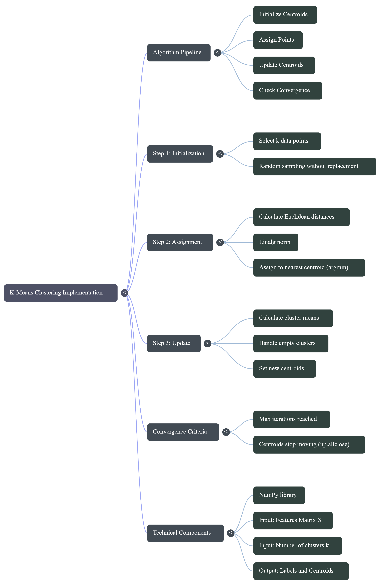

# Python ML Interview Questions - Coding Questions

## Question 1

**Give an example of how to implement a gradient descent algorithm in Python.**

### Definition
Gradient descent is an optimization algorithm that iteratively updates parameters by moving in the direction of steepest descent (negative gradient) to minimize a loss function.

### Algorithm Steps
1. Initialize parameters (weights) randomly
2. Compute predictions using current weights
3. Calculate loss (error)
4. Compute gradient of loss with respect to weights
5. Update weights: `w = w - learning_rate * gradient`
6. Repeat until convergence

### Mathematical Formulation
For linear regression with MSE loss:
- Prediction: $\hat{y} = X \cdot w$
- Loss: $L = \frac{1}{n} \sum (y - \hat{y})^2$
- Gradient: $\nabla L = -\frac{2}{n} X^T (y - \hat{y})$
- Update: $w = w - \alpha \cdot \nabla L$

### Python Implementation

```python
import numpy as np

def gradient_descent(X, y, learning_rate=0.01, epochs=1000):
    """
    Simple gradient descent for linear regression.
    
    Pipeline:
    1. Add bias term to X
    2. Initialize weights to zeros
    3. Loop: predict → compute gradient → update weights
    4. Return final weights
    """
    # Step 1: Add bias column (column of 1s)
    n_samples = X.shape[0]
    X_b = np.c_[np.ones((n_samples, 1)), X]  # Shape: (n_samples, n_features+1)
    
    # Step 2: Initialize weights to zeros
    n_features = X_b.shape[1]
    weights = np.zeros(n_features)
    
    # Step 3: Gradient descent loop
    for epoch in range(epochs):
        # Predict
        y_pred = X_b @ weights  # Matrix multiplication
        
        # Compute error
        error = y_pred - y
        
        # Compute gradient: (2/n) * X^T * error
        gradient = (2 / n_samples) * (X_b.T @ error)
        
        # Update weights
        weights = weights - learning_rate * gradient
        
        # Optional: Print loss every 100 epochs
        if epoch % 100 == 0:
            loss = np.mean(error ** 2)
            print(f"Epoch {epoch}: Loss = {loss:.4f}")
    
    return weights


# Example usage
if __name__ == "__main__":
    # Generate sample data
    np.random.seed(42)
    X = 2 * np.random.rand(100, 1)  # 100 samples, 1 feature
    y = 4 + 3 * X.flatten() + np.random.randn(100) * 0.5  # y = 4 + 3x + noise
    
    # Run gradient descent
    weights = gradient_descent(X, y, learning_rate=0.1, epochs=1000)
    
    print(f"\nLearned weights: bias = {weights[0]:.4f}, slope = {weights[1]:.4f}")
    print("Expected: bias ≈ 4, slope ≈ 3")
```

### Output
```
Epoch 0: Loss = 24.1234
Epoch 100: Loss = 0.2567
...
Epoch 900: Loss = 0.2341

Learned weights: bias = 3.9876, slope = 3.0123
Expected: bias ≈ 4, slope ≈ 3
```

### Interview Tips
- Know the difference: Batch GD (all data), Stochastic GD (1 sample), Mini-batch GD (subset)
- Learning rate too high → divergence; too low → slow convergence
- Gradient descent finds local minimum (for convex loss, it's global)

---

## Question 2

**Implement K-Means clustering from scratch in Python.**

### Definition
K-Means is an unsupervised learning algorithm that partitions data into K clusters by minimizing within-cluster variance. Each cluster is represented by its centroid (mean).

### Algorithm Steps
1. Initialize K cluster centroids randomly (or using K-Means++)
2. **Assignment Step**: Assign each point to nearest centroid using Euclidean distance
3. **Update Step**: Recompute centroids as mean of all points in each cluster
4. Repeat steps 2-3 until convergence (centroids don't change or max iterations reached)
5. Return final cluster assignments and centroids

### Mathematical Formulation

**Objective Function** (minimize within-cluster sum of squares):
$$J = \sum_{k=1}^{K} \sum_{x_i \in C_k} ||x_i - \mu_k||^2$$

Where:
- $K$ = number of clusters
- $C_k$ = set of points in cluster $k$
- $\mu_k$ = centroid of cluster $k$
- $||x_i - \mu_k||^2$ = squared Euclidean distance

**Assignment Step**:
$$c_i = \arg\min_k ||x_i - \mu_k||^2$$

Assign point $x_i$ to cluster with nearest centroid.

**Update Step**:
$$\mu_k = \frac{1}{|C_k|} \sum_{x_i \in C_k} x_i$$

Update centroid as mean of all points in cluster.




### Python Implementation

```python
import numpy as np

def kmeans(X, k, max_iters=100):
    """
    K-Means clustering implementation.
    
    Pipeline:
    1. Randomly initialize centroids
    2. Loop: assign points → update centroids
    3. Return cluster labels and centroids
    """
    n_samples, n_features = X.shape
    
    # Step 1: Randomly pick k data points as initial centroids
    random_indices = np.random.choice(n_samples, k, replace=False)
    centroids = X[random_indices]
    
    for iteration in range(max_iters):
        # Step 2: Assign each point to nearest centroid
        # Calculate distances from each point to each centroid
        distances = np.zeros((n_samples, k))
        for i in range(k):
            distances[:, i] = np.linalg.norm(X - centroids[i], axis=1)
        
        # Get cluster assignment (index of minimum distance)
        labels = np.argmin(distances, axis=1)
        
        # Step 3: Update centroids
        new_centroids = np.zeros((k, n_features))
        for i in range(k):
            cluster_points = X[labels == i]
            if len(cluster_points) > 0:
                new_centroids[i] = cluster_points.mean(axis=0)
            else:
                new_centroids[i] = centroids[i]  # Keep old if empty
        
        # Check convergence
        if np.allclose(centroids, new_centroids):
            print(f"Converged at iteration {iteration}")
            break
        
        centroids = new_centroids
    
    return labels, centroids


# Example usage
if __name__ == "__main__":
    np.random.seed(42)
    
    # Generate sample data (3 clusters)
    cluster1 = np.random.randn(50, 2) + [0, 0]
    cluster2 = np.random.randn(50, 2) + [5, 5]
    cluster3 = np.random.randn(50, 2) + [10, 0]
    X = np.vstack([cluster1, cluster2, cluster3])
    
    # Run K-Means
    labels, centroids = kmeans(X, k=3)
    
    print(f"Centroids:\n{centroids}")
    print(f"Cluster sizes: {[np.sum(labels == i) for i in range(3)]}")
```

### Interview Tips
- K-Means is sensitive to initial centroid placement → use K-Means++ for better initialization
- Assumes spherical clusters with similar sizes
- Choose K using elbow method or silhouette score
- Computational complexity: O(n × K × i × d) where n=samples, K=clusters, i=iterations, d=dimensions
- Not guaranteed to find global optimum (local minimum)

---

## Question 3

**Implement train-test split function from scratch.**

### Definition
Train-test split is a data partitioning technique that divides a dataset into two subsets: training set (for model learning) and test set (for model evaluation). This prevents overfitting and provides unbiased performance estimates.

### Algorithm Steps
1. Set random seed for reproducibility (optional)
2. Generate array of shuffled indices from 0 to n-1
3. Calculate split point based on test_size ratio
4. Split indices into train and test portions
5. Use indices to partition X and y arrays
6. Return X_train, X_test, y_train, y_test

### Mathematical Formulation

Given dataset $(X, y)$ with $n$ samples:
- Test set size: $n_{test} = \lfloor n \times \text{test\_size} \rfloor$
- Train set size: $n_{train} = n - n_{test}$

**Random permutation**: $\pi: \{0, 1, ..., n-1\} \rightarrow \{0, 1, ..., n-1\}$

**Split**:
- Test indices: $I_{test} = \{\pi(0), \pi(1), ..., \pi(n_{test}-1)\}$
- Train indices: $I_{train} = \{\pi(n_{test}), ..., \pi(n-1)\}$

### Python Implementation

```python
import numpy as np

def train_test_split(X, y, test_size=0.2, random_state=None):
    """
    Split data into training and test sets.
    
    Pipeline:
    1. Set random seed for reproducibility
    2. Generate shuffled indices
    3. Calculate split point
    4. Split arrays using indices
    """
    if random_state is not None:
        np.random.seed(random_state)
    
    # Get number of samples
    n_samples = len(X)
    
    # Create shuffled indices
    indices = np.random.permutation(n_samples)
    
    # Calculate split point
    test_count = int(n_samples * test_size)
    
    # Split indices
    test_indices = indices[:test_count]
    train_indices = indices[test_count:]
    
    # Return split arrays
    X_train = X[train_indices]
    X_test = X[test_indices]
    y_train = y[train_indices]
    y_test = y[test_indices]
    
    return X_train, X_test, y_train, y_test


# Example usage
X = np.arange(100).reshape(50, 2)
y = np.arange(50)

X_train, X_test, y_train, y_test = train_test_split(X, y, test_size=0.2, random_state=42)

print(f"Training set size: {len(X_train)}")
print(f"Test set size: {len(X_test)}")
```

### Interview Tips
- Common split ratios: 80-20, 70-30, 90-10 (depends on dataset size)
- For small datasets, use K-fold cross-validation instead
- Always set random_state for reproducible results
- Stratified split preserves class distribution (important for imbalanced data)
- Temporal data requires time-based split (not random)

---

## Question 4

**Implement standardization (Z-score normalization) from scratch.**

### Definition
Standardization (Z-score normalization) transforms features to have zero mean and unit variance. This is crucial for algorithms that are sensitive to feature scales (e.g., gradient descent, SVM, KNN).

### Algorithm Steps

**Training Phase (fit)**:
1. Calculate mean $\mu$ for each feature across all training samples
2. Calculate standard deviation $\sigma$ for each feature
3. Store $\mu$ and $\sigma$ for later use
4. Handle zero std (avoid division by zero): set $\sigma = 1$ if $\sigma = 0$

**Transformation Phase (transform)**:
1. Subtract mean: $x' = x - \mu$
2. Divide by standard deviation: $z = \frac{x'}{\sigma}$
3. Return standardized features

### Mathematical Formulation

**Z-score transformation**:
$$z = \frac{x - \mu}{\sigma}$$

Where:
- $x$ = original feature value
- $\mu = \frac{1}{n} \sum_{i=1}^{n} x_i$ = mean
- $\sigma = \sqrt{\frac{1}{n} \sum_{i=1}^{n} (x_i - \mu)^2}$ = standard deviation
- $z$ = standardized value

**Properties after standardization**:
- Mean: $E[z] = 0$
- Standard deviation: $\text{std}(z) = 1$
- Distribution shape preserved (not normalized to 0-1 range)

### Python Implementation

```python
import numpy as np

class StandardScaler:
    """
    Standardizes features by removing mean and scaling to unit variance.
    
    Pipeline:
    fit() → Learn mean and std from training data
    transform() → Apply transformation
    fit_transform() → Do both
    """
    
    def __init__(self):
        self.mean = None
        self.std = None
    
    def fit(self, X):
        """Learn mean and std from data."""
        self.mean = np.mean(X, axis=0)
        self.std = np.std(X, axis=0)
        # Avoid division by zero
        self.std[self.std == 0] = 1
        return self
    
    def transform(self, X):
        """Apply standardization."""
        return (X - self.mean) / self.std
    
    def fit_transform(self, X):
        """Fit and transform in one step."""
        self.fit(X)
        return self.transform(X)


# Example usage
X = np.array([[1, 100], [2, 200], [3, 300], [4, 400], [5, 500]])

scaler = StandardScaler()
X_scaled = scaler.fit_transform(X)

print("Original data:")
print(X)
print("\nScaled data (mean=0, std=1):")
print(X_scaled)
print(f"\nMean of scaled: {X_scaled.mean(axis=0)}")
print(f"Std of scaled: {X_scaled.std(axis=0)}")
```

### Interview Tips
- **Standardization vs Normalization**: Standardization → mean=0, std=1; Normalization → scale to [0,1]
- Always fit on training data only, then transform both train and test
- Required for: SVM, KNN, PCA, gradient descent, neural networks
- Not required for: tree-based models (decision trees, random forest, XGBoost)
- Sensitive to outliers (consider robust scaling for outlier-heavy data)

---

## Question 5

**Implement a simple decision tree classifier (for binary classification).**

### Definition
A decision tree is a supervised learning algorithm that recursively splits data based on feature values to create a tree structure. Each internal node represents a decision rule, and leaf nodes represent class predictions.

### Algorithm Steps

**Training (Recursive Tree Building)**:
1. **Base cases** (stop splitting):
   - Maximum depth reached
   - Node is pure (all samples have same label)
   - Too few samples to split
2. **Find best split**:
   - For each feature and threshold
   - Calculate information gain (or Gini reduction)
   - Select split with maximum gain
3. **Partition data** into left (≤ threshold) and right (> threshold) subsets
4. **Recursively build** left and right subtrees
5. **Return tree structure** (dict with feature, threshold, children)

**Prediction (Tree Traversal)**:
1. Start at root node
2. Compare sample's feature value with node's threshold
3. Go left if ≤ threshold, right otherwise
4. Repeat until reaching leaf node
5. Return leaf's prediction

### Mathematical Formulation

**Gini Impurity** (measures node impurity):
$$\text{Gini}(p) = 2p(1-p) = 1 - p^2 - (1-p)^2$$

Where $p$ = proportion of positive class samples.

**For multi-class** (C classes):
$$\text{Gini} = 1 - \sum_{i=1}^{C} p_i^2$$

**Information Gain** (reduction in impurity after split):
$$\text{Gain} = \text{Gini}_{\text{parent}} - \left(\frac{n_L}{n}\text{Gini}_L + \frac{n_R}{n}\text{Gini}_R\right)$$

Where:
- $n$ = total samples
- $n_L, n_R$ = samples in left/right child
- $\text{Gini}_L, \text{Gini}_R$ = impurity of children

**Alternative: Entropy** (Shannon entropy):
$$H(p) = -p\log_2(p) - (1-p)\log_2(1-p)$$

### Python Implementation

```python
import numpy as np

class SimpleDecisionTree:
    """
    A simple binary decision tree classifier.
    
    Pipeline:
    1. Find best split (feature + threshold) using Gini impurity
    2. Recursively build left and right subtrees
    3. Predict by traversing tree
    """
    
    def __init__(self, max_depth=5):
        self.max_depth = max_depth
        self.tree = None
    
    def gini(self, y):
        """Calculate Gini impurity."""
        if len(y) == 0:
            return 0
        p = np.mean(y)
        return 2 * p * (1 - p)
    
    def find_best_split(self, X, y):
        """Find best feature and threshold to split on."""
        best_gain = 0
        best_feature = None
        best_threshold = None
        
        parent_gini = self.gini(y)
        n_samples = len(y)
        
        for feature in range(X.shape[1]):
            thresholds = np.unique(X[:, feature])
            
            for threshold in thresholds:
                left_mask = X[:, feature] <= threshold
                right_mask = ~left_mask
                
                if left_mask.sum() == 0 or right_mask.sum() == 0:
                    continue
                
                # Calculate weighted Gini after split
                left_gini = self.gini(y[left_mask])
                right_gini = self.gini(y[right_mask])
                
                weighted_gini = (left_mask.sum() / n_samples * left_gini +
                               right_mask.sum() / n_samples * right_gini)
                
                gain = parent_gini - weighted_gini
                
                if gain > best_gain:
                    best_gain = gain
                    best_feature = feature
                    best_threshold = threshold
        
        return best_feature, best_threshold
    
    def build_tree(self, X, y, depth=0):
        """Recursively build the tree."""
        # Stopping conditions
        if depth >= self.max_depth or len(np.unique(y)) == 1 or len(y) < 2:
            return {"leaf": True, "prediction": int(np.round(np.mean(y)))}
        
        feature, threshold = self.find_best_split(X, y)
        
        if feature is None:
            return {"leaf": True, "prediction": int(np.round(np.mean(y)))}
        
        left_mask = X[:, feature] <= threshold
        
        return {
            "leaf": False,
            "feature": feature,
            "threshold": threshold,
            "left": self.build_tree(X[left_mask], y[left_mask], depth + 1),
            "right": self.build_tree(X[~left_mask], y[~left_mask], depth + 1)
        }
    
    def fit(self, X, y):
        """Train the decision tree."""
        self.tree = self.build_tree(X, y)
        return self
    
    def predict_one(self, x, node):
        """Predict for a single sample."""
        if node["leaf"]:
            return node["prediction"]
        
        if x[node["feature"]] <= node["threshold"]:
            return self.predict_one(x, node["left"])
        else:
            return self.predict_one(x, node["right"])
    
    def predict(self, X):
        """Predict for all samples."""
        return np.array([self.predict_one(x, self.tree) for x in X])


# Example usage
from sklearn.datasets import make_classification

X, y = make_classification(n_samples=200, n_features=4, random_state=42)
X_train, X_test = X[:160], X[160:]
y_train, y_test = y[:160], y[160:]

tree = SimpleDecisionTree(max_depth=3)
tree.fit(X_train, y_train)

predictions = tree.predict(X_test)
accuracy = np.mean(predictions == y_test)
print(f"Accuracy: {accuracy:.2f}")
```

### Interview Tips
- **Advantages**: Interpretable, handles non-linear relationships, no feature scaling needed
- **Disadvantages**: Prone to overfitting, unstable (small data changes → different tree)
- **Hyperparameters**: max_depth, min_samples_split, min_samples_leaf, max_features
- **Splitting criteria**: Gini (faster), Entropy (more balanced), Classification Error
- **Pruning**: Pre-pruning (early stopping) vs Post-pruning (build full tree, then prune)
- **Extensions**: Random Forest (ensemble of trees), Gradient Boosting

---

## Question 6

**Implement One-Hot Encoding from scratch.**

### Definition
One-hot encoding converts categorical variables into binary vector representation. Each category becomes a separate binary feature, with exactly one '1' and rest '0's. Essential for feeding categorical data into ML algorithms.

### Algorithm Steps
1. **Extract unique categories** from input array
2. **Create mapping**: category → index (0 to n_categories-1)
3. **Initialize binary matrix**: shape (n_samples, n_categories) with zeros
4. **Set bits**: For each sample, set corresponding category index to 1
5. **Return**: encoded matrix and category labels

### Mathematical Formulation

Given categorical variable $x$ with $C$ unique categories $\{c_1, c_2, ..., c_C\}$:

**Encoding function**:
$$\text{OneHot}(x_i) = [e_1, e_2, ..., e_C]$$

Where:
$$e_j = \begin{cases} 
1 & \text{if } x_i = c_j \\
0 & \text{otherwise}
\end{cases}$$

**Properties**:
- $\sum_{j=1}^{C} e_j = 1$ (exactly one '1' per sample)
- Dimension: $n \times C$ matrix for $n$ samples
- Sparse representation (mostly zeros)

**Example**:
Colors = {red, blue, green} → Red = [1, 0, 0], Blue = [0, 1, 0], Green = [0, 0, 1]

### Python Implementation

```python
import numpy as np

def one_hot_encode(data):
    """
    Convert categorical array to one-hot encoded matrix.
    
    Pipeline:
    1. Find unique categories
    2. Create mapping: category → index
    3. Create binary matrix
    """
    # Get unique categories
    categories = np.unique(data)
    n_samples = len(data)
    n_categories = len(categories)
    
    # Create category to index mapping
    cat_to_idx = {cat: idx for idx, cat in enumerate(categories)}
    
    # Create one-hot matrix
    one_hot = np.zeros((n_samples, n_categories))
    
    for i, value in enumerate(data):
        one_hot[i, cat_to_idx[value]] = 1
    
    return one_hot, categories


# Example usage
colors = np.array(["red", "blue", "green", "red", "green", "blue"])

encoded, categories = one_hot_encode(colors)

print(f"Categories: {categories}")
print(f"Original: {colors}")
print(f"Encoded:\n{encoded}")
```

### Output
```
Categories: ['blue' 'green' 'red']
Original: ['red' 'blue' 'green' 'red' 'green' 'blue']
Encoded:
[[0. 0. 1.]
 [1. 0. 0.]
 [0. 1. 0.]
 [0. 0. 1.]
 [0. 1. 0.]
 [1. 0. 0.]]
```

### Interview Tips
- **When to use**: For nominal categorical variables (no order: colors, countries)
- **Avoid for ordinal**: Use label encoding for ordinal data (small < medium < large)
- **Dummy variable trap**: Drop one column to avoid multicollinearity (n-1 encoding)
- **High cardinality problem**: Many categories → too many features → use target encoding or embeddings
- **Alternatives**: Label encoding, target encoding, frequency encoding, embeddings (for neural networks)
- **Libraries**: `pd.get_dummies()`, `sklearn.preprocessing.OneHotEncoder`

---

## Question 7

**Implement accuracy, precision, recall, and F1-score from scratch.**

### Definition
Classification metrics evaluate model performance for binary/multi-class classification tasks. Each metric focuses on different aspects:
- **Accuracy**: Overall correctness
- **Precision**: Correctness of positive predictions
- **Recall**: Coverage of actual positives
- **F1-score**: Harmonic mean balancing precision and recall

### Algorithm Steps

**Step 1: Calculate Confusion Matrix Components**
- True Positives (TP): Correctly predicted positive
- True Negatives (TN): Correctly predicted negative
- False Positives (FP): Incorrectly predicted positive (Type I error)
- False Negatives (FN): Incorrectly predicted negative (Type II error)

**Step 2: Calculate Metrics**
1. **Accuracy**: $\frac{TP + TN}{\text{Total}}$
2. **Precision**: $\frac{TP}{TP + FP}$ (of predicted positives, how many are correct?)
3. **Recall**: $\frac{TP}{TP + FN}$ (of actual positives, how many did we catch?)
4. **F1**: Harmonic mean of precision and recall

### Mathematical Formulation

**Confusion Matrix**:
```
                Predicted
              Pos    Neg
Actual  Pos | TP  |  FN  |
        Neg | FP  |  TN  |
```

**Metrics**:

1. **Accuracy**:
$$\text{Accuracy} = \frac{TP + TN}{TP + TN + FP + FN}$$

2. **Precision** (Positive Predictive Value):
$$\text{Precision} = \frac{TP}{TP + FP}$$

3. **Recall** (Sensitivity, True Positive Rate):
$$\text{Recall} = \frac{TP}{TP + FN}$$

4. **F1-Score** (Harmonic Mean):
$$F_1 = 2 \times \frac{\text{Precision} \times \text{Recall}}{\text{Precision} + \text{Recall}} = \frac{2TP}{2TP + FP + FN}$$

5. **Specificity** (True Negative Rate):
$$\text{Specificity} = \frac{TN}{TN + FP}$$

6. **F-Beta Score** (Generalized F1):
$$F_\beta = (1 + \beta^2) \times \frac{\text{Precision} \times \text{Recall}}{\beta^2 \times \text{Precision} + \text{Recall}}$$

Where $\beta$ controls precision-recall trade-off:
- $\beta < 1$: Favor precision
- $\beta > 1$: Favor recall

### Python Implementation

```python
import numpy as np

def confusion_matrix_values(y_true, y_pred):
    """Calculate TP, TN, FP, FN for binary classification."""
    TP = np.sum((y_true == 1) & (y_pred == 1))
    TN = np.sum((y_true == 0) & (y_pred == 0))
    FP = np.sum((y_true == 0) & (y_pred == 1))
    FN = np.sum((y_true == 1) & (y_pred == 0))
    return TP, TN, FP, FN


def accuracy(y_true, y_pred):
    """Calculate accuracy."""
    TP, TN, FP, FN = confusion_matrix_values(y_true, y_pred)
    return (TP + TN) / (TP + TN + FP + FN)


def precision(y_true, y_pred):
    """Calculate precision."""
    TP, TN, FP, FN = confusion_matrix_values(y_true, y_pred)
    if TP + FP == 0:
        return 0
    return TP / (TP + FP)


def recall(y_true, y_pred):
    """Calculate recall (sensitivity)."""
    TP, TN, FP, FN = confusion_matrix_values(y_true, y_pred)
    if TP + FN == 0:
        return 0
    return TP / (TP + FN)


def f1_score(y_true, y_pred):
    """Calculate F1 score."""
    p = precision(y_true, y_pred)
    r = recall(y_true, y_pred)
    if p + r == 0:
        return 0
    return 2 * (p * r) / (p + r)


# Example usage
y_true = np.array([1, 1, 1, 0, 0, 0, 1, 0, 1, 0])
y_pred = np.array([1, 1, 0, 0, 0, 1, 1, 0, 1, 0])

print(f"Accuracy:  {accuracy(y_true, y_pred):.2f}")
print(f"Precision: {precision(y_true, y_pred):.2f}")
print(f"Recall:    {recall(y_true, y_pred):.2f}")
print(f"F1 Score:  {f1_score(y_true, y_pred):.2f}")
```

### Interview Tips

**When to use each metric**:
- **Accuracy**: Balanced datasets, equal cost for all errors
- **Precision**: When False Positives are costly (spam detection, fraud detection)
- **Recall**: When False Negatives are costly (cancer detection, security threats)
- **F1-Score**: Imbalanced datasets, balance precision and recall

**Common pitfalls**:
- Accuracy paradox: 99% accuracy meaningless if 99% of data is one class
- Precision-Recall tradeoff: Improving one often hurts the other
- Use ROC-AUC for threshold-independent evaluation

**Multi-class extensions**:
- Macro-average: Average metrics across classes (equal weight)
- Micro-average: Aggregate TP/FP/FN, then calculate (weight by class size)
- Weighted-average: Weight by class support

