# 🎯 Supervised Learning - Complete Interview Guide

## 📚 Table of Contents
- [Core Concepts](#core-concepts)
- [Key Algorithms](#key-algorithms)
- [Coding Questions](#coding-questions)
- [Theory Deep Dive](#theory-deep-dive)
- [Quick Revision Notes](#quick-revision-notes)
- [Must-Know by Heart](#must-know-by-heart)

---

## 🔥 Must-Know by Heart

### ⚡ Quick Facts
```
• Supervised Learning = Learning with labeled data
• Two main types: Classification (categories) & Regression (continuous values)
• Train-Validation-Test split: 70%-15%-15%
• Goal: Minimize loss function to generalize well
• Overfitting = High training accuracy, Low test accuracy
• Underfitting = Low training accuracy, Low test accuracy
```

### 🧠 Core Algorithm Logic (Memorize These!)

#### Linear Regression Algorithm
```python
# Core Logic - MUST MEMORIZE
1. Initialize: w = 0, b = 0
2. For each epoch:
   - Forward Pass: y_pred = w*X + b
   - Calculate Loss: MSE = (1/n) * Σ(y_pred - y)²
   - Calculate Gradients:
     * dw = (2/n) * Σ(X * (y_pred - y))
     * db = (2/n) * Σ(y_pred - y)
   - Update Parameters:
     * w = w - learning_rate * dw
     * b = b - learning_rate * db
3. Repeat until convergence
```

#### Logistic Regression Algorithm
```python
# Core Logic - MUST MEMORIZE
1. Initialize: w = 0, b = 0
2. For each epoch:
   - Forward Pass: z = w*X + b
   - Apply Sigmoid: p = 1/(1 + e^(-z))
   - Calculate Loss: Cross-entropy = -[y*log(p) + (1-y)*log(1-p)]
   - Calculate Gradients:
     * dw = (1/n) * X^T * (p - y)
     * db = (1/n) * Σ(p - y)
   - Update Parameters:
     * w = w - learning_rate * dw
     * b = b - learning_rate * db
3. Repeat until convergence
```

---

## 🎯 Core Concepts

### 1️⃣ What is Supervised Learning?

```mermaid
graph LR
    A[Input Data X] --> B[Model f]
    B --> C[Prediction ŷ]
    D[True Label y] --> E[Loss Function]
    C --> E
    E --> F[Optimizer]
    F --> B
```



**🔑 Key Definition**: Supervised learning is a machine learning paradigm where algorithms learn from **labeled training data** to make predictions on new, unseen data.

**🎯 Core Components**:
- **Input Features (X)**: The data we use to make predictions
- **Target Labels (y)**: The correct answers we want to predict
- **Model (f)**: The algorithm that maps X to y
- **Loss Function (L)**: Measures how wrong our predictions are
- **Optimizer**: Updates model parameters to minimize loss

**🧠 Simple Analogy**: 
> Think of it like learning math with a teacher. The teacher shows you problems (X) with solutions (y). After seeing many examples, you learn to solve new problems on your own.

---

### 2️⃣ Types of Supervised Learning Problems


#### 🎯 Classification (Predicting Categories)

| Type | Description | Example | Output |
|------|-------------|---------|---------|
| **Binary** | 2 classes | Email: Spam/Not Spam | {0, 1} |
| **Multi-class** | 3+ classes, one label | Animal: Cat/Dog/Bird | {0, 1, 2} |
| **Multi-label** | Multiple labels possible | News: Politics+Tech | {[1,0,1]} |

#### 📈 Regression (Predicting Numbers)

| Type | Description | Example | Output |
|------|-------------|---------|---------|
| **Linear** | Straight line relationship | House price vs Size | $250,000 |
| **Non-linear** | Complex relationships | Stock price prediction | $145.67 |

---

### 3️⃣ Train-Validation-Test Split

```
📊 Dataset Split Strategy:
┌─────────────────────────────────────────────────────────┐
│  Training (70%)    │ Validation (15%) │ Testing (15%)   │
│  Learn patterns    │ Tune parameters  │ Final evaluation │
└─────────────────────────────────────────────────────────┘
```

**🔥 CRITICAL RULES** (Memorize These!):
1. **Never** use test data during training
2. **Never** use test data for hyperparameter tuning
3. **Only** touch test data once for final evaluation
4. Validation set guides model selection and early stopping

---

## 🚀 Key Algorithms

### 1️⃣ Linear Regression

**📝 Mathematical Foundation**:
```
ŷ = w₁x₁ + w₂x₂ + ... + wₙxₙ + b
ŷ = w^T × X + b
```

**💡 Interview-Ready Code**:
```python
import numpy as np
import matplotlib.pyplot as plt
from sklearn.model_selection import train_test_split
from sklearn.metrics import mean_squared_error, r2_score

class LinearRegressionFromScratch:
    def __init__(self, learning_rate=0.01, n_iterations=1000):
        self.learning_rate = learning_rate
        self.n_iterations = n_iterations
        self.weights = None
        self.bias = None
        self.cost_history = []
    
    def fit(self, X, y):
        # Initialize parameters
        n_samples, n_features = X.shape
        self.weights = np.zeros(n_features)
        self.bias = 0
        
        # Gradient descent
        for i in range(self.n_iterations):
            # Forward pass
            y_pred = np.dot(X, self.weights) + self.bias
            
            # Calculate cost (MSE)
            cost = (1/(2*n_samples)) * np.sum((y_pred - y)**2)
            self.cost_history.append(cost)
            
            # Calculate gradients
            dw = (1/n_samples) * np.dot(X.T, (y_pred - y))
            db = (1/n_samples) * np.sum(y_pred - y)
            
            # Update parameters
            self.weights -= self.learning_rate * dw
            self.bias -= self.learning_rate * db
    
    def predict(self, X):
        return np.dot(X, self.weights) + self.bias
    
    def plot_cost_history(self):
        plt.plot(self.cost_history)
        plt.title('Cost Function Over Iterations')
        plt.xlabel('Iterations')
        plt.ylabel('Cost')
        plt.show()

# Example usage (Interview Demo)
if __name__ == "__main__":
    # Generate sample data
    np.random.seed(42)
    X = np.random.randn(100, 1)
    y = 2 * X.flatten() + 1 + np.random.randn(100) * 0.1
    
    # Split data
    X_train, X_test, y_train, y_test = train_test_split(X, y, test_size=0.2, random_state=42)
    
    # Train model
    model = LinearRegressionFromScratch(learning_rate=0.01, n_iterations=1000)
    model.fit(X_train, y_train)
    
    # Make predictions
    y_pred = model.predict(X_test)
    
    # Evaluate
    mse = mean_squared_error(y_test, y_pred)
    r2 = r2_score(y_test, y_pred)
    
    print(f"MSE: {mse:.4f}")
    print(f"R² Score: {r2:.4f}")
    print(f"Learned weights: {model.weights}")
    print(f"Learned bias: {model.bias:.4f}")
```

**🧠 Key Points to Remember**:
- Uses **MSE** as loss function
- **Gradient descent** for optimization
- Assumes **linear relationship** between features and target
- **No activation function** needed
- **Interpretable**: coefficients show feature importance

---

### 2️⃣ Logistic Regression

**📝 Mathematical Foundation**:
```
z = w^T × X + b
p = σ(z) = 1/(1 + e^(-z))    # Sigmoid function
ŷ = 1 if p ≥ 0.5 else 0
```

**💡 Interview-Ready Code**:
```python
import numpy as np
from sklearn.datasets import make_classification
from sklearn.model_selection import train_test_split
from sklearn.metrics import accuracy_score, classification_report, confusion_matrix

class LogisticRegressionFromScratch:
    def __init__(self, learning_rate=0.01, n_iterations=1000):
        self.learning_rate = learning_rate
        self.n_iterations = n_iterations
        self.weights = None
        self.bias = None
        self.cost_history = []
    
    def _add_intercept(self, X):
        intercept = np.ones((X.shape[0], 1))
        return np.concatenate((intercept, X), axis=1)
    
    def _sigmoid(self, z):
        # Clip z to prevent overflow
        z = np.clip(z, -250, 250)
        return 1 / (1 + np.exp(-z))
    
    def _cost_function(self, h, y):
        return (-y * np.log(h) - (1 - y) * np.log(1 - h)).mean()
    
    def fit(self, X, y):
        # Add intercept term to X
        X = self._add_intercept(X)
        
        # Initialize weights
        self.weights = np.zeros(X.shape[1])
        
        for i in range(self.n_iterations):
            # Forward propagation
            z = np.dot(X, self.weights)
            h = self._sigmoid(z)
            
            # Calculate cost
            cost = self._cost_function(h, y)
            self.cost_history.append(cost)
            
            # Calculate gradient
            gradient = np.dot(X.T, (h - y)) / y.size
            
            # Update weights
            self.weights -= self.learning_rate * gradient
    
    def predict_proba(self, X):
        X = self._add_intercept(X)
        return self._sigmoid(np.dot(X, self.weights))
    
    def predict(self, X, threshold=0.5):
        return (self.predict_proba(X) >= threshold).astype(int)

# Example usage (Interview Demo)
if __name__ == "__main__":
    # Generate sample data
    X, y = make_classification(n_samples=1000, n_features=2, n_redundant=0, 
                             n_informative=2, random_state=42, n_clusters_per_class=1)
    
    # Split data
    X_train, X_test, y_train, y_test = train_test_split(X, y, test_size=0.2, random_state=42)
    
    # Train model
    model = LogisticRegressionFromScratch(learning_rate=0.1, n_iterations=1000)
    model.fit(X_train, y_train)
    
    # Make predictions
    y_pred = model.predict(X_test)
    y_pred_proba = model.predict_proba(X_test)
    
    # Evaluate
    accuracy = accuracy_score(y_test, y_pred)
    print(f"Accuracy: {accuracy:.4f}")
    print(f"\\nClassification Report:")
    print(classification_report(y_test, y_pred))
    print(f"\\nConfusion Matrix:")
    print(confusion_matrix(y_test, y_pred))
```

**🧠 Key Points to Remember**:
- Uses **Sigmoid function** to map to probabilities [0,1]
- Uses **Cross-entropy loss** function
- **Decision boundary** at p = 0.5
- Can be extended to **multi-class** with softmax
- **Probabilistic output** unlike SVM

---

### 3️⃣ Decision Trees

**🌳 Algorithm Logic**:
```
1. Start with entire dataset at root
2. For each feature:
   - Try all possible split points
   - Calculate information gain/Gini impurity
3. Choose best split (highest gain/lowest impurity)
4. Recursively repeat for each branch
5. Stop when: max_depth reached OR pure nodes OR min_samples
```

**💡 Interview-Ready Code**:
```python
import numpy as np
from collections import Counter
from sklearn.datasets import make_classification
from sklearn.model_selection import train_test_split

class DecisionTreeFromScratch:
    def __init__(self, max_depth=3, min_samples_split=2):
        self.max_depth = max_depth
        self.min_samples_split = min_samples_split
        self.root = None
    
    def _gini_impurity(self, y):
        """Calculate Gini impurity"""
        proportions = np.bincount(y) / len(y)
        return 1 - np.sum(proportions ** 2)
    
    def _information_gain(self, parent, left_child, right_child):
        """Calculate information gain"""
        weight_left = len(left_child) / len(parent)
        weight_right = len(right_child) / len(parent)
        
        gain = (self._gini_impurity(parent) - 
                weight_left * self._gini_impurity(left_child) - 
                weight_right * self._gini_impurity(right_child))
        return gain
    
    def _best_split(self, X, y):
        """Find the best split for the data"""
        best_gain = -1
        best_feature = None
        best_threshold = None
        
        n_features = X.shape[1]
        for feature_idx in range(n_features):
            thresholds = np.unique(X[:, feature_idx])
            
            for threshold in thresholds:
                left_mask = X[:, feature_idx] <= threshold
                right_mask = ~left_mask
                
                if len(y[left_mask]) == 0 or len(y[right_mask]) == 0:
                    continue
                
                gain = self._information_gain(y, y[left_mask], y[right_mask])
                
                if gain > best_gain:
                    best_gain = gain
                    best_feature = feature_idx
                    best_threshold = threshold
        
        return best_feature, best_threshold, best_gain
    
    def _build_tree(self, X, y, depth=0):
        """Recursively build the decision tree"""
        # Stopping criteria
        if (depth >= self.max_depth or 
            len(set(y)) == 1 or 
            len(y) < self.min_samples_split):
            # Return leaf node with majority class
            return Counter(y).most_common(1)[0][0]
        
        # Find best split
        feature_idx, threshold, gain = self._best_split(X, y)
        
        if gain == 0:
            return Counter(y).most_common(1)[0][0]
        
        # Split the data
        left_mask = X[:, feature_idx] <= threshold
        right_mask = ~left_mask
        
        # Create node
        node = {
            'feature': feature_idx,
            'threshold': threshold,
            'left': self._build_tree(X[left_mask], y[left_mask], depth + 1),
            'right': self._build_tree(X[right_mask], y[right_mask], depth + 1)
        }
        
        return node
    
    def fit(self, X, y):
        """Train the decision tree"""
        self.root = self._build_tree(X, y)
    
    def _predict_sample(self, sample, node):
        """Predict a single sample"""
        if not isinstance(node, dict):
            return node
        
        if sample[node['feature']] <= node['threshold']:
            return self._predict_sample(sample, node['left'])
        else:
            return self._predict_sample(sample, node['right'])
    
    def predict(self, X):
        """Make predictions on new data"""
        return np.array([self._predict_sample(sample, self.root) for sample in X])
    
    def print_tree(self, node=None, depth=0):
        """Print the tree structure"""
        if node is None:
            node = self.root
        
        if not isinstance(node, dict):
            print(f"{'  ' * depth}Class: {node}")
            return
        
        print(f"{'  ' * depth}Feature {node['feature']} <= {node['threshold']:.2f}")
        print(f"{'  ' * depth}├── True:")
        self.print_tree(node['left'], depth + 1)
        print(f"{'  ' * depth}└── False:")
        self.print_tree(node['right'], depth + 1)

# Example usage
if __name__ == "__main__":
    # Generate sample data
    X, y = make_classification(n_samples=200, n_features=4, n_redundant=0, 
                             n_informative=4, random_state=42)
    
    # Split data
    X_train, X_test, y_train, y_test = train_test_split(X, y, test_size=0.2, random_state=42)
    
    # Train model
    dt = DecisionTreeFromScratch(max_depth=3, min_samples_split=5)
    dt.fit(X_train, y_train)
    
    # Make predictions
    y_pred = dt.predict(X_test)
    
    # Evaluate
    accuracy = np.mean(y_pred == y_test)
    print(f"Accuracy: {accuracy:.4f}")
    
    # Print tree structure
    print("\\nTree Structure:")
    dt.print_tree()
```

**🧠 Key Points to Remember**:
- **Greedy algorithm**: makes locally optimal choices
- **Gini Impurity** or **Information Gain** for splitting
- **Prone to overfitting** (high variance)
- **Interpretable**: easy to visualize and understand
- **Handles both numerical and categorical features**

---

## 🏆 Performance Metrics (Must Memorize!)

### 📊 Classification Metrics

```python
# Confusion Matrix Components
# ┌─────────────────────────────────┐
# │         Predicted               │
# │         0      1                │
# │ Actual 0│ TN   │ FP    │         │
# │       1 │ FN   │ TP    │         │
# └─────────────────────────────────┘

def classification_metrics(y_true, y_pred):
    """Calculate all classification metrics"""
    from sklearn.metrics import confusion_matrix
    
    tn, fp, fn, tp = confusion_matrix(y_true, y_pred).ravel()
    
    # Core metrics (MEMORIZE THESE FORMULAS!)
    accuracy = (tp + tn) / (tp + tn + fp + fn)
    precision = tp / (tp + fp)  # When model says positive, how often is it right?
    recall = tp / (tp + fn)     # How many actual positives did we catch?
    f1_score = 2 * (precision * recall) / (precision + recall)
    specificity = tn / (tn + fp)  # True negative rate
    
    return {
        'accuracy': accuracy,
        'precision': precision,
        'recall': recall,
        'f1_score': f1_score,
        'specificity': specificity
    }
```

**🔥 When to Use Each Metric**:
- **Accuracy**: Balanced datasets
- **Precision**: When false positives are costly (spam detection)
- **Recall**: When false negatives are costly (medical diagnosis)
- **F1-Score**: Imbalanced datasets, harmonic mean of precision/recall

### 📈 Regression Metrics

```python
def regression_metrics(y_true, y_pred):
    """Calculate all regression metrics"""
    n = len(y_true)
    
    # Core metrics (MEMORIZE THESE FORMULAS!)
    mae = np.mean(np.abs(y_true - y_pred))  # Mean Absolute Error
    mse = np.mean((y_true - y_pred)**2)     # Mean Squared Error
    rmse = np.sqrt(mse)                     # Root Mean Squared Error
    
    # R² Score (Coefficient of Determination)
    ss_res = np.sum((y_true - y_pred)**2)   # Sum of squares of residuals
    ss_tot = np.sum((y_true - np.mean(y_true))**2)  # Total sum of squares
    r2 = 1 - (ss_res / ss_tot)
    
    return {
        'mae': mae,
        'mse': mse,
        'rmse': rmse,
        'r2_score': r2
    }
```

---

## ⚡ Quick Revision Notes

### 🎯 Algorithm Comparison Table

| Algorithm | Type | Pros | Cons | Use Cases |
|-----------|------|------|------|-----------|
| **Linear Regression** | Regression | Simple, Fast, Interpretable | Assumes linearity | Linear relationships |
| **Logistic Regression** | Classification | Probabilistic output, Fast | Assumes linear decision boundary | Binary/Multi-class classification |
| **Decision Trees** | Both | Interpretable, No assumptions | Overfitting, Unstable | Feature selection, Rule extraction |
| **Random Forest** | Both | Reduces overfitting, Feature importance | Less interpretable | General purpose |
| **SVM** | Both | Works with high dimensions | Slow on large data | Text classification, High-dimensional data |
| **Neural Networks** | Both | Universal approximator | Black box, Needs lots of data | Complex patterns, Images, NLP |

### 🧠 Common Interview Questions & Answers

#### Q: "Explain overfitting vs underfitting"
**A**: 
- **Underfitting** (High Bias): Model too simple, poor performance on both training and test data
- **Overfitting** (High Variance): Model too complex, great on training data but poor on test data
- **Sweet Spot**: Good performance on both training and test data

#### Q: "How do you handle overfitting?"
**A**: 
1. **More Data**: Best solution if possible
2. **Regularization**: L1 (Lasso), L2 (Ridge), Elastic Net
3. **Cross-validation**: Better model evaluation
4. **Feature selection**: Remove irrelevant features
5. **Early stopping**: Stop training when validation error increases
6. **Ensemble methods**: Combine multiple models

#### Q: "Bias-Variance Tradeoff?"
**A**:
- **High Bias, Low Variance**: Underfitting (e.g., linear model on non-linear data)
- **Low Bias, High Variance**: Overfitting (e.g., deep tree on small dataset)
- **Goal**: Balance both for optimal generalization

### 🔥 Code Patterns to Memorize

#### Standard ML Pipeline
```python
# MEMORIZE THIS PATTERN!
from sklearn.model_selection import train_test_split
from sklearn.preprocessing import StandardScaler
from sklearn.linear_model import LogisticRegression
from sklearn.metrics import classification_report, confusion_matrix

# 1. Load and split data
X_train, X_test, y_train, y_test = train_test_split(X, y, test_size=0.2, random_state=42)

# 2. Scale features (for algorithms sensitive to scale)
scaler = StandardScaler()
X_train_scaled = scaler.fit_transform(X_train)
X_test_scaled = scaler.transform(X_test)

# 3. Train model
model = LogisticRegression(random_state=42)
model.fit(X_train_scaled, y_train)

# 4. Make predictions
y_pred = model.predict(X_test_scaled)

# 5. Evaluate
print(classification_report(y_test, y_pred))
print(confusion_matrix(y_test, y_pred))
```

#### Cross-Validation Pattern
```python
from sklearn.model_selection import cross_val_score

# MEMORIZE THIS PATTERN!
scores = cross_val_score(model, X, y, cv=5, scoring='accuracy')
print(f"CV Accuracy: {scores.mean():.3f} (+/- {scores.std() * 2:.3f})")
```

---

## 🎯 Final Interview Success Tips

### 🔥 What Interviewers Want to Hear:

1. **Problem Understanding**: "First, I'd understand if this is classification or regression..."
2. **Data Exploration**: "I'd start by exploring the data distribution and checking for missing values..."
3. **Baseline Model**: "I'd establish a simple baseline before trying complex models..."
4. **Evaluation Strategy**: "I'd use stratified cross-validation for this imbalanced dataset..."
5. **Business Impact**: "This model would help reduce customer churn by 15%..."

### 🧠 Common Gotchas:
- Don't use test data for hyperparameter tuning
- Always check for data leakage
- Consider class imbalance in classification
- Scale features for distance-based algorithms
- Use appropriate metrics for the business problem

### ⚡ Quick Mental Checklist:
- [ ] Understand the problem type
- [ ] Check data quality and distribution
- [ ] Choose appropriate baseline
- [ ] Select relevant features
- [ ] Pick suitable algorithm
- [ ] Use proper evaluation metrics
- [ ] Validate with cross-validation
- [ ] Consider business constraints

---

*Remember: Practice coding these algorithms from scratch, understand the math, and always think about the business problem you're solving!* 🚀